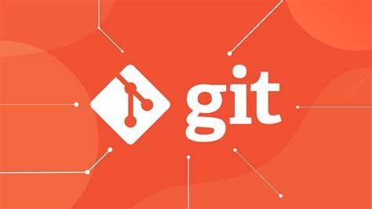

# **Git仓库的创建**

Git 创建仓库  
创建一个git仓库有如下几种方式：

git init：初始化一个git仓库  
git clone：clone一个git仓库  
下面对这几种方式进行详细介绍：

git init  
Git使用git init命令来初始化一个Git仓库，执行完git init命令后，会生成一个.git目录，该目录包含了资源数据，且只会在仓库的根目录生成。  
如果用当前目录作为Git仓库，则只需要执行如下命令：

```
git init
```

执行该命令之后，就可以在当前目录下生成.init文件夹，并且会默认生成一个master分支。

如果要在指定的目录下生成仓库，则指令如下：

```
git init newDir
```

newDir为仓库的路径，执行完成之后，会在newDir目录下生成一个.git目录。

执行该命令之后，就可以在当前目录下生成newtest文件夹，并在改文件夹下生成.init文件夹。

```
git clone
```

使用git clone命令可以从Git仓库拷贝项目，类似于SVN中的 svn checkout，命令格式为：

```
git clone <url> [directory]
```

url为git仓库地址，directory为本地目录，比如，要克隆某个Git 代码仓库，可以用下面的命令：

```
git clone git://github.com/schacon/grit.git
```

执行完成之后会在当前目录下生成仓库，如果要指定目录下生成，则可以在后面加一个具体的位置路径，如：

```
git clone git://github.com/schacon/grit.git newgit
```

git clone 时，可以用不同的协议，包括 ssh, git, https 等，其中最常用的是 ssh，因为速度较快，还可以配置公钥免输入密码，各种写法格式如下：

```
git clone git@github.com/schacon/grit.git --SSH协议
git clone git://github.com/schacon/grit.git --GIT协议
git clone https://github.com/schacon/grit.git --HTTPS协议
```

# **Git常用的基本命令**

Git 基本指令的使用  
下面介绍一下git中常用的几种命令：

git config：配置信息  
git add：添加文件到缓存命令  
git status：查看文件的状态命令  
git diff：查看更新的详细信息命令  
git commit：提交命令  
git reset HEAD：取消缓存命令  
git rm：删除命令  
git mv：移动或重命名命令  
下面对这几个命令进行详细介绍：

1、git config

我们可以通过git config来配置用户名和邮箱地址，便于我们将代码提交到远程仓库，具体格式如下：

```
git config --global user.name '你的用户名'
git config --global user.email '你的邮箱'
```

2、git add

git add 命令可将文件添加到缓存，如新项目中，添加所有文件很普遍，可以使用如下命令：

```
git add .
```

当然我们也可以指定某一类文件，如将java文件添加到缓存中，可以使用如下命令：

```
git add *.java
```

3、git status  
我们可以使用 git status 命令来查看相关文件的状态，直接执行如下命令：

```
git status
```

根据上面git status命令的提示内容，我们可以得到三种处理情况：

暂存文件的命令：git add <文件名>  
放弃未暂存文件的修改命令：git checkout – <文件名>  
将被修改的文件暂存并提交的命令：git commit -a  
如果你对Git的各种状态比较熟悉了，也可以使用 git status -s 来查看简写的状态，这种简写的状态和SVN上的差不多 M - 被修改，A - 被添加，D - 被删除，R - 重命名，?? - 未被跟踪 等等。

4、git diff

执行 git diff 来查看更新的详细信息，与git status不同的是，git status只显示更新的状态，而 git diff 可以显示已写入缓存与已修改但尚未写入缓存的改动的区别具体的详细信息。

尚未缓存的改动：git diff  
查看已缓存的改动： git diff --cached  
查看已缓存的与未缓存的所有改动：git diff HEAD  
显示摘要而非整个 diff：git diff --stat  
如：我们在修改一下test.txt文件内容，使用git diff查看修改详细信息：

之后我们将修改的内容add到缓存中，再使用git diff查看修改详细信息：

5、git commit  
git commit 将缓存区内容添加到仓库中，可以在后面加-m选项，以在命令行中提供提交注释，格式如下：

```
git commit -m "第一次版本提交"
```

如果你觉得 每次 commit之前要add一下，想跳过add这一步，可以直接使用 -a选项,如：

```
git commit -am "第一次版本提交"
```

如：我们可以创建一个文件，并将它添加打缓存，之后在提交，具体操作如下：

6、git reset HEAD  
git reset HEAD 命令用于取消已缓存的内容，如我们要取消已提交的test.txt文件，可以如下使用：

```
git reset HEAD test.txt
```

执行完之后，再使用commit提交时，test.txt文件不会被提交。

如果只是简单地从工作目录中手工删除文件，运行 git status 时就会在 Changes not staged for commit 的提示。要从 Git 中移除某个文件，就必须要从已跟踪文件清单中移除，然后提交。可以如下使用：

```
git rm <file>
```

如果删除之前修改过并且已经放到暂存区域的话，则必须要用强制删除选项 -f

```
git rm -f <file>
```

如果把文件从暂存区域移除，但仍然希望保留在当前工作目录中，换句话说，仅是从跟踪清单中删除，使用 --cached 选项即可

```
git rm --cached <file>
```

可以递归删除，即如果后面跟的是一个目录做为参数，则会递归删除整个目录中的所有子目录和文件：

```
git rm –r *
```

如：我们移除上面所创建的hello.java文件：git mv  
git mv 命令用于移动或重命名一个文件、目录、软连接，如要将一个test.txt文件重命名为newtest.txt，则可以使用如下命令：

```
git mv test.txt newtest.txt
```

# **Git的分支管理**

如：我们将上面的test1.txt文件重命名为test.txt:Git的分支管理  几乎每种版本控制系统都支持分支管理，使用分支我们可以从主干中分离出来，然后继续开发，不影响主干。下面介绍一下Git中分支常用的命令：

git branch：查看分支命令  
git branch (branchname)：创建分支命令  
git checkout (branchname)：切换分支命令  
git merge：合并分支命令  
git branch -d (branchname)：删除分支命令  
下面分别对这些命令进行详细介绍：

```
git branch
```

git branch可以查看分支，也可以创建分支，如果没有参数时，git branch会列出你在本地的分支；如果有参数时，git branch就会创建改参数的分支。  
如果要查看分支，命令格式如下：

1、git branch  
在bash执行的效果如下图所示：

当我们想创建分支时，可以在后面加参数，命令格式如下：

```
git branch branchname
```

如我们想创建一个test的分支，可以如下操作：

```
git branch test
```

现在我们可以看到，多了一个新的分支test。而master分支在我们执行git init的时候，缺省情况下 Git 就会为你创建 master 分支。

```
git checkout (branchname)
```

git checkout可以切换分支，命令格式如下：

```
git checkout branchname
```

如果我们想切换到上面刚刚创建的test分支中，可以如下操作：

```
git checkout test
```

可以看到，没有执行之前，当前的分支是master，当执行之后，当前的分支是test，这个时候可以可以在切换后的分支中继续操作，而不会影响到其他分支。  
我们也可以使用 git checkout -b (branchname) 命令来创建新分支并立即切换到该分支下，从而在该分支中操作。如，我们想创建一个newtest分支，并创建后就切换到该分支下，可以如下操作：

可以看出，执行之前还在master分支中，执行之后，直接进入newtest分支了。

```
git merge
```

git merge命令可以将任意分支合并到到当前分支中去，命令格式如下：

```
git merge branchname
```

查看内容

```
cat test
```

可见master中也存在test3.txt文件了。  
合并冲突  
合并的时候，最大的难点就是冲突了，合并并不仅仅是简单的文件添加、移除的操作，Git 也会合并修改，如果我们在两个分支中同时修改了同一个文件，这时再合并，就可能会产生冲突，冲突并不可怕，可怕的是要怎样去解决，下面以一个小的例子来展示一下合并是冲突的解决。  
还是用上面的那个仓库，现在有两个分支：master、newtest，两个分支中都要test.txt文件，这个时候我们都这个两个仓库的文件都进行修改，之后再提交，最后将newtest合并到master中，具体的操作如下：  
1、先修改分支：master、newtest中的test.txt文件，并提交：

2、之后再将newtest分支修改的内容合并到master分支中：

可以看到newtest分支修改的内容和master分支修改的内容发生了冲突，这是根据具体的情况去解决，如下，我们保留两个分支都有的，之后再add，在commit就可以了：

到此一个简单的合并就完成了。实际项目开发中，合并比这要复杂的多，要结合具体的情况去操作。

git branch -d (branchname)  
git branch -d可以删除分支，删除分支命令格式如下：

```
git branch -d (branchname)
```

# **Git查看提交历史**

Git查看提交历史  
在使用 Git 提交了若干更新之后，又或者克隆了某个项目，想回顾下提交历史，我们可以使用 git log 命令查看，如，我们想列出历史提交记录如下：

下面介绍查看历史记录的几种选项：

–oneline ：查看历史记录的简洁版本  
–graph ：查看历史中什么时候出现了分支、合并  
–reverse ：逆向显示所有日志  
–author ：查找指定用户的提交日志  
–since、–before、 --until、–after： 指定筛选日期  
–no-merges ：选项以隐藏合并提交  
我们可以用 –oneline 选项来查看历史记录的简洁版本：

我们还可以用 –graph 选项，查看历史中什么时候出现了分支、合并：

这样我们可以更清楚明了地看到何时工作分叉、又何时归并，也可以用 –reverse 参数来逆向显示所有日志：

如果只想查找指定用户的提交日志可以使用命令：git log --author , 例如，比方说我们要找 Git 源码中qtqt提交的部分：

如果你要指定日期，可以执行几个选项：–since 和 --before，但是你也可以用 --until 和 --after，–no-merges 选项以隐藏合并提交。

例如，如果我要看 Git 项目中八月一日前且在七月二十九日之后的所有提交，我可以执行这个：

多数情况下，了解每条提交与那个分支／标签关联是很有用的。–decorate 标记让git log展示所有指向每个提交引用（如分支，标签等）,如:

# **Git 标签**

使用标签可以很方便的永远的记住那个特别的提交快照，比如：我们发一个新的版本时，可以给它加一个“vx.x”版本，这样你可以使用git tag给它打上标签。  
创建新标签  
可以使用 git tag -a vx.x来创建一个标签。a 选项意为"创建一个带注解的标签"。 不用 -a 选项也可以执行的，但它不会记录这标签是啥时候打的，谁打的，也不会让你添加个标签的注解。  
如：我们为我们上的例子创建一个标签：

追加标签  
如果我们忘了给某个提交打标签，又将它发布了，我们可以给它追加标签。如，假设我们发布了提交 d6f7147，但是那时候忘了给它打标签。 我们现在也可以：

查看标签  
如果我们要查看所有标签可以使用以下命令：

1、git tag  
执行结果如下：

指定标签信息命令：

```
git tag -a <tagname> -m "某某标签"
```

PGP签名标签命令：

```
git tag -s <tagname> -m "某某标签"
```

# **Git 远程仓库**

前面我们使用到的 Git 命令都是在本地执行，如果你想通过 Git 分享你的代码或者与其他开发人员合作。 你就需要将数据放到一台其他开发人员能够连接的服务器上。本本将使用 Github 作为远程仓库，来介绍Git 远程仓库的使用。  
下面介绍远程仓库常用的几种指令：

git remote add：添加远程仓库  
git remote：查看当前的远程仓库  
git fetch、git pull：提取远程仓仓库  
git push：推送到远程仓库  
git remote rm：删除远程仓库  
1.git remote add  
git remote add可以添加一个远程仓库，其命令格式如下：

```
git remote add [alias] [url]
```

参数\[alias\]为别名， \[url\]为远程仓库的地址，如：我们可以将https://github.com/qtqt/test.git

1、git remote

git remote可以查看当前有哪些远程仓库。

可以看出，有上面添加的别名为test仓库。

2、git fetch、git pull  
git fetch可以提取远程仓库的数据，如果有多个远程仓库，我们可以在后面加仓库的别名，操作如下：

该命令执行完后需要执行git merge 远程分支到你所在的分支。假设你配置好了一个远程仓库，并且你想要提取更新的数据，你可以首先执行 git fetch \[alias\] 告诉 Git 去获取它有你没有的数据，然后你可以执行 git merge \[alias\]/\[branch\] 以将服务器上的任何更新（假设有人这时候推送到服务器了）合并到你的当前分支。操作如下：

执行完成之后可以在本地仓库找到远程仓库的文件。使用这种方式只能保证本地是一个空的仓库，如果非空，则会报：fatal: refusing to merge unrelated histories错误。  
git pull命令用于从另一个存储库或本地分支获取并集成(整合)，在默认模式下，git pull是git fetch后跟git merge FETCH\_HEAD的缩写，使用格式：

```
git pull [options] [<repository> [<refspec>…]]
```

如：我们可以将远程仓库pull到本地，如果本地仓库和远程仓库实际上是独立的两个仓库，–allow-unrelated-history选项来解决。

3、git fetch和git pull的区别：

git fetch：相当于是从远程获取最新版本到本地，不会自动合并。

git pull：相当于是从远程获取最新版本并merge到本地。

git push  
git push 推送你的新分支与数据到某个远端仓库命令，格式如下：

```
git push [alias] [branch]
```

如：我们可以将前面提交的文件push到远程仓库中：

4、git remote rm  
git remote rm删除远程仓库，格式如下：

```
git remote rm [别名]
```

# git指令快查

```sh
git config --global user.name '你的用户名'
```

```sh
git config --global user.email '你的邮箱'
```

```sh
git init
```

```sh
git add filename
```

```sh
git commit -m "first commit"
```

```sh
git branch -M branchname
```

```sh
git remote add origin https://github.com/ruanjianshi/test.git
```

```sh
git push -u origin main
```

```sh
git remote rm [别名]
```

```sh
git status
git log
git reset HEAD test.txt

```
