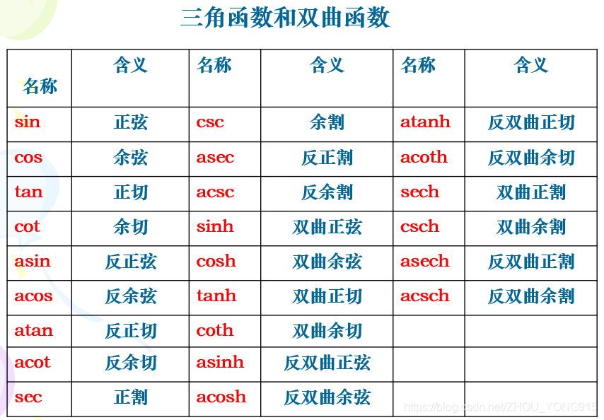
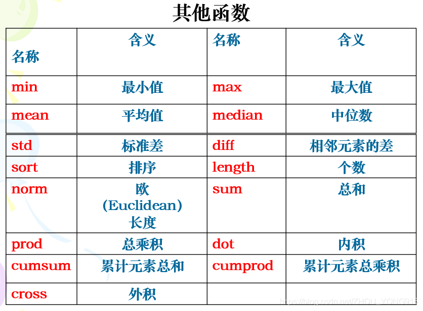
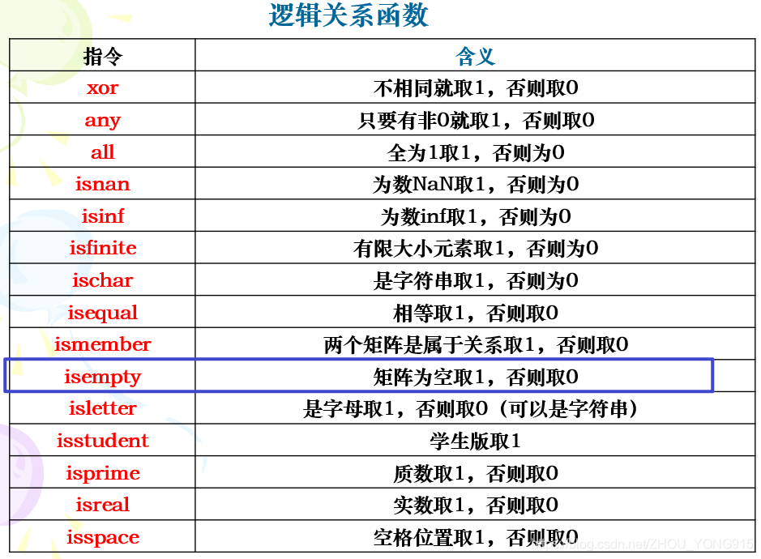

## 前言

MATLAB（Matrix Laboratory）是一种广泛应用于工程、科学和数学领域的高级编程语言和交互式环境。它由MathWorks公司开发，主要用于数值计算、数据分析、算法开发、数据可视化以及系统建模和仿真。对于工科生来说，MATLAB是一个几乎不可或缺的工具，原因如下：

1. **数值计算**：MATLAB提供了强大的数值计算能力，能够处理大规模的矩阵运算、线性代数问题、微积分、概率统计等。这些功能对于解决工程和科学中的复杂数学问题至关重要。

3. **数据分析与可视化**：MATLAB内置了丰富的数据分析和可视化工具，能够帮助用户快速处理和分析数据，并通过图表、图像等形式直观地展示结果。这对于工程设计和科学研究中的数据处理和结果展示非常有用。

5. **算法开发**：MATLAB支持用户开发和测试各种算法，从简单的数值算法到复杂的机器学习和深度学习模型。它提供了丰富的函数库和工具箱，如信号处理、图像处理、控制系统、优化等，极大地简化了算法开发的流程。

7. **系统建模与仿真**：MATLAB的Simulink工具箱允许用户对动态系统进行建模和仿真。这对于工程师在设计控制系统、通信系统、电力系统等领域时，进行虚拟实验和性能评估非常有帮助。

9. **跨学科应用**：MATLAB不仅在电气工程、机械工程、土木工程等传统工科领域广泛应用，还在生物医学工程、金融工程、环境科学等跨学科领域发挥重要作用。

11. **教育与培训**：MATLAB在高校中广泛用于教学和科研，许多工程课程和研究项目都要求学生掌握MATLAB的基本使用。通过MATLAB，学生可以更加直观地理解复杂的理论和概念。

总之，MATLAB作为一个功能强大且易于使用的工具，为工科生提供了一个高效的平台来进行科学计算、数据分析、算法开发和系统仿真，极大地提高了工程和科学研究的效率和质量。

**官方Matlab文档查询跳转：**​**[MATLAB](https://ww2.mathworks.cn/help/index.html?s_tid=CRUX_lftnav)**

**快速上手教程查询跳转：**​**[菜鸟鸭](https://www.cainiaoya.com/matlab/matlab-algebra.html)**

‍

**添加进度条提醒** **：**

```
%% 建立进度条
f = waitbar(x,msg)
f = waitbar(x,msg,Name,Value)

%% 更新进度条
waitbar(x)
waitbar(x,f)
waitbar(x,f,msg)
```

其中，参数`x`​表示进度大小，用一个\[0, 1\]之间的小数来表示。参数`msg`​表示对话框上显示的信息，这个函数会建立一个非模态对话框，即在出现进度条后MATLAB的其他窗口还能继续访问。此外，其Name, Value参数对中有一个是`'Name'`​，用于指定弹出的对话框的名字。

```
bar = waitbar(0,'读取数据中...');    % waitbar显示进度条
A = randn(1000,1);                  % 随机生成1000行1列数据
len = length(A);                    % 读取A矩阵长度
for i = 1:len                       % 循环1000次
    B(i) = i^2;                     % 求平方，无意义，示例函数
    str=['计算中...',num2str(100*i/len),'%']; % 百分比形式显示处理进程,不需要删掉这行代码就行
    waitbar(i/len,bar,str,'Name','Result');  % 更新进度条bar，配合bar使用
end
close(bar)    % 循环结束可以关闭进度条
```

**显示程序运行时间：**

```
t = zeros(1,100);
for n = 1:100
    A = rand(n,n);
    b = rand(n,1);
    tic; %随着循环的进行，会不断刷新起点
    x = A\b;
    t(n) = toc; %取最近一次起点到当前时刻所用时间
end
plot(t)
```

‍

## 界面介绍

  下面对Matlab的界面做一个简单的介绍。

  如果需要完成比较复杂的任务，也可以在所在的工作文件夹下，右键，新建，脚本，建立.m文件，相当于C语言里面的.c和.cpp文件，然后双击.m文件就会在命令行上方弹出编辑器窗口，拉动边界可以调整命令行和编辑器的大小，如果按住窗口上方往外拖，还可以实现编辑器单独窗口。

  接下来对工具栏和菜单栏做一个简单的介绍。

​

- 文件栏主要是对脚本文件的操作

- 变量栏主要是对工作区变量的操作，但一般用得很少，因为如果要查看变量可以直接在工作区双击即可查看

- 环境部分要注意预设和设置路径两个按钮，预设就相当于是设置，可以调节界面，字体，显示语言等；设置路径是在添加第三方工具包的时候需要用到，可以理解为添加插件

​

  这个工具栏是针对编辑器的，也就是打开编辑器就会自动弹出。这个界面主要是对代码的各种操作

​

- 注释：快捷键为CTRL+R

- 取消注释：快捷键为CTRL+T

- 运行节：相比于其他的IDE中需要选中某段代码才能实现运行部分代码，Matlab提供了一种高效的方式，即设置分节符 %%（后面记得加个空格），则用光标选中某个节即可运行某一节代码。

- 设置断点：Matlab设置和VSC一样非常方便，只需要在代码左边点击一下出现红点即可

- 清除断点：点击断点下的那个三角形，就可以选择清除所有断点。

## 入门操作

### 命令窗口（Command Window）

### 基本介绍

**命令窗口**，它最大的特点就是**所见即所得**，也就是在命令行中随意输入一个命令，按下回车键，即可得到其运算结果，速度非常快，如下所示：

​

**工作区**（参考简介中的界面图）会自动添加运算过程中出现的变量，比如此时右边就出现了一个**ans**的变量，并显示值为2.

​

命令行回车即显示结果，那可不可以不显示呢？当然可以，只要在最后加上一个**英文的分号**即可。

​

### 基础指令

- **demo** ：输入demo直接回车可以弹出安装在**本地的帮助文档**，当然，也可以用浏览器访问在线的帮助文档——[Matlab在线帮助文档](https://ww2.mathworks.cn/help/index.html)，**善用搜索功能！**

- **help** ：查找具体函数或算法的利器！等同于命令**doc**，使用方法就是help加上需要查找的内容。

​

类似命令：**helpwin** （简化版的help）和**helpdesk**（单独使用，定位到帮助文档首页）

- **clc** ：清除命令窗口的内容（类似于串口终端的清屏功能）

- **clear** ：清理右边工作区的变量（慎用！注意与clc区分！）

- **format** ：设置数据的格式，如下图所示：

​

另外还有`format rat`​表示运算结果用分数表示。

- ver ：单独使用，查看MatLab和Windows版本。

- who ：显示当前所有变量的名字

- whos ：显示当前所有变量的详细信息。

- pack ：整理工作间的内存

- load ：从文件中导入工作区（一般是mat后缀的文件）

- save ：把工作区的所有变量存入文件中，一般都保存为mat后缀的文件

- what ：显示指定的Matlab文件。

- lookfor ：在help中搜索关键字（排序原则是将包含搜索内容的按数字母排序）

- which ：定位函数或文件

- path ：获取或设置搜索路径

- echo ：命令回显

- cd ：改变当前的工作目录

- pwd ：显示当前的工作目录（这个普适性很强）

- dir ：显示目录内容

- unix ：执行unix命令

- dos ：执行dos命令

- ！：执行操作系统命令

- computer ：显示计算机类型。

### 基本操作

- 基本操作符 + - \* / ^

​

- 变量

- 没有被赋值的临时变量将被自动赋值给ANS

- 大小写敏感

- 变量类型

​

- 常用指令

- `who`​ 查看工作区含有的变量

- `whos`​ 查看工作区含有的变量以及详细信息

- `iskeyword`​ 查看关键字

- `clear`​ 清除工作区的所有变量，**可以指定单个变量**

- `clc`​ 清除界面的显示

- 特殊变量及常量

- `i、j`​ ：复数

- `Inf`​ ：∞

- `eps`​：自然对数

- `NaN`​：不是一个数

- `pi`​：圆周率

​

- 变量优先级 变量>内置函数>子功能>私有函数

- 数字显示格式：

- `short`​ 保留4位小数

- `long`​ 保留15位小数

- `shortE`​ 科学计数法保留4位小数

- `longE`​ 科学计数法保留15位小数

- `bank`​ 保留2位小数

- `hex`​ 二进制双精度数的十六进制表示法

- `rat`​ 小整数比

- 指令结尾带`;`​ 不会显示运算结果，否则就会显示运算结果

**这里尤其需要注意带“.”的运算符！！！**  
  一般来说，带“.”的运算符功能和不带“.”的运算符是一样的，但是在矩阵与矩阵之间的运算时有差别，即**带“.”的运算符表示矩阵的每一个元素进行运算，而不是一般的矩阵运算（乘法）** ，参考如下例程：

​

一般来说，但凡涉及到向量或者矩阵的运算，都得要考虑是不是得加点号，因为不加可能会报错或者运算结果完全不对，慎重！

**其他符号：**

​

- `%{`​和`%}`​：块注释，相当于C语言中的`/**/`​，注意，这里的大括号和百分号是错位的和C语言块注释符不太一样。

- **······** ：表示续行

#### 符号变量的声明

在命令行中随便输入一个a = 10，表明a是一个常数变量，而一般在求导和积分时，几乎都是用符号进行运算，因此，一般都需要在程序运行前声明必要的符号变量，语法如下所示：

> x=sym(‘x’) —— 表明x是符号变量
> 
> syms x y z —— 定义多个符号变量

syms f(x) —— 定义两个符号变量，f和x，且二者之间还有函数关系  
在声明符号函数时，还可以使用inline函数：  
f = inline(“x3+5​_x”) 或者 ff = inline(‘-x_​sin(x2-x-1)’, ‘x’) 如果不带引号，则其内部的变量都应已知。

  有时候需要多个函数共用一个变量，就可以将变量定义为全局变量，使用指令global，具体用法建议使用help查看。  
  使用方法是在每个函数中都要声明global val，表示这个变量去全局变量中找，如果任何函数改动这个数值，如val = 0;那么所有函数引用该变量得到的值都会发生改变。

#### 输入输出函数

​

说明：如果不加参数 ‘s’，则输入的内容可以参与运算，比如一个矩阵A，rand(3)等，而加上参数 ‘s’之后，输入的内容都会作为字符串返回。

​

​

#### 常用数学函数总结

​

​

​

​

​

#### 逻辑运算

**“等于”和“不等于”**

- **\==** ：表示等于，一个 **\=** 表示赋值

- **~=** ：表示不等于，记住，不是感叹号哦！

**逻辑运算符：**

​

**逻辑关系函数总结**

​

### 矩阵操作

#### 向量与矩阵

```
//行矩阵
>> a = [1 2 3 4]

//列矩阵
>> b = [1; 2; 3; 4]
```

#### 等距等比数组

​

​

​

#### 矩阵的大小

- **\[row, col\]** **\=** **size(A)** %row为矩阵A的行数，col为A的列数

如果不需要某个参数，可以用 **~** 符号代替，表示**参数缺省**，如：

- **\[row,** **~\]** **\=** **size(A)** %表示只取矩阵A的行数row

- **row** **\=** **size(A, 1)** %表示获取矩阵A的第一个参数，即行数

- **col** **\=** **size(A, 2)** %表示获取矩阵A的第二个参数，即列数

- **a** **\=** **length(A)** %返回值a = max{row, col}

#### 获取矩阵值

```
a=[1 2 3; 4 5 6; 7 8 9;]
```

> 通过行列值选择，例如 a(1, 3) 就是第一行第三列的数 和 a(\[1 3\], \[1 3\]) 就是第一行第一列和第三行第三列的数
> 
> 通过索引获取 a(1) = 1

​

#### 特殊矩阵

- diag(A, k)：表示将矩阵 A 的第 k 个对角线的元素提取组成列向量，若 k 省略 等价于k=0，表示主对角线元素。即该函数返回的是一个列向量。

- tril(A, k)：表示提取矩阵A的第k个对角线以下的元素组成下三角矩阵，剩余部分补0，如果k省略，等价于k=0，即主对角线元素。该函数返回的是一个矩阵。

- triu(A, k)：表示提取矩阵A的第k个对角线以上的元素组成上三角矩阵，剩余部分补0，如果k省略，等价于k=0，即主对角线元素。该函数返回的是一个矩阵。

- rot90(A)：表示将矩阵A逆时针旋转90°，注意和转置运算区分开来！

- fliplr(A)：表示将矩阵A左右翻转

- flipud(A)：表示将矩阵A上下翻转

‍

`linspace()`​[^1](括号内为空的，不代表参数为空，可能包含多个参数) 线性矩阵

`eye(n)`​ 单位对角矩阵

`zeros(n1, n2)`​ 零矩阵

`ones(n1, n2)`​ 单位矩阵

`diag()`​ 对角矩阵

`rand()`​ 随机矩阵

‍

- A = \[ \] : 创建一个空矩阵，空矩阵大小为0

- B = zeros(m, n) : 创建一个m行n列的零矩阵，如果只有一个参数n，则代表创建n阶方阵（下面的也类似），注意函数名有一个"s"！

- C = ones(m, n)：创建一个m行n列的全为1的矩阵，注意函数名有一个"s"！

- D = eye(m, n)：创建一个m行n列的单位矩阵，注意函数名没有"s"！

- E = rand(m, n)： 创建一个m行n列的在 \[0, 1\] 内均匀分布的随机矩阵，如果需要创建其他范围的随机矩阵，可以用其他表达式乘以该矩阵。

- F = randn(m,n)：创建一个m行n列的 标准正态分布（数据范围为\[-1, 1\]） 的矩阵。

#### 矩阵相关函数

`max`​ 矩阵的最大值，以列为单位

`max(max(a))`​

`min()`​

`sum()`​

`sort()`​ 以列为单位，升序排列矩阵

`sortrows()`​ 以第一列的数字为判断标准，升序排列每行元素

`size()`​ 返回矩阵的**行数**和**列数**

`find()`​ 返回矩阵的**列数**

‍

#### 矩阵变形

在[矩阵运算](https://so.csdn.net/so/search?q=%E7%9F%A9%E9%98%B5%E8%BF%90%E7%AE%97&spm=1001.2101.3001.7020)过程中，经常会遇到对一个矩阵进行变形的操作，比如原来是一个向量，现在需要变成一个矩阵，就需要用到`reshape`​函数。  
  这个函数在Python中也有，但是奇怪的设定之处在于**MATLAB中的reshape函数是按列堆叠的**（Python中是按行堆叠的），如以下代码所示。

```
>> A = 1:6
>> B = reshape(A,[2,3])
A =

     1     2     3     4     5     6

B =

     1     3     5
     2     4     6
```

#### 矩阵的运算

​

​

#### 线性相关与方程组

##### 多项式

- poly2sym( p )：输出以向量p为系数的多项式p ( x ) p(x)p(x)。

- polyval(p, a)：返回多项式p ( x ) p(x)p(x)当x = a x=ax=a时的值。

- roots( p )：返回多项式函数p ( x ) = 0 p(x)=0p(x)=0的所有复数根

- conv(p1, p2)：返回多项式p 1 ( x ) p1(x)p1(x)和p 2 ( x ) p2(x)p2(x)的乘积结果的系数

- \[a, b\]=deconv(p1, p2)：返回p 1 ( x ) p1(x)p1(x)和p 2 ( x ) p2(x)p2(x)的商式a和余式b的系数。

- collect(f)：对符号多项式f(syms x，即f(x) )进行合并同类项

- expand(f)：对符号多项式f进行展开

- horner(f)：对符号多项式f进行嵌套分解

​

- factor(f)：对符号多项式进行因式分解

- \[a, b, r\] = residue(p, q)：将有理分式p ( x ) / q ( x ) p(x)/q(x)p(x)/q(x)分解为最简分式之和。看下面这个例子：

​

- **\[p, q\]** **\=** **residue(a, b, r)** ：将简单分式之和合并为一个有理分式，即上面那个表达式的逆运算。

##### 向量组的相关性和极大无关组

​

##### 齐次线性方程组的解

- B=null(A)：输出A的基础解系的标准正交基，即得到的矩阵B的所有列向量为A X = 0 AX=0AX=0的解向量，且这些解向量标准正交。

- B=null(A, ‘r’)：输出A的基础解系，矩阵B的所有列向量为A X = 0 AX=0AX=0的解，且不进行正交化。

‍

##### 非齐次线性方程组的解

​

##### 特征值与二次型

​

​

### 脚本语言

- **变量的命名** ：只能以字母开头（C语言还可以以下划线开头），且最多不超过19个字符。

- **全局变量**

​

- **循环结构**：在MatLab中，循环不使用 **{ }** ，而是用**end**表示循环的结束（不要求缩进），而且**if** 或**while**的条件不需要加 **( )** 。参考下面的例程：

```
/****for循环****/
for n = 1:10    //表示i从1到10逐次+1，循环十次
    x(n) = sin(n*10);
end  //终止for循环

/****while循环****/
x = 0;
sum = 0;
while x < 101
    sum = sum + x;
    x = x + 2;
end

/****if-else语句*****/
if x > 1
    f = x^2 + 1;
else if x <= 0
    f = x^3;
else
    f = 2 * x
end

/*****switch语句******/
num = input('请输入一个数');
switch num
case -1  //注意case后面没有冒号
    disp('I am a teacher.');
case 0
    disp('I am a student.');
case 1
    disp('You are a teacher.');
otherwise     //等同于C语言中的 default
    disp('You are a student.');
end
```

**定义函数** ：在MatLab中，写脚本时，不能像C语言一样在该脚本中随便定义一个函数，应该在另一个文件（最好同一目录）中定义。**操作方法就是点击新建按钮旁边的三角，选择新建函数**。

​

1. 由此可知，定义函数的格式为 function 因变量 = 函数名 (自变量)，且需要在最后加上end，（也可以不加）表示函数结束；

3. 保存为.m文件时，文件名和定义的函数名fun1必须要一样；

5. 如果需要另外定义一个函数，可以直接在该文件中直接定义，但这个函数不能被其他文件调用，只能被该文件名对应的函数调用。

7. 调用该函数时，需要严格按照 定义的函数格式来调用，即输入参数和输出参数应该一一对应。

9. nargin 和 nargout 的用法：nargin可以理解为n\_arg\_in，即输入参数的个数，同理，nargout表示输出参数的个数，有了这两个永久变量，可以实现Matlab调用函数时的参数可调性，参考下面这个例子：

​

**定义类：** 点击新建，选择新建类，得到一个模板：

​

### 绘图

#### 基础绘图

##### Plot

‍

​

​

​

#### 图像处理

​

​

​

​

​

​

​

​

如果图像需要放到论文或者正式的文档中，建议可以按照如下操作：

​

#### 🖌Matlab绘图技巧及经验总结

- [基础绘图命令](Matlab教程.md#基础绘图命令)

- [图形对象属性控制绘图参数：set/get](Matlab教程.md#图形对象属性控制绘图参数：setget)

##### 基础绘图命令

```
figure(1)
x = linspace(0,2*pi,100);
y = sin(x);
y2 = cos(x);

%%指定坐标轴范围

xlim([xmin xmax]);
ylim([ymin ymax]);
zlim([zmin zmax]);

axis([xmin xmax ymin ymax zmin zmax])

%% 绘制子图
subplot(2,2,1)
x = linspace(0,10);
y1 = sin(x);
plot(x,y1)
title('Subplot 1: sin(x)')

subplot(2,2,2)
y2 = sin(2*x);
plot(x,y2)
title('Subplot 2: sin(2x)')

subplot(2,2,[3 4])
y3 = sin(3*x);
plot(x,y3)
title('Subplot 3/4: sin(3x)')

%%画在同一个figure中

% 方法一
plot(x,y,'--or') %LineSpec:线型、标记、颜色
hold on
plot(x,y2)
hold off

%方法二
plot(x,y1,'LineSpec1',x,y2,'LineSpec2')

grid on;            %加网格线
box on;            %加坐标边框
axis on/off;
axis equal;%坐标轴采用等刻度

%% title,legend,text，xlabel，ylabel的用法
title(['Temperature is ',num2str(c),' C'])%包含变量c
title({'First line';'Second line'})%分行
legend({'Line 1','Line 2','Line 3','Line 4'},'FontSize',12,'TextColor','blue')
```

参考：

> [1.MATLAB绘图类型](https://ww2.mathworks.cn/help/matlab/creating_plots/types-of-matlab-plots.html)

##### 图形对象属性控制绘图参数：set/get

​

```
h1=figure(1)%
set(gcf,'Name','Property')%设置当前图窗的属性
set(h1,'Name','Property')%设置当前图窗的属性

a1=axes()
set(gca,'Name','Property')%设置当前坐标轴的属性
set(a1,'Name','Property')%设置当前坐标轴的属性

p1 = plot(1:10,1:10);
p1.LineWidth = 3; 
%或者
set(p1,'Name','Property')

t1=text('');
set(p1,'Name','Property');
```

> [1.查看图形对象的属性及标识](https://ww2.mathworks.cn/help/matlab/graphics-object-properties.html)

#### SCI论文--Matlab作图指南

```
figure(3);
%需要画的线；'LineWidth'设置线宽,'Color'设置颜色（QQ的截图功能可以当取色器用）;'LineStyle'更改线型
plot(t,TotalE(1,:),'LineWidth',2,'Color',[255/255,128/255,0/255]);hold on ;
plot(t,TotalE(2,:),'LineWidth',2,'Color',[64/255,105/255,224/255]);hold on ;

%'FontSize'设置所有的字的大小（刻度、坐标轴、图例等）
set(gca,'FontSize',19);

%设置坐标轴名称的字体，可以覆盖上述设置
xlabel('Time/h','fontsize',25);ylabel('Obj','fontsize',25);

%设置图例；'Orientation'设置图例为竖着还是横着，默认为竖着，'horizontal'为横
legend({'Baseline-Opt','LB-CMVP'},'Orientation','horizontal');
%设置图例位置'NorthOutside'表示在上方外部；右上角为'NorthEast'，依此类推
set(legend,'Location','NorthOutside');

%设置x轴范围
xlim([0,24]);
%设置x刻度如何显示
xticks(0:3:24);

%设置输出的图的大小
set(gcf,'PaperUnits','centimeters')
set(gcf,'PaperSize',[28,11.4])
set(gcf,'PaperPositionMode','manual')
set(gcf,'PaperPosition',[0,0,28,11.4]);
set(gcf,'Renderer','painters');

%输出'test1'pdf
print('test1','-dpdf')
%输出'3.jpg';3是图片名
print 3.jpg -djpeg -r600
%输出'3.eps'
print 3.eps -depsc2 -r600
```

​

```
%%%%%双轴图画法
figure(4);

yyaxis left; % 激活左边的轴
plot(t,Objective_B(1,:),'LineWidth',2.5, 'Color',[64/255,105/255,224/255]);hold on;
plot(t,Objective_B(2,:),'LineWidth',2.5, 'Color',[255/255,128/255,0/255],'LineStyle','-');hold on;
set(gca,'FontSize',20);
xlabel('Time/day','fontsize',26);
ylabel('Obj','fontsize',26); % 给左y轴添加轴标签

%设置x，y轴颜色，不然两个轴matlab会自动改色
set(gca,'Xcolor',[0 0 0]);
set(gca,'Ycolor',[0 0 0]);

yyaxis right; % 激活右边的轴
plot(t,Auser2,'Color',[0/255,96/255,156/255],'LineStyle','--','LineWidth',1.5);
ylabel('Users','fontsize',26); % 给右y轴添加轴标签
set(gca,'Ycolor',[0 0 0]);%设置x，y轴颜色

legend({'LB-CMVP','Baseline-Heur','Users'},'Orientation','horizontal');set(legend,'Location','NorthOutside');

    set(gcf,'PaperUnits','centimeters')
    set(gcf,'PaperSize',[28,13])
    set(gcf,'PaperPositionMode','manual')
    set(gcf,'PaperPosition',[0,0,28,13]);
    set(gcf,'Renderer','painters');
    print('test4','-dpdf')
     print 4_2.jpg -djpeg -r600
     print 4_2.eps -depsc2 -r600
```

​

**set(gca, 'YGrid', 'on');%仅设置垂直y轴的网线格**

## 高级操作

### 数学运算

#### 函数极限

​

#### 导数与偏导

​

#### 函数极值&最值

​

​

#### 求方程（组）的根

求代数方程f(x) = 0的根，可以使用MATLAB中的命令solve(f, x)，输出结果即为f(x) = 0的所有符号解或精确解。  
  如果需要求方程组的解，如  
​​

可以使用指令\[x, y\] = solve(f, g, x, y)求出。

  同样需要注意：这个solve指令可能求出的并不是唯一解，也有可能不是精确解，需要自己根据实际情况判断选择。

#### 求函数零点

MATLAB中求函数零点的方法都是使用**牛顿迭代法**求出的**近似解**。

​

​

#### [泰勒公式](https://so.csdn.net/so/search?q=%E6%B3%B0%E5%8B%92%E5%85%AC%E5%BC%8F&spm=1001.2101.3001.7020)

​

可以看出，这个指令的参数结构是 **“Name, Value”** 格式的，即两个参数为一对，先是参数的类型名，然后是参数对应的值。

#### 数列求和

在已知一个具体数字组成的向量或矩阵时，可以直接使用`sum(x)`​的指令来进行**求和**。  
  但是需要注意：如果`x`​为一个向量，那么所求出的结果为向量所有元素之和；如果`x`​为一个矩阵，那么求出的结果为一个向量，且向量元素的数量为**矩阵**​**​`x`​**​**的列数**，即每个元素为矩阵`x`​一列元素之和。

​

​

​

​

#### 函数积分

​

如果是多重积分，可以连续使用多个**int**指令。如下所示

​

#### [数值积分](https://so.csdn.net/so/search?q=%E6%95%B0%E5%80%BC%E7%A7%AF%E5%88%86&spm=1001.2101.3001.7020)

所谓数值积分，是针对那些求积分求不出**解析解**的数学表达式，利用图形化的方法来求其积分的**数值解**，即**曲线与x轴围成的面积大小，即下面积大小**。记住，这是核心思想！

然后针对如何求曲线下面积的方法，提出了不同的方法。比较常用的有三种：**梯形积分法、辛普森法（Simpson）、自适应辛普森法（Adaptive Simpson）** ，

#### 表达式化简

- pretty(f) —— 将符号表达式化简成与高等数学课本上显示符号表达式形式类似（大大提升表达式可读性！）

- collect(f) —— 合并符号表达式的同类项

- horner(f) —— 将一般的符号表达式转换成嵌套形式的符号表达式

- factor(f) —— 对符号表达式进行因式分解

- expand(f) —— 对符号表达式进行展开

- simplify(f) —— 对符号表达式进行化简，它利用各种类型的代数恒等式，包括求和、积分、三角函数、指数函数以及 Bessel 函数等来化简符号表达式。

#### 插值

​

​

​

​

​

#### [常微分方程](https://so.csdn.net/so/search?q=%E5%B8%B8%E5%BE%AE%E5%88%86%E6%96%B9%E7%A8%8B&spm=1001.2101.3001.7020)

常微分方程的解一般可以分为两类，**一种是能够求出解析解的表达式**，**一种是只能求出数值解的表达式**。

```
syms y(t) a
eqn = diff(y,t) == a*y;
S = dsolve(eqn)
/****************************************/
syms y(t) a
eqn = diff(y,t) == a*y;
cond = y(0) == 5;
ySol(t) = dsolve(eqn,cond)
/****************************************/
syms y(t) a b
eqn = diff(y,t,2) == a^2*y;
Dy = diff(y,t);
cond = [y(0)==b, Dy(0)==1];
ySol(t) = dsolve(eqn,cond)
/****************************************/
syms y(t) z(t)
eqns = [diff(y,t) == z, diff(z,t) == -y];
S = dsolve(eqns)
/****************************************/
syms y(t) z(t)
eqns = [diff(y,t)==z, diff(z,t)==-y];
[ySol(t),zSol(t)] = dsolve(eqns)
```

‍

​

​

​

### Simulink仿真

#### Simulink介绍

**Simulink** 是 MathWorks 公司开发的一款用于动态系统和嵌入式系统的多领域仿真和基于模型的设计工具。它作为 MATLAB 环境中的一个扩展模块，广泛应用于工程和科学领域，特别是在控制系统、信号处理、通信系统和电力系统等领域。

##### 主要功能与特点

1. **图形化建模**：Simulink 提供了一个图形化的用户界面，用户可以通过拖拽图标和连接线的方式构建系统模型。这种可视化的建模方式使得复杂的系统设计更加直观和易于理解。

3. **多领域仿真**：Simulink 支持多种领域的仿真，包括但不限于控制系统、数字信号处理、通信系统、电力电子、机器人学等。用户可以在同一个环境中进行跨学科的系统仿真。

5. **广泛的标准库**：Simulink 提供了丰富的标准库，包括信号源、数学运算、逻辑运算、控制器、电机模型、通信模块等。用户可以直接使用这些库中的模块构建系统模型，极大地提高了开发效率。

7. **代码自动生成**：Simulink 支持从模型直接生成嵌入式代码，这些代码可以直接用于微控制器和其他嵌入式系统中。这使得 Simulink 不仅是一个仿真工具，还可以作为从设计到实现的完整解决方案。

9. **仿真与调试**：Simulink 提供了强大的仿真和调试功能，用户可以设置不同的仿真参数（如步长、求解器类型等），并对仿真过程进行实时监控和调试。Simulink 还支持模型的分步仿真和并行仿真，以加速大规模系统的仿真过程。

11. **与 MATLAB 的无缝集成**：Simulink 与 MATLAB 紧密集成，用户可以在 Simulink 模型中调用 MATLAB 函数和脚本，或者将仿真结果导入 MATLAB 进行进一步的分析和处理。这种集成使得 Simulink 成为了一个强大的工具链，能够支持从建模、仿真到数据分析的全流程。

##### 应用领域

- **控制系统**：Simulink 广泛应用于控制系统的设计和分析，用户可以通过 Simulink 设计控制算法，并对系统进行仿真和优化。

- **信号处理**：在数字信号处理领域，Simulink 提供了丰富的信号处理模块，用户可以通过这些模块构建复杂的信号处理系统，并进行仿真和验证。

- **通信系统**：Simulink 在通信系统设计中也有广泛应用，用户可以通过 Simulink 进行通信协议的仿真、信道建模、调制解调等。

- **电力系统**：Simulink 提供了专门的电力系统模块库，用户可以通过这些模块进行电力系统的仿真，包括电机控制、电力电子转换器设计等。

- **机器人学**：在机器人学领域，Simulink 可以用于机器人动力学建模、路径规划、控制算法设计等。

##### 总结

Simulink 作为一种强大的仿真和建模工具，极大地简化了复杂系统的开发过程。其图形化的建模方式、广泛的库支持、与 MATLAB 的无缝集成以及代码生成能力，使其在多个工程和科学领域中得到了广泛的应用。无论是学术研究还是工业应用，Simulink 都是一种不可或缺的工具。

#### 常用仿真模块

​

​

​

#### 视频讲解

[https://player.bilibili.com/player.html?bvid=BV1bA411G7bL&page=1&high\_quality=1&as\_wide=1&allowfullscreen=true&autoplay=0&spm\_id\_from=333.788.videopod.episodes&vd\_source=f412fc178503cd4cd82f9c512d4f458d&p=5](https://player.bilibili.com/player.html?bvid=BV1bA411G7bL&page=1&high_quality=1&as_wide=1&allowfullscreen=true&autoplay=0&spm_id_from=333.788.videopod.episodes&vd_source=f412fc178503cd4cd82f9c512d4f458d&p=5)

‍

### ‍APP设计

实践性较强，边实践边学习。。。。。
