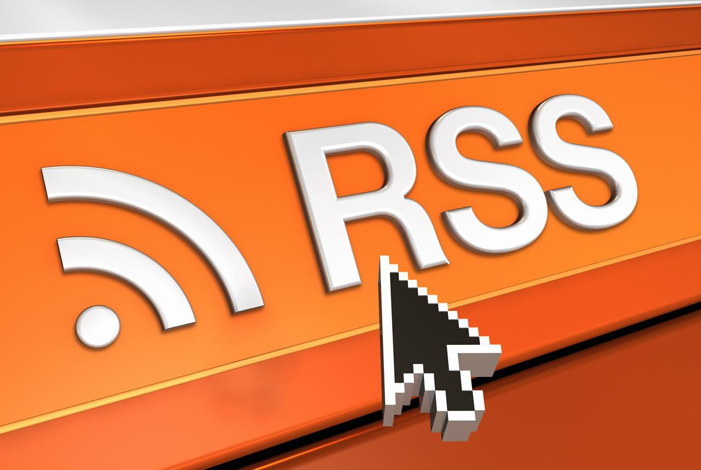
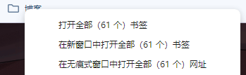
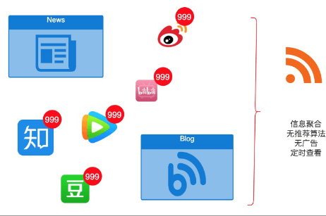
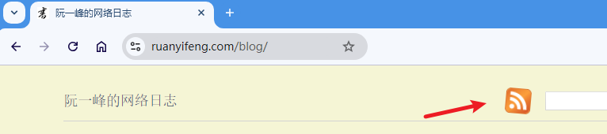
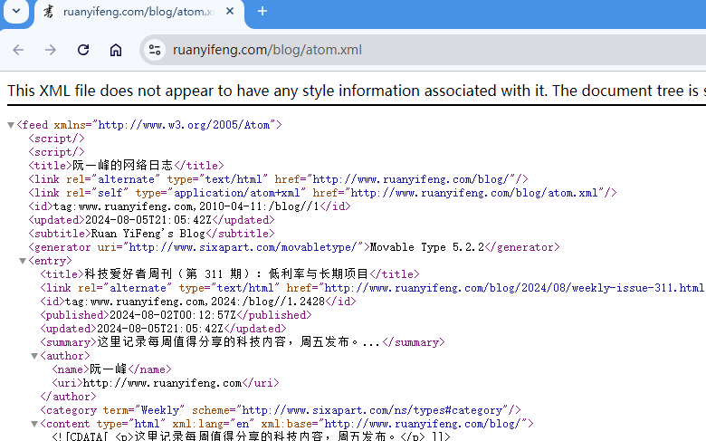
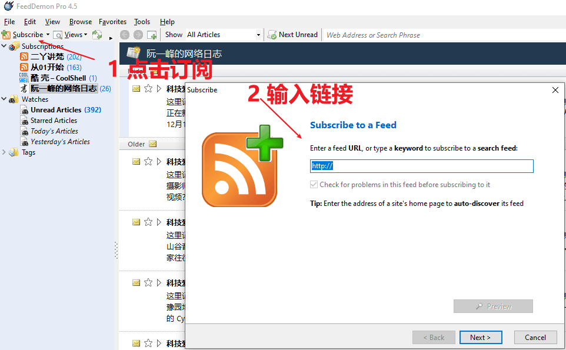
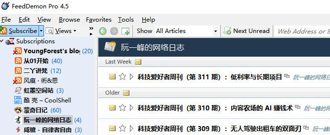
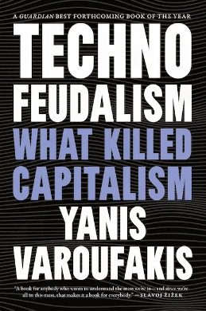
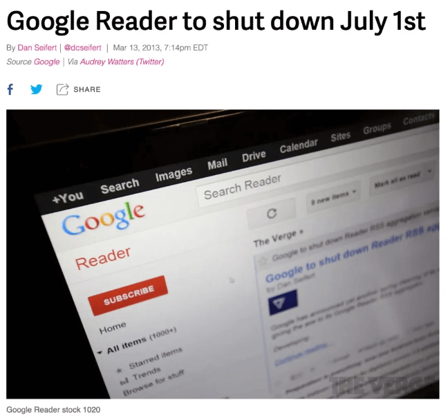

使用 RSS，摆脱算法控制，建立自己的信息流。



‍

## 在 RSS 出现之前

在介绍 RSS 之前，先讲讲没有 RSS 的情况下遇到的问题。

比如我想关注一名微博用户，并想知道他的动态，那么可以在微博上关注他。

如果我想关注一名 UP 主，同理也得在 B 站关注他。

我自己是搭建博客的，也看到过很多博客，那么我如何知道这些博客的最新内容呢？

最笨的办法：定期去回访这些博客，也就是逐个逐个网站打开。但这得花多少时间啊！更别提浏览花去的时间了。就比如我自己收藏了 60 多个博客：



[](https://img2024.cnblogs.com/blog/1139407/202408/1139407-20240812104410423-1367147790.png)

也许有人会说，普通人的话，谁会关心那么多网站啊？

我只能说：与你发生关系的网站可能不多，但是其他平台呢？例如抖音、微博、B 站、知乎、小红书、论坛.... 就比如我，在 B 站甚至关注了 400+ 个 UP 主。

除了关注这些平台的博主外，你是否会追星？还有追番、追剧、电影、小说，甚至你们学校的公告，一些重要的政策公告......

* * *

到了这个时候，我们会发现，靠自己去定期检查是否有更新，是很花费时间的，效率也是很低的。而且如果没更新的话，那么时间更是白白浪费了。

* * *

也许有人又说道：现在各个平台不都有 APP 吗？不是可以通过通知来完成吗？

首先，大多数平台我平时都不怎么使用，更别说给这些 APP 打开通知权限了，但凡打开过的人都知道这些通知有多烦人，而且有时候根本不是推送你所关注的人的动态，而是其他推广。

此外，安装的 App 多了后也会很烦人，占用空间，各种索取权限等。

* * *

那有没一种办法，将这些信息都聚合起来呢？只需在这一个地方，就能了解所有你关注的人/事物的最新动态？

有，那就是通过 RSS，将所有平台的更新信息聚合到一个地方。



[](https://img2024.cnblogs.com/blog/1139407/202408/1139407-20240812104513810-976344267.png)

‍

‍

## 什么是 RSS

RSS 协议的 1.0 版本是在 2000 年上线的，距今 20 多年了。

为什么会有 RSS？其实，这是互联网发展的必然。在早期，几乎没有什么互联网企业，也用不上 RSS，而后期互联网开始繁荣，那么 RSS 就被提出来了。

‍

RSS 的全称有三种说法：

- RDF Site Summary（资源描述框架站点摘要）

- Rich Site Summary（网站内容摘要）

- Really Simple Syndication（简易资讯聚合）

但其实全称并不重要，对于多数人，这样理解就够了：RSS 就像一个网站的海报，里面包括这个网站的最新内容，会自动更新。

所以，如果订阅了，就不会错过自己关注的更新了。

‍

## RSS 的原理

从技术方面来说，就是各个平台会提供一个 XML 格式的纯文本文件，该文件里包含了该网站的内容。如果该平台有更新，也会同步更新这个 XML 文件。而 RSS 软件就可以去管理这些众多的 XML 文件，定期去抓取更新的内容，以此来完成订阅。

‍

‍

## 快速入门

我们来看一个案例，如何订阅一个博客。

例如阮一峰老师的[博客](http://www.ruanyifeng.com/blog/)，首先，我们可以看到其网站上有 RSS 的标识（橙色的 WiFi 图标）：



[](https://img2024.cnblogs.com/blog/1139407/202408/1139407-20240812104407515-841903012.png)

> 注意：并不是所有博客都会提供 RSS 功能，所以如果找不到也不用惊讶。

‍

点击它便能看到的该博客提供的 RSS 地址：

- [http://feeds.feedburner.com/ruanyifeng](http://feeds.feedburner.com/ruanyifeng)（正式 Feed，大陆地区被屏蔽）

- [http://www.ruanyifeng.com/blog/atom.xml](http://www.ruanyifeng.com/blog/atom.xml)（备用 Feed，正常访问）

‍

如果我们点击第二个地址，就能看到一个 XML 格式的文本文件（也叫 RSS 源）：



[](https://img2024.cnblogs.com/blog/1139407/202408/1139407-20240812104750892-1953095388.png)

‍

可以看到，文件内容里包含了很多文章的内容，例如标题（title），地址（link），发布日期（published）...

```
 <entry>     <title>科技爱好者周刊（第 311 期）：低利率与长期项目</title>     <link rel="alternate" type="text/html" href="http://www.ruanyifeng.com/blog/2024/08/weekly-issue-311.html"/>     <id>tag:www.ruanyifeng.com,2024:/blog//1.2428</id>     <published>2024-08-02T00:12:57Z</published>     <updated>2024-08-05T21:05:42Z</updated> ... <entry>     <title>科技爱好者周刊（第 310 期）：内容农场的 AI 赚钱术</title>     <link rel="alternate" type="text/html" href="http://www.ruanyifeng.com/blog/2024/07/weekly-issue-310.html"/>     <id>tag:www.ruanyifeng.com,2024:/blog//1.2427</id>     <published>2024-07-26T00:05:24Z</published> ....
```

‍

‍

不过，这种 XML 文件看上去密密麻麻，不适合阅读，有没什么办法呢？

我们可以找 RSS 阅读器，就是能解析上述这个 XML 文件的，并且能帮助我们管理所有的 RSS 订阅。

例如，Windows 平台上可以用 [FeedDemon](http://feeddemon.com/) 这个软件，下载安装后，点击订阅，然后输入 RSS 源：



[](https://img2024.cnblogs.com/blog/1139407/202408/1139407-20240812104717701-702360601.png)

‍

‍

‍

然后就可以完成订阅了。如果该博客有更新，那么 RSS 也会同步更新（一般来说都会，得看博客的作者是否做了这一步）。

后续我们只需打开这个软件并刷新下，该软件就会去抓取这些博客的 RSS 源，然后判断是否有更新，有则显示，无则略过。

至此，我们以后只需打开这个软件并刷新，就可以知道所有订阅了的博客的动态，而不用逐个打开网站去看有没更新：



[](https://img2024.cnblogs.com/blog/1139407/202408/1139407-20240812104421181-1574099490.png)

‍

注意：目前市面上有很多 RSS 阅读器，这里仅仅是举个例子，不一定非得用这款，我后续会写篇博客列举下流行的 RSS 阅读器，到时再挑一个也不迟。

‍

小结：

将大象放进冰箱只需三步，RSS 也是一样的：找到 RSS 源 → 打开 RSS 阅读器并输入 → 刷新。

‍

‍

## RSS 能订阅什么？

万物皆可 RSS。几乎任何你想关注的信息都可以通过 RSS 来订阅：

- 国内几乎所有主流平台：微博、B 站、抖音、豆瓣、即刻、简书、酷安、知乎、小红书……

- 各种新闻平台：今日头条、参考消息、澎湃新闻、得到、36kr、InfoQ、差评……

- 各种论坛：V2EX，贴吧，威锋……

- 国外的也可以（当然得魔法上网）：Pixiv、YouTube、Twitter、Telegra、TikTok、Reddit、GitHub……

- 各种博客：独立博客（例如本站）、博客园、十年之约、CSDN......

- 各种音视频：ACFun、AGE 动漫、X 漫画、BT 之家、4k 世界、CNTV......

- 其他：大学通知、降价通知、预报预警、科学期刊、金融财报、政务消息......

‍

除此之外，你甚至可以自己写代码来生成 RSS 文件，以此来完成订阅！不过这需要一点点编程基础，后续的教程里会提到。

> PS：不推荐订阅新闻，因为更新太频繁，我试过订阅，动辄几十上百条。实在想看的话每天抽点时间看看新闻网站即可

‍

‍

## 使用 RSS 的好处

‍

目前国内常见的订阅方式有：

- 站内订阅：和 RSS 订阅有些相似，都需要用户主动订阅，但这些网站都在试图打造自己的内容闭环生态圈，因此你只能订阅该站站内的内容。比如视频订阅，微博关注，微信公众号订阅，知乎专栏关注等 SNS 网站。缺点：信息孤岛效应

- 算法推荐：以算法为主要内容分发机制，通过你的浏览记录来猜测和推送你可能感兴趣的内容，比如今日头条，腾讯新闻等各大门户的新闻客户端。算法推荐可能是当下最普遍的分发机制，大多数网站和应用或多或少地都在使用。缺点：回音室效应

- 人工推荐：更近似于传统媒体，产品的内容质量较高，同时也颇具“个人”特色，因为内容都是这些网站的编辑精选而来。比如知乎日报，湾区日报，好奇心日报，果壳精选等。（缺点：推荐内容与预期存在较大偏差）

‍

目前，各类平台基本上都会使用「推荐算法」，将一些“认为你感兴趣”的内容推送给你。

不能否认推荐算法能有助于我们节约时间，快速发现更多自己感兴趣的内容。但也有坏处：大多数人很容易陷入「被毫无意义的推荐内容浪费了时间」却还浑然不知的处境。

有时候，过滤信息的能力比收集信息更重要。技术应当是给人们带来自由和发展，而非接管人们的注意力，浪费宝贵的时间，而 RSS 能做到这一点。

‍

‍

‍

‍

‍

‍

‍

## RSS 的没落

‍

以下内容摘自阮一峰老师的[周刊](https://www.ruanyifeng.com/blog/2024/06/weekly-issue-303.html)：

> 2024 年有一本书在国外很红，叫做《技术封建主义》，即技术导致的封建主义。
> 
> 
> 
> [](https://img2024.cnblogs.com/blog/1139407/202408/1139407-20240812104508499-1900749966.png)
> 
> 历史上，封建主义盛行在中世纪的欧洲，指的是大地主（又称为领主）占有大片土地，控制土地上的一切，农民也变成领主的私人财产（即农奴）。
> 
> 这跟现在的互联网有相似之处。互联网虽然大，但是占有统治地位的，就是那几家公司：谷歌、苹果、微软、亚马逊、Meta......**它们是互联网领主，瓜分了大部分的数字领地。**
> 
> 在自己的领地上，它们就是掌管一切的王。
> 
> 这本书进一步说，**广大的网民实际上是数字农奴（又称云奴）** 。你在人家的领地里发帖子、上传照片视频，就是为领主工作。你拿不到多少回报，你的免费劳动只是为领主的公司增加价值。
> 
> 久而久之，你甚至还会产生心理依赖，一天不去领主的土地看看，心里就会万分失落。
> 
> 这些数字领主有强烈的领地意识，造出了高高的围篱，防止自己的数字资产（数据）流出，或者领地被其他公司侵占。
> 
> 如果你要使用某个领主的领地，必须交付地租（使用费）。比如，你要把自己的 App 放在苹果应用商店出售，就必须把 30% 的收入交给苹果。这是苹果对它的数字领地收取的地租，跟中世纪的封建制度一模一样。

‍

RSS 曾经非常火爆，很多浏览器（Chrome、Firefox）都支持 RSS，但现在可以说是没落了，很多平台都不再支持 RSS，很多浏览器后续也下架了这些功能。

当年 Google 的 Google Reader 是非常优秀、出名的 RSS 阅读器，可惜了。



[](https://img2024.cnblogs.com/blog/1139407/202408/1139407-20240812105247792-758461106.png)

‍

而原因我认为技术封建主义占了很大一部分。现如今，流量为王，流量就是金钱，各个平台都在想方设法地留住用户，就拿国内的平台来说：

- 各个平台都开发了独立 APP，很多内容和功能都需要登录后才能看和使用。即使有网页端，也要求看全文就得下载 APP

- 不能发其他平台相关的内容。如果你在抖音上发关于微信公众号的内容，是视作违规的，轻则禁言，重则封号；在微信在公众号里写文章，是不能带有其他平台的超链接的，写了也会被转换为纯文本。

> 其实微信公众号这个产品的精神内核就是 RSS，通过订阅来知道作者发布的文章，但最近也开始有很多推荐算法在干预了。

‍

RSS 对流量的影响更是巨大的，甚至是“懒腰斩断”的，因为通过 RSS 能简单看到新内容的标题、摘要等等，甚至可以看到全文，而这种匿名阅读的方式会导致“阅读数据”不好看，流量下去了，平台的收益就少了。

此外，RSS 会将网站的内容转为纯文本，这样一来，哪怕你的网站再好看，排版再好，在 RSS 阅读器里都体现不出来，而这些也是吸引读者的一部分。

RSS 还会屏蔽掉网站里的广告，可以看到 RSS 其实是反商业的，没有商业模式，也无人在此上获益。

为此，不少平台不仅不支持 RSS，更建立了一些反爬机制来防止他人轻易获取内容，因此通过 RSS 来订阅也得做更多的配置，提高了门槛。

‍

‍

‍

## Newsletter

随着 RSS 的没落，Newsletter 开始吸引人们的注意。

简单来说，就是作者通过邮件的方式来发送更新给读者，这在西方还是比较流行的方式。

订阅 Newsletter 的方式也很简单：在平台的订阅一栏输入邮箱地址即可，一些订阅源还会向你发送一封确认邮件。

‍

‍

## 最后

重新打造自己的信息阅读方案不是一件易事，而 RSS 更是有一点点门槛的，折腾起来得花不少时间。

所以如果你仅仅玩一两个平台，那么其实不用 RSS 也没什么问题。我以前也没接触过，也活的好好的；但后续觉得每天花太多时间在刷新这些动态上去了（就像我以前时不时刷微信朋友圈一样，后面我改成定期刷了 🙃），而且写博客后关注的博主也多了，才开始慢慢地折腾 RSS。

当然，通过本教程，如果你想用 RSS 肯定会更轻松一点。

> 转载链接：[RSS: 是什么？为什么？怎么用？ - peterjxl - 博客园](https://www.cnblogs.com/PeterJXL/p/18354504)

‍
