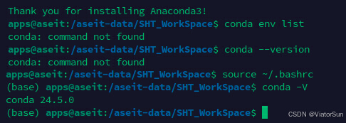

## 1、安装 conda

conda 分为 anaconda 和 miniconda，anaconda 是一个包含了许多常用库的集合版本，miniconda 是精简版本（只包含conda、pip、zlib、python 以及它们所需的包），剩余的通过 conda install command 命令自行安装即可；

- miniconda 官网：https://conda.io/miniconda.html

- anaconda 官网：https://www.anaconda.com/download

点击安装即可，不需要另外安装 Python运行环境，安装过程中，出现 Advanced options选项，第一个选项是将Anaconda的路径加入环境变量，第二个是默认将conda安装的 Python 定为系统使用的默认版本；

检查 conda 是否安装成功，返回conda版本号则说明安装成功

```
conda --version
```

升级 conda

```
conda update conda
```

安装完conda之后，可能报没有conda，如下图所示，只需要 `source ~/.bashrc` 即可



## 2、添加镜像源

```
conda config --add channels https://mirrors.tuna.tsinghua.edu.cn/anaconda/pkgs/free/conda config --add channels https://mirrors.tuna.tsinghua.edu.cn/anaconda/pkgs/main/conda config --add channels https://mirrors.tuna.tsinghua.edu.cn/anaconda/cloud/conda-forge/conda config --add channels https://mirrors.tuna.tsinghua.edu.cn/anaconda/cloud/bioconda/conda config --add channels https://mirrors.bfsu.edu.cn/anaconda/cloud/bioconda/conda config --add channels https://mirrors.bfsu.edu.cn/anaconda/cloud/conda-forge/conda config --add channels https://mirrors.bfsu.edu.cn/anaconda/pkgs/free/conda config --add channels https://mirrors.bfsu.edu.cn/anaconda/pkgs/main/
```

```
目前国内提供conda镜像的大学清华大学: https://mirrors.tuna.tsinghua.edu.cn/help/anaconda/北京外国语大学: https://mirrors.bfsu.edu.cn/help/anaconda/南京邮电大学: https://mirrors.njupt.edu.cn/南京大学: http://mirrors.nju.edu.cn/重庆邮电大学: http://mirror.cqupt.edu.cn/上海交通大学: https://mirror.sjtu.edu.cn/哈尔滨工业大学: http://mirrors.hit.edu.cn/#/home(目测哈工大的镜像同步的是最勤最新的)
```

查看已经添加的channels

```
conda config --get channels
```

已添加的channel在哪里查看

- windows 用户在C:\\Users\\～\\下面

- windows 用户无法直接创建 .condarc 文件，需要通过指令  
    conda config --set show\_channel\_urls yes  
    生成该文件，然后可以通过 vim/notepad++ 再修改

恢复默认镜像源

```
conda config --remove-key channels
```

## 3、创建/删除 环境

命令创建python版本为X.X、名字为 env\_name 的虚拟环境。env\_name文件可以在Anaconda安装目录 envs文件下找到。

```
conda create -n env_name python=3.8
```

在conda环境下，输入以下命令查看当前存在的环境：

```
conda env list（或者输入conda info --envs也是一样滴）
```

删除环境

```
conda remove -n env_name --allconda env remove -n env_name
```

重命名环境（将 --clone 后面的环境重命名成 -n 后面的名字）

```
conda create -n torch --clone py3 # 将 py3 重命名为 torch
```

创建完成环境之后，系统会提示如何 进入和退出环境，如下

```
conda activate env_name # 进入环境conda deactivate # 退出环境
```

## 4、在conda环境内使用 pip安装

在anaconda下用pip装包的原因：尽管在anaconda下我们可以很方便的使用conda install来安装我们需要的依赖，但是anaconda本身只提供部分包，远没有pip提供的包多，有时conda无法安装我们需要的包，我们需要用pip将其装到conda环境里。

- 首先进入指定的环境中，然后再通过 pip 安装即可，命令如下  
    conda activate env\_name # 进入环境

- conda install numpy=1.93  
    pip install numpy==1.93

- conda deactivate # 安装完之后记得退出环境

## 5、安装/删除 命令:

```
conda install gatkconda install gatk=3.7 # 安装特定的版本:conda install -n env_name gatk # 将 gatk 安装都 指定env_name中
```

安装完成后，可以用“which 软件名”来查看该软件安装的位置：

```
which gatk
```

查看已安装的库:

```
conda listconda list -n env_name # 查看 env_name 下的库
```

更新指定库:

```
conda update gatkconda update --all # 升级全部库
```

删除环境中的某个库：

```
conda remove --name env_name gatk
```

## 6、卸载 conda

1. 清理：rm -rf /opt/anaconda3

3. 删除 ~/.bash\_profile中anaconda的环境变量

5. 删除Anaconda的可能存在隐藏的文件

7. rm -rf ~/.condarc ~/.conda ~/.continuum

9. 经过以上步骤后，Anaconda 就被彻底删除了。

## 7、迁移 conda 环境

```
conda pack -n 虚拟环境名称 -o environment.tar.gz
```

```
如果报错：No command ‘conda pack’尝试使用：conda install -c conda-forge conda-pack
```

复制压缩文件到新的电脑环境

- 进到conda的安装目录：/anaconda(或者miniconda)/envs/

- 对于 ubuntu 可以通过 whereis conda 查看 conda的安装路径

- cd 到 conda 的安装路径

- mkdir environment

- 解压conda环境：

- tar -xzvf environment.tar.gz -C environment

使用conda env list查看虚拟环境，进入迁移的环境内，通过 pip list 查看迁移前后 包的安装情况

> # CondaHTTPError 问题

对于创建环境或者安装库的时候可能出现 CondaHTTPError 的问题，提供一下两种解决方案

- 添加国内镜像源，可以参考上面【2】的添加办法，或者采用以下方法皆可  
    在系统C盘用户文件夹下面，会有一个 .condarc 的文件，在此可以手动自行添加 channels

- 可能是现有的库文件版本较低，可以尝试升级下现有的库，方法如下

```
conda update --all # 升级全部库
```
