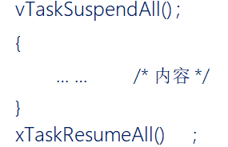
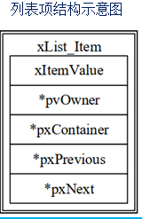
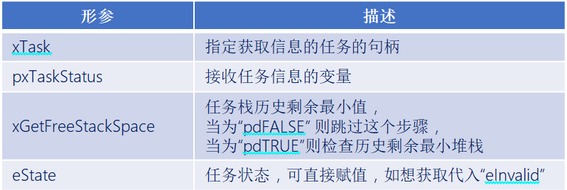
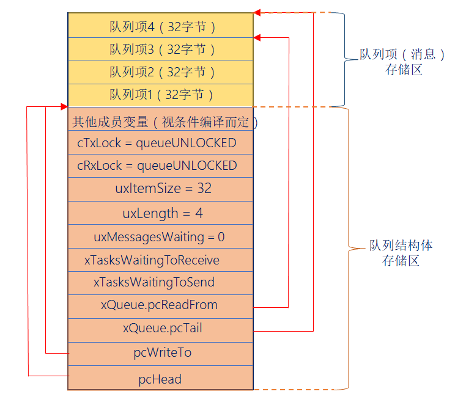
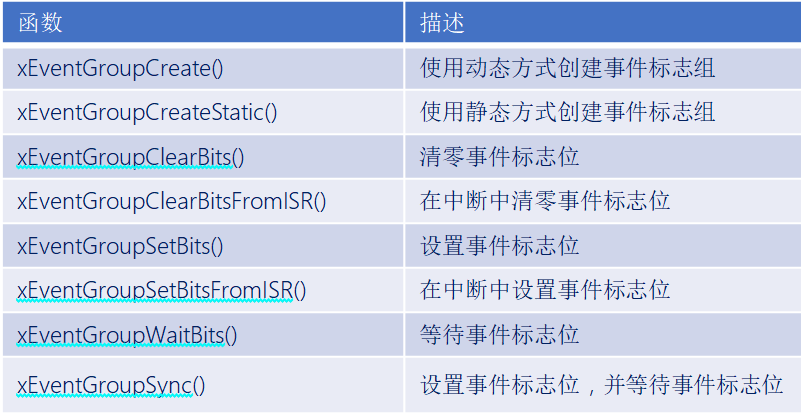
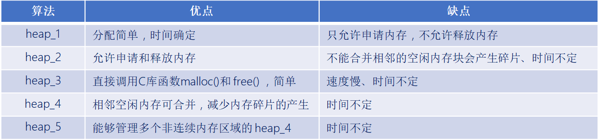

# FreeRTOS基础知识

* * *

## 一、任务调度简介(熟悉)

### 1、什么是任务调度器

答：任务调度器就是使用相关的调度算法来决定当前需要执行的哪个任务。

### 2、FreeRTOS的任务调度方式

答：FreeRTOS一共支持三种任务调度方式：

- **抢占式调度** ：主要是针对优先级不同的任务，每一个任务都有一个任务优先级，优先级高的任务可以抢占低优先级的任务的CPU使用权。

- **时间片调度** ：主要针对相同优先级的任务，当多个任务的优先级相同时，任务调度器会在每个时钟节拍到来的时候切换任务。

- **协程式调度** ：其实就是轮询，当前执行任务将会一直运行，同时高优先级的任务不会抢占低优先级任务。FreeRTOS现在虽然还在支持，但官方已经明确表示不再更新协程式调度。

### 3、抢占式调度过程

答：

运行过程如下：

1. 首先Task1在运行中，在这个过程中Task2就绪了，在抢占式调度器的作用下，Task2会抢占Task1的运行。

3. Task2运行过程中，Task3就绪了，在抢占式调度器的作用下Task3会抢占Task2的运行。

5. Task3运行过程中，Task3阻塞了(系统延时或者等待信号等)，此时就绪中，优先级最高的任务Task2执行。

7. Task3阻塞解除了(延时到了或者接收到信号量)，此时Task3恢复到就绪态中，抢占Task2的运行。

总结：

1. 高优先级任务，优先执行。

3. 高优先级任务不停止，低优先级任务无法执行。

5. 被抢占的任务将会进去就绪态。

### 4、什么是时间片

答：同等优先级任务轮流享有相同的CPU时间(可设置)，叫做时间片，在FreeRTOS中，一个时间片等于SysTick中断周期。

### 5、时间片调度过程

答：

运行过程如下：

1. 首先Task1运行完一个时间片后，切换至Task2运行。

3. Task2运行完一个时间片后，切换至Task3运行。

5. Task3运行过程中(还不到一个时间片)，Task3阻塞了(系统延时或者等待信号量等)，此时直接切换到下一个任务Task1执行。

7. Task1运行完一个时间片后，切换至Task2运行。

总结：

1. 同等优先级任务，轮流执行。

3. 一个时间片大小，取决滴答定时器中断周期。

5. 没有用完的时间片不会再使用，任务Task3下次得到执行时间还是按照一个时间片的时钟节拍运行。

* * *

## 二、任务状态( 熟悉)

### 1、FreeRTOS的任务状态

答：FreeRTOS中任务存在4种状态：

- **运行态** ：正在执行的任务，该任务就处于运行状态(注意：在STM32中，同一时间仅一个任务处于运行态)。

- **就绪态** ：如果该任务已经能够被执行，但当前还未被执行，那么该任务处于就绪态。

- **阻塞态** ：如果一个任务因为延时或者等待外部事件发生，那么这个任务就处于阻塞态。

- **挂起态** ：类似于暂停，调用函数vTaskSuspend()进入挂起态，需要调用解挂函数vTaskResume()才可以进入就绪态。

### 2、四种任务状态之间的转换关系

答：


总结：

1. 仅就绪态可以转换成运行态。

3. 其他状态的任务想要运行，必须先转换成就绪态。

### 3、任务状态列表

答：任务的四种状态中，除了运行态，其他三种任务状态的任务都有其对应的任务状态列表。

- **就绪列表** ： pxReadyTasksLists\[x\]，其中x代表人物优先级数值。

- **阻塞列表** ：pxDelayedTaskList

- **挂起列表** ：xSuspendedTaskList

* * *

# FreeRTOS系统配置文件详解

* * *


### 1、FreeRTOSConfig.h配置文件作用

答：对FreeRTOS进行功能配置和裁剪，以及API函数的使能。

### 2、学习途径

1. 官方的在线文档中有详细说的说明：https://www.freertos.org/a00110.html 。

3. 正点原子《FreeRTOS开发指南》第三章的内容 --- FreeRTOS系统配置。

### 3、配置文件中相关宏的分类

答：相关宏大致可以分为三类。

- **‘INCLUDE’开头** --- 配置FreeRTOS中可选的API函数。

- **’config‘开头** --- 完成FreeRTOS的功能配置和裁剪(如调度方式、使能信号量功能等)。

- **其他配置** --- PendSV宏定义、SVC宏定义。

* * *


# FreeRTOS任务创建和删除

* * *

## 一、任务创建和删除API函数(熟悉)

### 1、任务创建和删除的本质

答：任务创建和删除的本质就是调用FreeRTOS的API函数。


### 2、任务动态创建和静态创建的区别

答：

- **动态创建任务** ：任务的任务控制块以及任务的栈空间所需的内存，均由FreeRTOS从FreeRTOS管理的堆中分配。

- **静态创建任务** ：任务的任务控制块以及任务的栈空间所需的内存，需要用户分配提供。

### 3、任务控制块结构体成员介绍

答：


总结：

1. 任务栈栈顶，在任务切换时的任务上下文保存、任务恢复息息相关。

3. 每个任务都有属于自己的任务控制块，类似身份证。

### 4、什么是临界区保护

答：临界区保护，保护那些不想被打断的程序段，关闭freertos所管理的中断，中断无法打断，滴答中断和PendSV中断无法进行不能实现任务调度 。

### 5、动态创建优点

答：动态创建使用起来相对简单。在实际的应用中，动态方式创建任务是比较常用的，除非有特殊的需求，一般都会使用动态方式创建任务 。

### 6、静态创建优点

答：静态创建可将任务堆栈放置在特定的内存位置，并且无需关心对内存分配失败的处理 。

### 7、创建任务时任务堆栈所存内容

答：


1. 寄存器下PSR被初始为0x01000000，其中bit24被置1，表示使用Thumb指令。

3. 寄存器PC被初始化为任务函数指针(任务A，即我们写的任务函数的地址)，这样当某次任务切换后，任务A获得CPU控制权，任务函数(任务A)被出栈到PC寄存器，之后会执行任务A的代码。

5. LR寄存器初始化为函数指针prvTaskExitError，这个函数是FreeRTOS提供的，是一个出错处理函数。

7. 子函数的调用通过寄存器R0~R3传递参数，创建任务时，我们传入的参数被保存到R0中，用来向任务传递参数。

* * *

## 二、任务创建---动态方法(掌握)

### 1、动态任务创建函数

答：

函数参数：

函数返回值：


### 2、实现动态创建任务流程

答：用起来只需三步。

1. 将FreeRTOSConfig.h文件中宏configSUPPORT\_DYNAMIC\_ALLOCATION配置为1。

3. 定义函数入口参数。

5. 编写任务函数。

动态任务创建函数创建的任务会立刻进入就绪态，由任务调度器调度运行。

### 3、动态任务创建函数内部实现简述

答：

1. 申请堆栈内存&任务控制块内存。

3. TCB结构体(任务控制块)成员赋值。

5. 添加新任务到就绪列表中。

* * *

## 三、任务创建---静态方法(掌握)

### 1、静态任务创建函数

答：

函数参数：

函数返回值：


### 2、实现静态创建任务流程

答：用起来只需五步。

1. 将FreeRTOSConfig.h文件中宏configSUPPORT\_STATIC\_ALLOCATION配置为1。

3. 定义空闲任务&定时器任务的任务堆栈以及TCB。

5. 实现两个接口函数(vAppLicationGetldleTaskMemory() 空闲任务接口函数和vApplicationGetTimerTaskMemory()定时器任务接口函数)。

7. 定义函数入口参数。

9. 编写任务函数。

静态任务创建函数创建的任务会立刻进入就绪态，由任务调度器调度运行。

### 3、静态任务创建函数内部实现简述

答：

1. TCB结构体成员赋值。

3. 添加新任务到就绪列表中。

* * *

## 四、任务删除

### 1、任务删除函数

答：


任务删除函数用于删除已经被创建的任务，被删除的任务将从就绪任务列表、阻塞任务列表、挂起任务列表和事件列表中移除。

注意：

1. 当传入的参数为NULL，则代表删除任务自身(当前正在运行的任务)。

3. 空闲任务会负责释放被删除任务中由系统分配的内存，但是由用户在任务删除前申请的内存空间，必须用户在任务被删除前提前释放，否则将会导致内存泄漏。

### 2、删除任务流程

答：用起来只需两步。

1. 使用删除任务函数，将FreeRTOSConfig.h文件中宏INCLUDE\_vTaskDelete配置为1。

3. 入口参数输入需要删除的任务句柄(NULL代表删除本身)。

### 3、删除任务函数内部实现简述

答：

1. 获取所要删除的任务控制块 --- 通过传入的任务句柄，判断所需要删除哪个任务，NULL代表删除自身。

3. 将被删除任务移除所在列表 --- 将该任务所在列表中移除，包括：就绪、阻塞、挂起、事件等列表。

5. 判断所需要删除的任务

- 删除任务自身，需要先添加到等待删除列表，内存释放将在空闲任务执行。

- 删除其他任务，释放内存，任务数量。

1. 更新下个任务的阻塞时间 --- 更新下一个任务的阻塞超时时间，以防止被删除的任务就是下一个阻塞超时的任务。

* * *

# FreeRTOS的任务挂起与恢复

* * *

## 一、任务挂起和任务恢复介绍(熟悉)

### 1、任务的挂起与恢复的API函数

答：


- **挂起**：挂起任务类似暂停，可恢复；删除任务，无法恢复，类似“人死两清”。

- **恢复**：恢复被挂起的任务。

- **“FromISR”**：带有FromISR后缀是在中断函数中专用的API函数。

* * *

## 二、任务挂起(熟悉)

### 1、任务挂起函数介绍

答：


任务挂起函数用于挂起任务，使用时需要将将FreeRTOSConfig.h文件中宏INCLUDE\_vTaskSuspend配置为1。

无论优先级如何，被挂起的任务都将不再被执行，直到任务被恢复。

注意：当传入的参数是NULL，则代表挂起任务自身(当前正在运行的任务)。

### 2、任务挂起函数内部实现

答：

1. 获取所要挂起任务的控制块。（根据任务句柄获取任务控制块，如果任务句柄为NULL，表示挂起任务本身。）

3. 移除所在列表。（将要挂起的任务从相应的状态列表和事件列表中移除。）

5. 插入挂起任务列表。（将待挂起任务的任务状态列表项插入到挂起状态列表末尾。）

7. 判断任务调度器是否运行。（判断任务调度器是否运行，在运行，更新下一次阻塞时间，防止被挂起任务为下一个阻塞超时任务。）

9. 判断待挂起任务是否为当前任务。（如果挂起的是任务自身，且调度器正在运行，需要进行一次任务切换；调度器没有运行，判断挂起任务数是否等于任务总数，是：当前控制块赋值为NULL，否：寻找下一个最高优先级任务。）

* * *

## 三、任务恢复(熟悉)

### 1、任务恢复函数介绍(任务中恢复)

答：

.png)

使用该函数时需要将FreeRTOSConfig.h文件中宏INCLUDE\_vTaskSuspend配置为1。

注意：任务无论被vTaskSuspend()挂起多少次，只需在任务中调用vTaskResume()恢复一次就能继续运行，且被恢复的任务会进入就绪态。

### 2、任务恢复函数(任务中恢复)内部实现

答：

1. 恢复任务不能是正在运行任务。

3. 判断任务是否子啊挂起列表中。（是：就会将该任务在挂起列表中移除，将该任务添加到就绪列表中。）

5. 判断恢复任务优先级。（判断恢复的任务优先级是否大于当前正在运行的任务，是的话，执行任务切换。）

### 3、任务恢复函数介绍(中断中恢复)

答：

.png)

使用该函数注意要将FreeRTOSConfig.h文件中宏INCLUDE\_vTaskSuspend和INCLUDE\_xTaskResumeFromISR配置为1。

该函数专用于中断服务函数中，用于解挂被挂起任务。

注意：中断服务程序中要调用freeRTOS的API函数则中断优先级不能高于FreeRTOS所管理的最高优先级。

### 4、任务恢复函数(中断中恢复)内部实现

答：

1. 关闭freertos可管理中断，防止被其他的中断打断，并返回关闭前basepri寄存器的值。

3. 判断是否有挂起任务。

5. 将前面保存的basepri的值，恢复回来。

7. 返回xYieldRequired的值 用于决定是否需要进行任务切换。

* * *

# FreeRTOS中断管理简介

* * *

## 一、中断介绍(了解)

### 1、什么是中断

答：让CPU打断正常运行的程序，转而去处理紧急的事件(程序)，就叫中断。


### 2、中断执行机制

答：可简单概括为三步：

1. **中断请求** ：外设产生中断请求(如：GPIO外部中断、定时器中断…)。

3. **响应中断** ：CPU停止执行当前程序，转而执行中断处理程序(ISR)。

5. **退出中断** ：执行完毕，返回被打断的程序处，继续往下执行。

* * *

## 二、中断优先级分组设置(熟悉)

### 1、中断优先级分组介绍

答：ARM Cortex-M 使用了8位宽的寄存器来配置中断的优先等级，这个寄存器就是中断优先级配置寄存器。但STM32只用了中断优先级配置寄存器的高4位\[7:4\]，所以STM32提供了最大16级(0~15)的中断优先等级。


### 2、什么是抢占优先级，什么是子优先级

答：STM32的中断优先级可以分为抢占优先级和子优先级。

- **抢占优先级** ：抢占优先级的中断可以打断正在执行但抢占优先级低的中断。

- **子优先级** ：当同时发生具有相同抢占优先级的两个中断时，子优先级数小的优先执行。

注意 ：中断优先级(抢占优先级和子优先级)数值越小，优先级越高。

### 3、中断优先级配置方式

答：一共有5种配置方式，对应着中断优先级分组的5个组。


注意：FreeRTOS中为了方便管理，采用第4号(NVIC\_PriorityGroup\_4)分配方式。

### 4、FreeRTOS中对中断优先级的管理

答：

1. 低于configMAX\_SYSCALL\_INTERRUPT\_PRIORITY优先级的中断才允许调用FreeRTOS的API函数。

3. 建议将所有优先级位指定为抢占优先级位，方便FreeRTOS管理。

5. 中断优先级数值越小越优先，任务优先级数值越大越优先。


* * *

## 三、中断相关寄存器(熟悉)

### 1、系统中断优先级配置寄存器

答：三个系统中断优先级配置寄存器，分别为 SHPR1、 SHPR2、 SHPR3 。

- SHPR1寄存器地址：0xE000ED18~0xE000ED1B

- SHPR2寄存器地址：0xE000ED1C~0xE000ED1F

- SHPR3寄存器地址：0xE000ED20~0xE000ED23


注意：FreeRTOS主要是使用SHPR3寄存器对**PendSV**和**Systick**中断优先级进行设置(设置为最低优先级)。

### 2、FreeRTOS如何配置PendSV和Systick中断优先级

答：


注意：在FreeRTOS系统中PendSV和SysTick设置最低优先级。

### 3、为什么将PendSV和SysTick设置最低优先级

答：保证系统任务切换不会阻塞系统其他中断的响应。

### 4、中断屏蔽寄存器

答：三个中断屏蔽寄存器，分别为PRIMASK、FAULTMASK和BASEPRI 。


FreeRTOS所使用的中断管理就是利用的**BASEPRI**这个寄存器。

### 5、BASEPRI中断屏蔽寄存器

答：BASEPRI：屏蔽优先级低于某一个阈值的中断，当设置为0时，则不关闭任何中断。

比如： BASEPRI设置为0x50，代表中断优先级在5~15内的均被屏蔽，0~4的中断优先级正常执行


### 6、FreeRTOS的关中断程序

答：

### 7、FreeRTOS的开中断程序

答：

### 8、中断服务函数调用FreeRTOS的API函数需注意

答：

1. 中断服务函数的优先级需在FreeRTOS所管理的范围内。

3. 在中断服务函数里边需调用FreeRTOS的API函数，必须使用带“FromISR”后缀的函数。

* * *

# FreeRTOS临界段代码保护

* * *

## 一、临界段代码保护简介(熟悉)

### 1、什么是临界段

答：临界段代码也叫临界区，是指那些必须完整运行，不能被打断的代码片段。运行时临界段代码时需要关闭中断，当处理完临界段代码以后再打开中断。

### 2、适用什么场合

答：

- **外设** ：需要严格按照时序初始化的外设，如IIC、SPI等。

- **系统** ：系统自身需求，如任务切换过程等。

- **用户** ：用户需求，如我们写的任务创建任务。

### 3、什么可以打断当前程序的运行

答：中断、任务调度。

* * *

## 二、临界段代码保护函数介绍(掌握)

### 1、临界段代码保护函数

答：


任务级临界区调用格式示例：


中断级临界区调用格式示例：


### 2、临界段代码保护函数使用特点

答：

1. 成对使用。

3. 支持嵌套。

5. 尽量保持临界段耗时短。

* * *

# 任务调度器的挂起和恢复

* * *

### 1、任务调度器挂起和恢复函数

答：


使用格式示范：



### 2、任务调度器挂起和恢复的特点

答：

1. 与临界区不一样的是，挂起任务调度器，未关闭中断。

3. 它仅仅是防止任务之间的资源争夺，中断照样可以直接响应。

5. 挂起任务调度器的方式，适用于临界区位于任务与任务之间；既不用去延时中断响应，又可以做到临界区的安全。

### 3、挂起任务调度器：vTaskSuspendAll()

答：调用一次挂起调度器，该变量uxSchedulerSuspended就加一 ，变量uxSchedulerSuspended的值，将会影响Systick触发PendSV中断，即影响任务调度。

### 4、恢复任务调度器：xTaskResumeAll()

答：调用一次恢复调度器，该变量uxSchedulerSuspended就减一 ，如果uxSchedulerSuspended等于0，则允许调度 。

1. 当任务数量大于0时，恢复调度器才有意义，如果没有一个已创建的任务就无意义。

3. 移除等待就绪列表中的列表项,恢复至就绪列表,直到xPendingReadyList列表为空。

5. 如果恢复的任务优先级比当前正在执行任务优先级更高，则将xYieldPending赋值为pdTRUE,表示需要进行一次任务切换。

7. 在调度器被挂起的期间内,是否有丢失未处理的滴答数。 xPendedCounts是丢失的滴答数，有则调用xTasklncrementTickf() 补齐弄失的滴答数。

9. 判断是否允许任务切换。

11. 返回任务是否已经切换；已经切换返回pdTRUE；反之返回pdFALSE。

# FreeRTOS的列表和列表项

* * *

## 一、列表和列表项的简介(熟悉)

### 1、什么是列表

答：列表是FreeRTOS中的一个数据结构，概念上和链表有点类似，列表被用来跟踪FreeRTOS中的任务。

### 2、什么列表项

答：列表项就是存放在列表中的项目。

### 3、列表和列表项关系

答：列表相当于链表，列表项相当于节点，FreeRTOS中的列表是一个双向环形链表。


### 4、列表(链表)和数组的区别

答：

- **列表的特点**：列表项间的地址非连续的，是人为的连接到一起的。列表项的数目是由后期添加或删除的个数决定的，随时可以改变。

- **数组的特点**：数组成员地址是连续的，数组在最初确定了成员数量后，后期将无法改变。

### 5、OS中为什么使用列表

答：在OS中任务的数量是不确定的，并且任务状态是会发生改变的，所以非常适用列表(链表)这种数据结构。

### 6、列表结构体介绍

答：有关列表的东西均在文件list.c和list.h中，以下是列表结构体：

1. 在结构体中，包含两个宏(listFIRST\_LIST\_INTEGRITY\_CHECK\_VALUE 和 listSECOND\_LIST\_INTEGRITY\_CHECK\_VALUE)，这两个宏是确定的已知常量，FreeRTOS通过检查这两个常量的值，来判断列表的数据在程序运行过程中，是否遭到破坏，该功能一般用于测试，默认是不开启的(我们一般不用去理会)。

3. 成员uxNumberOfltems，用于记录列表中的列表项的个数(不包括xListEnd)。

5. 成员pxIndex用于指向列表中的某个列表项，一般用于遍历列表中的所有列表项。

7. 成员变量xListEnd是一个迷你列表项，排在最末尾。

列表结构示意图：


### 7、列表项结构体介绍

答：列表项是列表中用于存放数据的地方，在list.h文件中，列表项的相关结构体定义：


1. 成员变量xItemValue为列表项的值，这个值多用于按升序对列表中的列表项进行排序。

3. 成员变量pxNext和pxPrevious分别用于指向列表中列表项的下一个列表项和上一个列表项。

5. 成员变量pxOwner用于指向包含列表项的对象(通常是任务控制块)。

7. 成员变量pxContainer用于执行列表项所在列表。

列表项结构体示意图：



### 8、迷你列表项

答：迷你列表项也是列表项，但迷你列表项仅用于标记列表的末尾和挂载其他插入列表中的列表项。


1. 成员变量xItemValue为列表项的值，这个值多用于按升序对列表中的列表项进行排序。

3. 成员变量pxNext和pxPrevious分别用于指向列表中列表项的下一个列表项和上一个列表项。

5. 迷你列表项只用于标记列表的末尾和挂载其他插入列表中的列表项，因此不需要成员变量pxOwner和pxContainer，以节省内存开销。

迷你列表项示意图：


### 9、列表和列表项关系事例

答：

列表初始状态：


列表插入两个列表项：


列表当前状态：


* * *

## 二、列表相关的API函数介绍(掌握)

### 1、列表API函数

答：


### 2、初始化列表函数vListInitialise()

答：


函数参数：


列表初始化后示意图：


### 3、初始化列表项函数vListInitialiseItem()

答：


函数参数：


列表初始化后示意图：


### 4、列表插入列表项函数vListInsert()

答：此函数用于将待插入列表的列表项按照列表项值升序进行排序，有序地插入到列表中 。


函数参数：


总结：函数vListInsert()，是将插入列表的列表项按照列表项值升序进行排列，有序地插入到列表中。

### 5、列表末尾插入列表项vListInsertEnd()

答：此函数用于将待插入列表的列表项插入到列表 pxIndex 指针指向的列表项前面，是一种无序的插入方法。


函数参数：


### 6、列表项移除函数uxListRemove()

答：此函数用于将列表项从列表项所在列表中移除。


函数参数：


函数返回值：


* * *

# FreeRTOS任务调度

* * *

## 一、开启任务调度器(熟悉)

### 1、开启任务调度器函数vTaskStartScheduler()

答：作用：启动任务调度器，任务调度器启动后，FreeRTOS便会开始进行任务调度。

该函数内部实现，如下：

1. 创建空闲任务。

3. 如果使能软件定时器，则创建定时器任务。

5. 关闭中断，防止调度器开启之前或过程中，受到中断干扰，会在运行第一个任务时打开中断。

7. 初始化全局变量，并将任务调度器的运行标志设置为已运行。

9. 初始化任务运行时间统计功能的时基定时器。

11. 调用函数xPortStartScheduler()。

### 2、配置硬件架构及启动第一个任务函数xPortStartScheduler()

答：作用：该函数用于完成启动任务调度器中与硬件架构相关配置部分，以及启动第一个任务。

该函数内部实现，如下：

1. 检测用户在FreeRTOSConfig.h文件中对中断的配置是否有误。

3. 配置PendSV和SysTick的中断优先为最低优先级。

5. 调用函数vPortSetupTimerInterrupt()配置SysTick。

7. 初始化临界区嵌套计数器为0。

9. 调用函数prvEnableVFP()使能FPU。

11. 调用函数prvStartFirstTask()启动第一个任务。

### 3、SysTick滴答定时器

答：


### 4、堆和栈的地址生长方向

答：

**堆** 的生长方向向上，内存地址由低到高；

**栈** 的生长方向向下，内存地址由高到低。

### 5、压栈和出栈的地址增长方向

答：堆栈的生长方向从最本质的理解是堆栈入栈方向是从高地址向地址还是低地址向高地址。

从高地址向低地址生长一般叫做向下生长，也叫作逆向生长。

从低地址向高地址生长一般叫做向上生长，也叫作正向生长。

一般来说堆栈是逆向生长的。

- 51单片机的堆栈生长方向为正向生长，因为执行PUSH指令时先将SP的值加1再将指定的8位数据单元的内容入栈。

- 80x86微机的堆栈生长方向为逆向生长，因为执行PUSH指令时先将SP的值减2再将指定的16位数据单元内容入栈。高字节放高地址，低字节放低地址（小端模式）。

- STM32的堆栈生长方向是逆向生长。

注意：C语言中传递参数，一般是从右向左入栈的，所以最左边的参数是最先出栈的。

### 5、知识补充

1s = 1000ms

1ms = 1000us

1us = 1000ns

1Mhz = 1000 000hz

hz转换为s公式：1s = 1/(1hz)

例如：10hz等于0.1s (0.1s = 1 / 10hz)。

* * *

## 二、启动第一个任务(熟悉)

### 1、启动第一个任务涉及的关键函数

答：

prvStartFirstTask() /\* 启动第一个任务 \*/

vPortSVCHandle() /\* SVC中断服务函数 \*/

### 2、想象一下应该如何启动第一个任务

答：假设我们要启动的第一个任务是任务A，那么就需要将任务A的寄存器值恢复到CPU寄存器中。任务A的寄存器值，在一开始创建任务时就已经保存在任务堆栈里边了！

注意：

1. 中断产生时，硬件自动将xPSR、PC(R15)、LR(R14)、R12、R3~R0保存和恢复，而R4~R11需要手动保存和恢复。

3. 进入中断后，硬件会强制使用MSP指针，此时LR(R14)的值将会被自动更新为特殊的EXC\_RETURN。

### 3、prvStartFirstTask() 介绍

答：用于初始化启动第一个任务前的环境，主要是重新设置MSP指针，并使能全局中断，最后触发SVC中断。

### 4、什么是MSP指针

答：程序在运行过程中需要一定的栈空间来保存局部变量等信息。当有信息保存到栈中时，MCU会自动更新SP指针，ARM Cortex-M内核提供了两个栈空间：

- **主堆栈指针(MSP)**：它是给OS内核、异常服务程序以及所有需要特权访问的应用程序代码来使用的。

- **进程堆栈指针(PSP)**：用于常规的应用程序代码(不处于异常服务程序中时使用)。

在FreeRTOS中，中断使用MSP(主堆栈)，中断以为使用PSP(进程堆栈)。

注意：在RTOS中是使用双堆栈指针(即使用MSP和PSP)，但在裸机中是只使用MSP(主堆栈)。

### 5、为什么汇编代码要PRESERVE8(八字节对齐)

答：因为栈在任何时候都是需要4字节对齐的，而在调用入口得8字节对齐，在C编程的时候，编译器会自动帮我们完成对齐操作，而汇编则需要手动对齐。

### 6、prvStartFirstTask()为什么要操作0XE00ED08

答：因为需要从0XE000ED08获取向量表的偏移，为啥要获取向量表呢？因为向量表的第一个是MSP指针！获取MSP的初始值的思路是先根据向量表的位置寄存器VTOR(0XE000ED08)来获取向量表存储的地址，再根据向量表存储的地址，来访问第一个元素，也就是初始的MSP。

### 7、vPortSVCHandle()介绍

答：当使能了全局中断，并且手动触发SVC中断后，就会进到SVC的中断服务函数中。

1. 通过pxCurrentTCB获取优先级最高的就绪态任务的任务栈地址，优先级最高的就绪态任务是系统将要运行的任务。

3. 通过任务的栈顶指针，将任务栈中的内容出栈到CPU寄存器中，任务栈中的内容在调用任务创建函数的时候，已初始化，然后设置PSP指针。

5. 通过往BASEPRI寄存器中写0，允许中断。

7. R14是链接寄存器LR，在ISR中(此刻我们在SVC的ISR中)，它记录了异常返回值EXC\_RETURN，而EXC\_RETURN只有6个合法的值(M4、M7)，如下表所示：.png)

注意：

1. SVC中断只在启动第一次任务时会调用一次，以后均不调用。

3. R14(LR链接寄存器)，在异常处理期间(就是中断函数中)，LR存的是特殊的EXC\_RETURN(异常返回)数值，该数值会在异常处理结束时触发异常返回；在普通函数中，LR用于函数或者子程序调用时返回地址的保存。

### 8、出栈/压栈汇编指令详解

答：

1. **出栈（恢复现场）**，方向：从下往上（低地址往高地址）：假设r0地址为0x04汇编指令示例： ldmia r0!, {r4-r6} /\* 任务栈r0地址由低到高，将r0存储地址里面的内容手动加载到 CPU寄存器r4、r5、r6 \*/ r0地址(0x04)内容加载到r4，此时地址r0 = r0+4 = 0x08 r0地址(0x08)内容加载到r5，此时地址r0 = r0+4 = 0x0C r0地址(0x0C)内容加载到r6，此时地址r0 = r0+4 = 0x10

3. **压栈（保存现场）**，方向：从上往下（高地址往低地址）：假设r0地址为0x10汇编指令示例： stmdb r0!, {r4-r6} } /\* r0的存储地址由高到低递减，将r4、r5、r6里的内容存储到r0的任务栈里面。 \*/ 地址：r0 = r0-4 = 0x0C，将r6的内容（寄存器值）存放到r0所指向地址(0x0C) 地址：r0 = r0-4 = 0x08，将r5的内容（寄存器值）存放到r0所指向地址(0x08) 地址：r0 = r0-4 = 0x04，将r4的内容（寄存器值）存放到r0所指向地址(0x04)

* * *

## 三、任务切换(掌握)

### 1、任务切换的本质

答：任务切换的本质就是CPU寄存器内容的切换。

假设当由任务A切换到任务B时，主要分为两步：

**第一步**：需暂停任务A的执行，并且将此时任务A寄存器保存到任务堆栈中，这个过程叫做保存现场；

**第二步**：将任务B的各个寄存器值(被存于任务堆栈中)恢复到CPU寄存器中，这个过程叫做恢复现场。

对任务A保存现场，对任务B恢复现场，这个过程称为：**上下文切换**。

### 2、任务切换过程

答：

注意：任务切换的过程在PendSV中断服务函数里边完成。

### 3、PendSV中断是如何触发的

答：

1. 滴答定时器中断调用

3. 执行FreeRTOS提供的相关API函数：portYIELD()。

本质是通过中断控制和状态寄存器ICSR的bit28写入1挂起PendSV来启动PendSV中的。


上表摘取于《Cortex M3权威指南(中文)》第131页。

### 4、在PendSV中断中PSP和MSP

答：在进入PendSV异常前的自动压栈使用的是进程堆栈(PSP)，正式进入到PendSV异常Handle后才自动改为主堆栈(MSP)，退出异常时切回PSP，并且从进程堆栈(PSP)上弹出数据(出栈)。


注意：在PendSV中断中时，CPU使用的是MSP，但我们要处理的是PSP的数据存取。

### 5、查找最高优先级任务

答：

vTaskSwitchContext( ) /\* 查找最高优先级任务 \*/

taskSELECT\_HIGHEST\_PRIORITY\_TASK( ) /\* 通过这个函数完成 \*/

### 6、前导置零指令

答：


所谓的前导置零指令，大家可以简单理解为计算一个 32位数，出现第一个1前头部 0 的个数。

* * *

# FreeRTOS时间片轮询

* * *

### 1、时间片轮询简介

答：同等优先级任务轮流享有相同的CPU时间(可设置)，叫**时间片**，在FreeRTOS中，一个时间片就等于SysTick中断周期。


运行过程如下：

1. 首先Task1运行完一个时间片后，切换至Task2运行。

3. Task2运行完一个时间片后，切换至Task3运行。

5. Task3运行过程中(还不到一个时间片)，Task3阻塞了(系统延时或等待信号量等)，此时直接切换到下一个任务Task1.

7. Task1运行完一个时间片后，切换Task2运行。

总结：

1. 同等优先级任务，轮流执行，时间片流转。

3. 一个时间片大小，取决为滴答定时器中断频率。

5. 注意没有完成的时间片不会再使用，下次任务Task3得到执行还是按照一个时间片的时钟节拍执行。

* * *

# FreeRTOS任务相关的其他API函数

* * *

## 一、FreeRTOS任务相关的其他API函数介绍

### 1、FreeRTOS任务相关API函数介绍(部分常用的)

答：


* * *

## 二、任务状态查询API函数

### 1、获取任务优先级函数

答：

```
UBaseType_t  uxTaskPriorityGet(  const TaskHandle_t xTask  )
```

此函数用于获取指定任务的任务优先级，使用该函数需要将宏 INCLUDE\_uxTaskPriorityGet 置1。

函数参数：


函数返回值：


### 2、修改任务优先级函数

答：

```
void vTaskPrioritySet( TaskHandle_t xTask , UBaseType_t uxNewPriority )
```

此函数用于改变某个任务的任务优先级，使用该函数需将宏 INCLUDE\_vTaskPrioritySet 为 1 。

函数参数：


### 3、获取系统任务数量函数

答：

```
UBaseType_t   uxTaskGetNumberOfTasks( void )
```

此函数用于获取系统中任务的任务数量。

函数返回值：


### 4、获取系统中所有任务状态信息函数

答：

```
UBaseType_t   uxTaskGetSystemState(   TaskStatus_t * const pxTaskStatusArray,
                                      const UBaseType_t uxArraySize,
                                      configRUN_TIME_COUNTER_TYPE * const pulTotalRunTime   )
```

此函数用于获取系统中所有任务的任务状态信息，使用该函数需将宏 configUSE\_TRACE\_FACILITY 置 1。

函数参数：


函数返回值：


参数成员pxTaskStatusArray的结构体：

```
typedef struct xTASK_STATUS
{
    TaskHandle_t                   xHandle;                     /* 任务句柄 */ 
    const char *                   pcTaskName;                  /* 任务名 */
    UBaseType_t                    xTaskNumber;                 /* 任务编号 */
    eTaskStatee                    CurrentState;                /* 任务状态 */
    UBaseType_t                    uxCurrentPriority;           /* 任务优先级 */
    UBaseType_t                    uxBasePriority;              /* 任务原始优先级*/
    configRUN_TIME_COUNTER_TYPE    ulRunTimeCounter;            /* 任务运行时间*/
    StackType_t *                  pxStackBase;                 /* 任务栈基地址 */
    configSTACK_DEPTH_TYPE         usStackHighWaterMark;        /* 任务栈历史剩余最小值 */
} TaskStatus_t;
```

### 5、获取系统中单个任务状态信息函数

答：

```
void vTaskGetInfo(  TaskHandle_t     xTask,
                    TaskStatus_t *   pxTaskStatus,
                    BaseType_t       xGetFreeStackSpace,
                    eTaskState       eState  )  
```

此函数用于获取指定的单个任务的状态信息，使用该函数需将宏 configUSE\_TRACE\_FACILITY 置 1

函数参数：



参数成员eState的结构体：

```
typedef enum
{
    eRunning = 0,       /* 运行态 */
    eReady,             /* 就绪态 */
    eBlocked,           /* 阻塞态 */
    eSuspended,         /* 挂起态 */
    eDeleted,           /* 任务被删除 */
    eInvalid            /* 无效 */ 
} eTaskState;
```

### 6、获取当前任务的任务句柄函数

答：

```
TaskHandle_t    xTaskGetCurrentTaskHandle( void )
```

此函数用于获取当前任务的任务句柄， 使用该函数需将宏 INCLUDE\_xTaskGetCurrentTaskHandle 置 1。

函数返回值：


### 7、通过任务名获取任务句柄函数

答：

```
TaskHandle_t xTaskGetHandle(const char * pcNameToQuery); 
```

此函数用于通过任务名获取任务句柄 ， 使用该函数需将宏 INCLUDE\_xTaskGetHandle 置 1。

函数参数：


函数返回值：


### 8、获取指定任务的任务堆栈历史最小剩余函数

```
UBaseType_t    uxTaskGetStackHighWaterMark( TaskHandle_t  xTask )
```

此函数用于获取指定任务的任务栈历史最小剩余堆栈；使用该函数需将宏 INCLUDE\_uxTaskGetStackHighWaterMark 置 1。

函数参数：


函数返回值：


### 9、查询指定任务运行状态函数

答：

```
eTaskState    eTaskGetState(TaskHandle_t xTask)
```

此函数用于查询某个任务的运行状态，使用此函数需将宏 INCLUDE\_eTaskGetState 置1

函数参数：


函数返回值：


参数成员xTask的结构体：

```
typedef enum
{
    eRunning = 0,    /* 运行态 */
    eReady,         /* 就绪态 */
    eBlocked,       /* 阻塞态 */
    eSuspended,     /* 挂起态 */
    eDeleted,       /* 任务被删除 */
    eInvalid        /* 无效 */ 
} eTaskState;
```

### 10、以“表格”的形式获取系统中任务信息函数

答：

```
void   vTaskList(char * pcWriteBuffer)
```

此函数用于以“表格”的形式获取系统中任务的信息 ；

使用此函数需将宏 configUSE\_TRACE\_FACILITY 和configUSE\_STATS\_FORMATTING\_FUNCTIONS 置1 。

函数参数：


表格内容：


- Name：创建任务的时候给任务分配的名字。

- State：任务的壮态信息， B 是阻塞态， R 是就绪态， S 是挂起态， D 是删除态。

- Priority：任务优先级。

- Stack： 任务堆栈的“高水位线”，就是堆栈历史最小剩余大小。

- Num：任务编号，这个编号是唯一的，当多个任务使用同一个任务名的时候可以通过此编号来做区分。

* * *

## 三、任务时间统计API函数

### 1、任务时间统计函数

答：

```
void    vTaskGetRunTimeStats( char * pcWriteBuffer ) 
```

此函数用于统计任务的运行时间信息，使用此函数需将宏 configGENERATE\_RUN\_TIME\_STAT 、configUSE\_STATS\_FORMATTING\_FUNCTIONS 置1。

函数参数：


时间统计表格：


- Task：任务名称。

- Abs Time：任务实际运行的总时间(绝对时间)。

- %Time：占总处理时间的百分比。

### 2、时间统计API函数使用流程

答：

1.将宏 configGENERATE\_RUN\_TIME\_STATS 置1 。

2.将宏 configUSE\_STATS\_FORMATTING\_FUNCTIONS 置1 。

3.当将此宏 configGENERATE\_RUN\_TIME\_STAT 置1之后，还需要实现2个宏定义：

1）portCONFIGURE\_TIMER\_FOR\_RUNTIME\_STATE() ：用于初始化用于配置任务运行时间统计的时基定时器；

注意：这个时基定时器的计时精度需高于系统时钟节拍精度的10至100倍！

2）portGET\_RUN\_TIME\_COUNTER\_VALUE()：用于获取该功能时基硬件定时器计数的计数值 。

* * *

# FreeRTOS时间管理

* * *

## 一、延时函数介绍

### 1、FreeRTOS的延时函数

答：FreeRTOS有两种延时函数：相对延时函数 和 绝对延时函数。


- **相对延时**：指每次延时都是从执行函数vTaskDelay()开始，直到延时指定的时间结束。

- **绝对延时**：指将整个任务的运行周期看成一个整体，适用于需要按照一定频率运行的任务。

注意：一般来说，绝对延时中的主体任务运行所需时间必须比绝对延时时间小。

### 2、相对延时和绝对延时的区别

答：

**相对延时**：


**绝对延时**：


* * *

## 二、延时函数解析

### 1、相对延时函数内部解析

答：

1. 判断延时时间是否大于0，大于0才有效。

3. 挂起调度器。

5. 将当前正在运行的任务从就绪列表移除，添加到阻塞列表prvAddCurrentTaskToDelayedList( )。

7. 将该任务从就绪列表中移除。

9. 如果使能挂起操作，并且延时时间为0XFFFF FFFF，并且xCanBlockIndefinitely等于pdTRUE，就代表此时是一直等，相当于挂起，所以添加到挂起列表。

11. 如果延时时间小于0XFFFF FFF。
     - 记录阻塞超时时间，并记录在列表项值里（通过该值确定插入阻塞列表的位置）。
     
     - 如果阻塞超时时间溢出，将该任务状态列表项添加到溢出阻塞列表。
     
     - 如果没溢出，则将该任务状态列表项添加到阻塞列表，并判断阻塞超时时间是否小于下一个阻塞超时时间，是的话就更新当前这个时间为下一个阻塞超时时间

13. 恢复任务调度器。

15. 进行一次任务切换。

### 2、延时函数的流程

答：

- 正在运行的任务。

- 调用延时函数。

- 此时将该任务移除就绪列表，并添加到阻塞列表中。

- 滴答中断里边进行计时。

- 判断阻塞时间是否到达，如果到达将从阻塞列表移除，添加到就绪列表。

* * *

# FreeRTOS消息队列

* * *

## 一、队列简介

### 1、FreeRTOS中的消息队列是什么

答：消息队列是任务到任务、任务到中断、中断到任务数据交流的一种机制(消息传递)。

### 2、消息队列和全局变量的区别

答：消息队列作用有点类似于全局变量，但消息队列在RTOS中比全局变量更安全可靠。

假设有一个全局变量a=0，现在有两个任务都要写这个变量a。


上图中任务1和任务2在RTOS中相互争取修改a的值，a的值容易受损错乱。

全局变量的弊端：数据无保护，导致数据不安全，当多个任务同时对该变量操作时，数据易受损。

### 3、使用队列的情况

答：使用队列的情况如下：


读写队列做好了保护，防止多任务或中断同时访问产生冲突。我们只需直接调用API函数即可，简单易用。

注意：FreeRTOS基于队列，实现了多种功能，其中包括队列集、互斥信号量、计数信号量、二值信号量、递归互斥信号量，因此很有必要深入了解FreeRTOS的队列。

### 4、队列项目和队列长度

答：在队列中可以存储数量有限、大小固定的数据。队列中的每个数据就叫做 “队列项目” ，队列能够存储 “队列项目” 的最大数量称为队列的长度。


在创建队列时，就要指定队列长度以及队列项目的大小！

### 5、FreeRTOS队列特点

答：

1. **数据入队出队方式** ： 队列通常采用 “先进先出(FIFO)” 的数据存储缓冲机制，即先入队的数据会先从队列中被读取，FreeRTOS中也可以配置为 “后进先出(LIFO)” 方式。

3. **数据传递方式** ： FreeRTOS中队列采用实际值传递，即将数据拷贝到队列中进行传递，FreeRTOS采用拷贝数据传递，也可以传递指针，所以在传递较大的数据的时候采用指针传递。

5. **多任务访问** ： 队列不属于某个任务，任何任务和中断都可以向队列写入/读取消息。

7. **出队、入队阻塞** ： 当任务向一个队列发送/读取消息时，可以指定一个阻塞时间，假设此时当队列已满无法入队。

### 6、消息队列阻塞时间设置

答：

- 若阻塞时间为0 ：直接返回不会等待。

- 若阻塞时间为0~port\_MAX\_DELAY ：等待设定阻塞时间，若在该时间内无法入队/出队，超时后直接返回不再等待。

- 若阻塞时间为port\_MAX\_DELAY ：死等，一直等到可以入队/出队为止。

### 7、入队/出队阻塞过程

答：

入队阻塞：


队列满了，此时写不进去数据：

1. 将该任务的状态列表项挂载在pxDelayedTaskList；

3. 将该任务的事件列表项挂载在xTasksWaitingToSend；

出队阻塞：


队列为空，此时读取不了数据：

1. 将该任务的状态列表挂载在pxDelayedTaskList；

3. 将该任务的事件列表项挂载在xTasksWaitingToReceive；

### 8、当多个任务写入消息给一个 “满队列” 时，这些任务都会进入阻塞状态，也就是说有多个任务在等待同一个队列的空间。那当队列有空间时，哪个任务会进入就绪态？

答：

1. 优先级最高的任务

3. 如果大家的优先级相同，那等待时间最久的任务进入就绪态。

### 9、队列创建、写入和读出过程

答：


* * *

## 二、队列结构体介绍

### 1、队列结构体

答：

```
typedef struct QueueDefinition 
{
    int8_t * pcHead;                       /* 存储区域的起始地址 */
    int8_t * pcWriteTo;                    /* 下一个写入的位置 */
    union
    {
        QueuePointers_t     xQueue;
        SemaphoreData_t  xSemaphore; 
    } u ;
    List_t xTasksWaitingToSend;             /* 等待发送列表 */
    List_t xTasksWaitingToReceive;          /* 等待接收列表 */
    volatile UBaseType_t uxMessagesWaiting; /* 非空闲队列项目的数量 */
    UBaseType_t uxLength；                  /* 队列长度 */
    UBaseType_t uxItemSize;                 /* 队列项目的大小 */
    volatile int8_t cRxLock;                /* 读取上锁计数器 */
    volatile int8_t cTxLock;                /* 写入上锁计数器 */
   /* 其他的一些条件编译 */
} xQUEUE;
```

当用于队列使用时：

```
typedef struct QueuePointers
{
    int8_t * pcTail;                 /* 存储区的结束地址 */
    int8_t * pcReadFrom;             /* 最后一个读取队列的地址 */
} QueuePointers_t;
```

当用于互斥信号量和递归互斥信号量时：

```
typedef struct SemaphoreData
{
    TaskHandle_t xMutexHolder;            /* 互斥信号量持有者 */
    UBaseType_t uxRecursiveCallCount;    /* 递归互斥信号量的获取计数器 */
} SemaphoreData_t;
```

队列结构体示意图：



* * *

## 三、队列相关API函数介绍

### 1、队列使用流程

答：使用队列的主要流程：创建队列 —> 写队列 —> 读队列。

### 2、创建队列函数

答：


动态和静态创建队列之间的区别：队列所需的内存空间由 FreeRTOS 从 FreeRTOS 管理的堆中分配，而静态创建需要用户自行分配内存。

```
#define xQueueCreate (  uxQueueLength,   uxItemSize  )
        xQueueGenericCreate( ( uxQueueLength ), ( uxItemSize ), (queueQUEUE_TYPE_BASE )) 
```

此函数用于使用动态方式创建队列，队列所需的内存空间由 FreeRTOS 从 FreeRTOS 管理的堆中分配。

函数参数：


函数返回值：


### 3、各种功能所对应的队列

答：

```
#define queueQUEUE_TYPE_BASE                    ( ( uint8_t ) 0U )  /* 队列 */
#define queueQUEUE_TYPE_SET                     ( ( uint8_t ) 0U )  /* 队列集 */
#define queueQUEUE_TYPE_MUTEX                   ( ( uint8_t ) 1U )  /* 互斥信号量 */
#define queueQUEUE_TYPE_COUNTING_SEMAPHORE      ( ( uint8_t ) 2U )  /* 计数型信号量 */
#define queueQUEUE_TYPE_BINARY_SEMAPHORE        ( ( uint8_t ) 3U )  /* 二值信号量 */
#define queueQUEUE_TYPE_RECURSIVE_MUTEX         ( ( uint8_t ) 4U )  /* 递归互斥信号量 */
```

### 4、队列写入消息函数

答：


```
#define  xQueueSend( xQueue, pvItemToQueue, xTicksToWait  )
         xQueueGenericSend( ( xQueue ), ( pvItemToQueue ), ( xTicksToWait ), queueSEND_TO_BACK )
```

```
#define  xQueueSendToBack( xQueue, pvItemToQueue, xTicksToWait  )
         xQueueGenericSend( ( xQueue ), ( pvItemToQueue ), ( xTicksToWait ), queueSEND_TO_BACK )
```

```
#define  xQueueSendToFront( xQueue, pvItemToQueue, xTicksToWait  )
         xQueueGenericSend( ( xQueue ), ( pvItemToQueue ), ( xTicksToWait ), queueSEND_TO_FRONT )
```

```
#define  xQueueOverwrite(  xQueue,   pvItemToQueue  )
         xQueueGenericSend( ( xQueue ), ( pvItemToQueue ), 0, queueOVERWRITE )
```

可以看到这几个写入函数调用的是同一个函数xQueueGenericSend( )，只是指定了不同的写入位置！

队列一共有3种写入位置：

```
#define queueSEND_TO_BACK                ( ( BaseType_t ) 0 )       /* 写入队列尾部 */
#define queueSEND_TO_FRONT              ( ( BaseType_t ) 1 )        /* 写入队列头部 */
#define queueOVERWRITE                  ( ( BaseType_t ) 2 )        /* 覆写队列*/
```

注意：覆写方式写入队列，只有在队列的队列长度为 1 时，才能够使用 。

往队列写入消息函数入口参数解析：

```
BaseType_t      xQueueGenericSend(  QueueHandle_t       xQueue,
                                    const void * const  pvItemToQueue,
                                    TickType_t          xTicksToWait,
                                    const BaseType_t    xCopyPosition   );
```

函数参数：


函数返回值：


### 5、队列读出消息函数

答：


```
BaseType_t    xQueueReceive( QueueHandle_t  xQueue, 
                             void *   const pvBuffer,  
                             TickType_t     xTicksToWait )
```

此函数用于在任务中，从队列中读取消息，并且消息读取成功后，会将消息从队列中移除。

函数参数：


函数返回值：


```
BaseType_t   xQueuePeek( QueueHandle_t   xQueue,
                         void * const   pvBuffer,
                         TickType_t   xTicksToWait )
```

此函数用于在任务中，从队列中读取消息， 但与函数 xQueueReceive()不同，此函数在成功读取消息后，并不会移除已读取的消息！

函数参数：


函数返回值：


* * *

# FreeRTOS信号量

* * *

## 一、信号量简介

### 1、什么是信号量

答：信号量是一种解决同步问题的机制，可以实现对共享资源的有序访问。

假设有一个人需要在停车场停车。


- 空车位：信号量资源数(计数值)

- 让出占用车位： 释放信号量(计数值++)

- 占用车位： 获取信号量(计数值--)

1. 首先判断停车场是否还有空车位(判断信号量是否有资源)。

3. 停车场正好有空车位(信号量有资源)，那么就可以直接将车开入停车位进行停车(获取信号量成功)。

5. 停车场已经没有空车位了(信号量没有资源)，那么可以选择不停车(获取信号量失败)，也可以选择等待(任务阻塞)其他人将车开出停车位(释放信号)，然后在将车停如空车位。

### 2、信号量简介

答：


- 当计数值大于0，表示有信号量资源。

- 当释放信号量，信号量计数值(资源数)加一。

- 当获取信号量，信号量计数值(资源数)减一。

- 信号量的计数值都是有限的：限定最大值。

- 如果最大值被限定为1，那么它就是二值信号量。

- 如果最大值不是1，它就是计数型信号量。

注意：信号量用于传递状态。

### 3、队列与信号量的对比

答：


* * *

## 二、二值信号量

### 1、二值信号量介绍

答：二值信号量的本质是一个队列长度为1的队列，该队列就只有空和满两种情况。这就是二值信号量。

注意：二值信号量通常用于互斥访问或任务同步，与互斥信号量比较类似，但是二值信号量有可能会导致优先级翻转的问题，所以二值信号量更适合用于同步！！！


### 2、二值信号量相关API函数

答：使用二值信号量的过程：创建二值信号量 -> 释放二值信号量 -> 获取二值信号量


### 3、创建二值信号量函数

答：创建二值信号量函数：

```
SemaphoreHandle_t  xSemaphoreCreateBinary( void );
```

```
#define   xSemaphoreCreateBinary()
xQueueGenericCreate(1 , semSEMAPHORE_QUEUE_ITEM_LENGTH, queueQUEUE_TYPE_BINARY_SEMAPHORE)
#define   semSEMAPHORE_QUEUE_ITEM_LENGTH   (( uint8_t ) 0U)
```

```
#define   queueQUEUE_TYPE_BASE                           ( ( uint8_t ) 0U ) /* 队列 */
#define   queueQUEUE_TYPE_SET                            ( ( uint8_t ) 0U ) /* 队列集 */
#define   queueQUEUE_TYPE_MUTEX                          ( ( uint8_t ) 1U ) /* 互斥信号量 */
#define   queueQUEUE_TYPE_COUNTING_SEMAPHORE             ( ( uint8_t ) 2U ) /* 计数型信号量 */
#define   queueQUEUE_TYPE_BINARY_SEMAPHORE               ( ( uint8_t ) 3U ) /* 二值信号量 */
#define   queueQUEUE_TYPE_RECURSIVE_MUTEX                ( ( uint8_t ) 4U ) /* 递归互斥信号量 */
```

返回值：


### 4、释放二值信号量函数

答：释放二值信号量函数：

```
BaseType_t   xSemaphoreGive( xSemaphore ) 
```

```
#define   xSemaphoreGive ( xSemaphore )
xQueueGenericSend((QueueHandle_t)( xSemaphore ), NULL, semGIVE_BLOCK_TIME, queueSEND_TO_BACK)
#define   semGIVE_BLOCK_TIME       ( ( TickType_t ) 0U )
```

函数参数：


函数返回值：


### 5、获取二值信号量函数

答：获取二值信号量函数：

```
BaseType_t   xSemaphoreTake( xSemaphore, xBlockTime ) 
```

函数参数：


函数返回值：


* * *

## 三、计数型信号量

### 1、计数型信号量介绍

答：计数型信号量相当于队列长度为1的队列，因此计数型信号量能够容纳多个资源，这在计数型信号量被创建的时候确定的。

计数型信号量适用场合：

- 事件计数 ： 当每次事件发生后，在事件处理函数中释放计数型信号量(计数值+1)，其他任务会获取计数型信号量(计数值-1)，这种场合一般在创建时将初始化计数值设置为0.

- 资源管理 ： 信号量表示有效资源数量。任务必须先获取信号量(信号计数值-1)才能获取资源控制权。当计数值减为0时表示没有资源。当任务使用完资源后，必须释放信号量(信号量计数值+1)。信号量创建时计数值应等于最大资源数目。

### 2、计数型信号量相关API函数

答：使用计数型信号量的过程：创建计数型信号量 -> 释放信号量 -> 获取信号量


注意：计数型信号量的释放与获取的函数和二值信号量一样。

### 3、计数型信号量创建函数

答：

```
#define     xSemaphoreCreateCounting( uxMaxCount , uxInitialCount )
            xQueueCreateCountingSemaphore( ( uxMaxCount ) , ( uxInitialCount ) ) 
```

函数参数：


函数返回值：


### 4、获取计数型信号量计数值函数

答：

```
#define     uxSemaphoreGetCount( xSemaphore ) 
            uxQueueMessagesWaiting(( QueueHandle_t )( xSemaphore ))
```

函数参数：


函数返回值：


* * *

## 四、优先级翻转介绍

### 1、优先级翻转简介

答：优先级翻转：高优先级的任务反而慢执行，低优先级的任务反而优先执行。

优先级翻转在抢占式内核中是非常常见的，但是在实时操作系统中是不允许出现优先级翻转的，因为优先级翻转会破坏任务的预期顺序，可能会导致未知的严重后果。

在使用二值信号量的时候，经常会遇到优先级翻转的问题。

### 2、优先级翻转的例子

答：


高优先级任务被低优先级任务阻塞，导致高优先级任务迟迟得不到调度。但其他中等优先级的任务却能抢到CPU资源。从现象上看，就像是中等优先级的任务比高优先级任务具有更高的优先权(即优先级翻转)。

* * *

## 五、互斥信号量

### 1、互斥信号量介绍

答：互斥信号量其实就是一个 拥有优先级翻转的二值信号量。

- 二值信号量更适用于同步的应用。

- 互斥信号量更适合那些需要互斥访问的应用(资源紧缺，需要资源保护)。

### 2、什么是优先级继承

答：当一个互斥信号量正在被一个低优先级的任务持有时，如果此时有一个高优先级的任务也尝试获取这个互斥信号量，那么这个高优先级的任务就会被阻塞。不过这个高优先级的任务会将低优先级任务的优先级提升到与自己相同的优先级。

### 3、优先级继承示例

答：


此时任务H的阻塞时间仅仅是任务L的执行时间，将优先级翻转的危害降低到了最低。

### 4、互斥信号量的注意事项

答：优先级继承并不能完全的消除优先级翻转的问题，它只是尽可能的降低优先级翻转带来的影响。

注意：互斥信号量不能用于中断服务函数中，原因如下：

1. 互斥信号量有优先级继承的机制，但是中断不是任务，没有任务优先级，所以互斥信号量只能用于任务中，不能用于中断服务函数中。

3. 中断服务函数中不能因为要等待互斥信号量而设置阻塞时间进入阻塞态。

### 5、互斥信号量相关API函数

答：使用互斥信号量：首先将宏configUSE\_MUTEXES置1.

使用流程：创建互斥信号量 -> (task)获取信号量 -> (give)释放信号量

创建互斥信号量函数：


互斥信号量的释放和获取函数与二值信号量相同！！！只不过互斥信号量不支持中断中调用。

注意：创建互斥信号量时，会主动释放一次信号量。

### 6、创建互斥信号量函数

答：

```
#define   xSemaphoreCreateMutex()      xQueueCreateMutex( queueQUEUE_TYPE_MUTEX )
```

函数返回值：


* * *

# FreeRTOS队列集

* * *

## 一、队列集简介

### 1、队列集介绍

答：

- 一个队列只允许任务间传递的消息为同一种数据类型，如果需要再任务间传递不同数据类型的消息时，那么就可以使用队列集！！！

- 作用：用于对多个队列或信号量进行“监听”，其中不管哪一个消息到来，都可让任务退出阻塞状态。

假设：有一个任务，使用到队列接收和信号量的获取，如下：

不使用队列集：


使用队列集：


* * *

## 二、队列集相关API函数

### 1、队列集相关API函数

答：


### 2、队列集创建函数

答：

```
QueueSetHandle_t     xQueueCreateSet( const  UBaseType_t  uxEventQueueLength ); 
```

函数参数：


函数返回值：


### 3、队列集添加函数

答：

```
BaseType_t xQueueAddToSet( QueueSetMemberHandle_t   xQueueOrSemaphore,
                           QueueSetHandle_t         xQueueSet); 
```

此函数用于往队列集中添加队列，要注意的时，队列在被添加到队列集之前队列中不能有有效的消息。

函数参数：


函数返回值：


### 4、队列集移除函数

答：

```
BaseType_t   xQueueRemoveFromSet( QueueSetMemberHandle_t    xQueueOrSemaphore,
                                  QueueSetHandle_t          xQueueSet ); 
```

此函数用于从队列集中移除队列，要注意的是，队列在从队列集中移除之前，必须没有有效的消息。

函数参数：


函数返回值：


### 5、队列集获取函数

答：

```
QueueSetMemberHandle_t   xQueueSelectFromSet( QueueSetHandle_t    xQueueSet,
                                              TickType_t const    xTicksToWait)
```

此函数用于在任务中获取队列集中有有效消息的队列。

函数参数：


函数返回值：


* * *

# FreeRTOS事件标志组

* * *

## 一、事件标志组简介

### 1、事件标志组介绍

答：

事件标志位：用一个位，来表示事件是否发生。

事件标志组是一组事件标志位的合集，可以简单的理解事件标志组，就是一个整数。

### 2、事件标志组的特点

答：

- 它的每一个位表示一个事件(高8位不算)。

- 每一位事件的含义，由用户自己决定，如：bit0表示按键是否按下，bit1表示是否接收到信息……

- 这些位的值为1表示事件发生了，值为0表示事件未发生。

- 任意任务或中断都可以读写这些位。

- 可以等待某一位成立，或者等待多位同时成立。

### 3、事件标志组的标志变量

答：一个事件组就包含了一个EventBits\_t数据类型的变量，变量类型EventBits\_t数据类型的定义如下所示：

```
typedef TickType_t EventBits_t;
#if ( configUSE_16_BIT_TICKS  ==  1 )
    typedef   uint16_t   TickType_t;
#else
    typedef   uint32_t   TickType_t;
#endif

#define  configUSE_16_BIT_TICKS    0 
```

EventBits\_t 实际上是一个 16 位或 32 位无符号的数据类型。

注意：虽然使用了32为/16位无符号的数据类型变量来存储事件标志，但其中的高8为作用是存储事件标志组的控制信息，低24位/8位的作用才是存储事件标志，所以说一个事件标志组最多可以存储24个事件标志！！！

24位事件标志组示例图：


### 4、事件标志组与队列、信号量的区别

答：


* * *

## 二、事件标志组相关API函数介绍

### 1、事件标志组相关API函数

答：



### 2、动态创建事件标志组函数

答：

```
EventGroupHandle_t    xEventGroupCreate ( void ); 
```

函数返回值：


### 3、消除事件标志位函数

答：

```
EventBits_t  xEventGroupClearBits( EventGroupHandle_t   xEventGroup,
                                   const EventBits_t    uxBitsToClear) 
```

函数参数：


函数返回值：


### 4、设置事件标志位函数

答：

```
EventBits_t   xEventGroupSetBits(  EventGroupHandle_t   xEventGroup,
                                   const EventBits_t    uxBitsToSet ) 
```

函数参数：


函数返回值：


### 5、等待事件标志位函数

答：

```
EventBits_t   xEventGroupWaitBits(   EventGroupHandle_t   xEventGroup,
                                     const EventBits_t    uxBitsToWaitFor,
                                     const BaseType_t     xClearOnExit,
                                     const BaseType_t     xWaitForAllBits,
                                     TickType_t           xTicksToWait  )
```

函数参数：


函数返回值：


函数特点：

1. 可以等待某一为、也可以等待多位。

3. 等待期望的事件后，可以选择自动清除相关位或者不清除。

### 6、同步事件标志组函数

答：

```
EventBits_t     xEventGroupSync(   EventGroupHandle_t   xEventGroup,
                                   const EventBits_t    uxBitsToSet,
                                   const EventBits_t    uxBitsToWaitFor,
                                   TickType_t           xTicksToWait) 
```

函数参数：


函数返回值：


* * *

# FreeRTOS任务通知

* * *

## 一、任务通知的简介

### 1、任务通知介绍

答：任务通知：用来通知任务的，任务控制块中的结构体成员变量ulNotifiedValue就是这个通知值。

使用队列、信号量、事件标志组时都需要另外创建一个结构体，通过中间的结构体进行间接通信。


使用任务通知时，任务结构体TCB中就包含了内部对象，可以直接接收别人发过来的“通知”。


### 2、任务通知值的更新方式

答：

- 不覆盖接收任务的通知值。

- 覆盖接收任务的通知值。

- 更新接收任务通知值的一个或多个位。

- 增加接收任务的通知值。

只要合理，灵活的利用任务通知的特点，可以在一些场合中替代队列、信号量、事件标志组。

### 3、任务通知值的优势及劣势

答：

任务通知的优势：

- 效率更高：使用任务通知向任务发送事件或数据比使用队列、事件标志组或信号量快得多。

- 使用内存更小：使用其他方法时都要先创建对应的结构体，使用任务通知时无需额外创建结构体。

任务通知的劣势：

- 无法发送数据给ISR：ISR没有任务结构体，所以无法给ISR发送数据。但是ISR可以使用任务通知的功能，发数据给任务。

- 无法广播给多个任务：任务通知只能是被指定的一个任务接收并处理 。

- 无法缓存多个数据：任务通知是通过更新任务通知值来发送数据的，任务结构体中只有一个任务通知值，只能保持一个数据。

- 发送受阻不支持阻塞：发送方无法进入阻塞状态等待。

* * *

## 二、任务通知值和通知状态

### 1、任务通知结构体

答：

任务都有一个结构体---任务控制块，它里面有两个结构体成员变量：

```
typedef  struct  tskTaskControlBlock 
{
      ......
      #if ( configUSE_TASK_NOTIFICATIONS  ==  1 )
           volatile  uint32_t    ulNotifiedValue [ configTASK_NOTIFICATION_ARRAY_ENTRIES ];
           volatile  uint8_t      ucNotifyState [ configTASK_NOTIFICATION_ARRAY_ENTRIES ];
      endif
      ......
} tskTCB;

#define  configTASK_NOTIFICATION_ARRAY_ENTRIES    1   /* 定义任务通知数组的大小, 默认: 1 */
```

- 一个是uint32\_t类型，用来表示任务通知值。

- 一个是uint16\_t类型，用来表示任务通知状态。

### 2、任务通知值

答：

任务通知值的更新方式有多种类型：

1. 计数值(数值累加，类似信号量)。

3. 相应位置1(类似事件标志组)。

5. 任意数值(支持覆写或不覆写，类似队列)。

### 3、任务通知状态

答：任务通知状态共有3种。

```
#define     taskNOT_WAITING_NOTIFICATION    ( ( uint8_t ) 0 )        /* 任务未等待通知 */
#define     taskWAITING_NOTIFICATION        ( ( uint8_t ) 1 )        /* 任务在等待通知 */
#define     taskNOTIFICATION_RECEIVED       ( ( uint8_t ) 2 )        /* 任务在等待接收 */
```

- 任务未等待通知：任务通知默认的初始化状态。

- 等待通知：接收方已经准备好了(调用了接收任务通知函数)，等待发送方给个通知。

- 等待接收：发送方已经发送过去(调用了发送任务通知函数)，等待接收方接收。

* * *

## 三、任务通知相关API函数

### 1、任务通知相关API函数介绍

答：任务通知API函数主要有两类：1-发送通知，2-接收通知。

注意：发送通知API函数可以用于任务和中断函数中，但接受通知API函数只能用在任务中。

发送通知相关API函数：


接收通知相关API函数：


### 2、发送任务通知函数

答：

所有发送任务通知函数：


```
#define     xTaskNotifyAndQuery( xTaskToNotify,  ulValue,  eAction,  pulPreviousNotifyValue )
            xTaskGenericNotify( ( xTaskToNotify ), 
                              ( tskDEFAULT_INDEX_TO_NOTIFY ), 
                              ( ulValue ), 
                              ( eAction ),
                              ( pulPreviousNotifyValue ) )

#define     xTaskNotify  (xTaskToNotify ,  ulValue ,  eAction)
            xTaskGenericNotify(  ( xTaskToNotify ) ,  
                                 ( tskDEFAULT_INDEX_TO_NOTIFY ) ,  
                                 ( ulValue ) ,
                                 ( eAction ) , 
                                   NULL    )

#define     xTaskNotifyGive(  xTaskToNotify  )
            xTaskGenericNotify(  ( xTaskToNotify ) ,
                                 ( tskDEFAULT_INDEX_TO_NOTIFY ) ,
                                 ( 0 ) ,
                                 eIncrement ,
                                 NULL )
```

关键函数：

```
BaseType_t     xTaskGenericNotify(  TaskHandle_t     xTaskToNotify,
                                    UBaseType_t      uxIndexToNotify,
                                    uint32_t         ulValue,
                                    eNotifyAction    eAction,
                                    uint32_t *       pulPreviousNotificationValue  )
```

发送任务通知的关键函数的参数：


任务通知方式枚举：

```
typedef  enum
{    
     eNoAction = 0,              /* 无操作 */
     eSetBits                    /* 更新指定bit */
     eIncrement                  /* 通知值加一 */
     eSetValueWithOverwrite      /* 覆写的方式更新通知值 */
     eSetValueWithoutOverwrite   /* 不覆写通知值 */
} eNotifyAction;
```

### 3、接收任务通知函数

答：


注意：

- 当任务通知用于信号量时，使用函数 ulTaskNotifyTake() 获取获取信号量。

- 当任务通知用于事件标志组或队列时，使用函数 xTaskNotifyWait() 来获取。

ulTaskNotifyTake()函数：

```
#define     ulTaskNotifyTake( xClearCountOnExit  ,   xTicksToWait )
            ulTaskGenericNotifyTake( ( tskDEFAULT_INDEX_TO_NOTIFY ),
                                     ( xClearCountOnExit ),
                                     ( xTicksToWait ) )
```

此函数用于接收任务通知值，可以设置在退出此函数的时候将任务通知值清零或者减一。

函数参数：


函数返回值：


xTaskNotifyWait()函数：

```
#define     xTaskNotifyWait(    ulBitsToClearOnEntry,
                                ulBitsToClearOnExit,
                                pulNotificationValue,
                                xTicksToWait) 
            xTaskGenericNotifyWait(   tskDEFAULT_INDEX_TO_NOTIFY,
                                      ( ulBitsToClearOnEntry ),
                                      ( ulBitsToClearOnExit ),
                                      ( pulNotificationValue ),
                                      ( xTicksToWait )         ) 
```

```
BaseType_t     xTaskGenericNotifyWait(     UBaseType_t     uxIndexToWaitOn,
                                           uint32_t        ulBitsToClearOnEntry,
                                           uint32_t        ulBitsToClearOnExit,
                                           uint32_t *      pulNotificationValue,
                                           TickType_t      xTicksToWait        ); 
```

函数参数：


函数返回值：


* * *

# FreeRTOS软件定时器

* * *

## 一、软件定时器的简介

### 1、定时器介绍

答：

定时器：从指定的时刻开始，经过一个指定时间，然后触发一个超时事件，用户可以自定义定时器周期。

硬件定时器：芯片本身自带的定时器模块，硬件定时器的精度一般很高，每次在定时时间到达之后就会自动触发一个中断，用户在中断服务函数中处理信息。

软件定时器：是指具有定时功能的软件，可设置定时周期，当指定时间到达后要调用回调函数(也称超时函数)，用户在回调函数中处理信息。

### 2、软件定时器优缺点

答：

优点：

- 硬件定时器数量有限，而软件定时器理论上只需有足够内存，就可以创建多个；

- 使用简单、成本低。

缺点：

- 软件定时器相对硬件定时器来说，精度没有那么高(因为它以系统时钟为基准，系统时钟中断优先级又是最低，容易被打断)。对于需要高精度要求的场合，不建议使用软件定时器。

### 3、FreeRTOS软件定时器特点

答：

1. 可裁剪：软件定时器是可裁剪可配置的功能，如果要使能软件定时器，需将configUSE\_TIMERS 配置项配置成 1 。

3. 单次和周期：软件定时器支持设置成 **单次定时器** 或 **周期定时器** 。

注意：l软件定时器的超时回调函数是由软件定时器服务任务调用的，软件定时器的超时回调函数本身不是任务，因此不能在该回调函数中使用可能会导致任务阻塞的 API 函数。

软件定时器服务任务：在调用函数 vTaskStartScheduler()开启任务调度器的时候，会创建一个用于管理软件定时器的任务，这个任务就叫做**软件定时器服务任务**。

### 4、软件定时器服务任务作用

答：

1. 负责软件定时器超时的逻辑判断。

3. 调用超时软件定时器的超时回调函数。

5. 处理软件定时器命令队列。

### 5、软件定时器的命令队列

答：FreeRTOS 提供了许多软件定时器相关的 API 函数，这些 API 函数大多都是往定时器的队列中写入消息（发送命令），这个队列叫做软件定时器命令队列，是提供给 FreeRTOS 中的软件定时器使用的，用户是不能直接访问的。


### 6、软件定时器的相关配置

答：

- l当FreeRTOS 的配置项 configUSE\_TIMERS 设置为1，在启动任务调度器时，会自动创建软件定时器的服务/守护任务prvTimerTask( )。

- l软件定时器服务任务的优先级为 configTIMER\_TASK\_PRIORITY = 31。

- 定时器的命令队列长度为 configTIMER\_QUEUE\_LENGTH = 5。

注意：软件定时器的超时回调函数是在软件定时器服务任务中被调用的，服务任务不是专为某个定时器服务的，它还要处理其他定时器。

因此定时器的回调函数不要影响其他“人”：

1. 回调函数要尽快实行，不能进入阻塞状态，即不能调用那些会阻塞任务的 API 函数，如：vTaskDelay() 。

3. 访问队列或者信号量的非零阻塞时间的 API 函数也不能调用。

* * *

## 二、软件定时器的状态

### 1、软件定时器的状态

答：

- 休眠态：软件定时器可以通过其句柄被引用，但因为没有运行，所以其定时超时回调函数不会被执行。

- 运行态：运行态的定时器，当指定时间到达之后，它的超时回调函数会被调用。

注意：新创建的软件定时器处于休眠状态 ，也就是未运行的！

### 2、如何让软件定时器从休眠态转变为运行态？

答：发送命令队列。

* * *

## 三、单次定时器和周期定时器

### 1、单次定时器和周期定时器介绍

答：FreeRTOS提供了两种软件定时器：

- 单次定时器：单次定时器的一旦定时超时，只会执行一次其软件定时器超时回调函数，不会自动重新开启定时，不过可以被手动重新开启。

- 周期定时器：周期定时器的一旦启动以后就会在执行完回调函数以后自动的重新启动 ，从而周期地执行其软件定时器回调函数。

### 2、单次定时器和周期定时器的对比示例

答：


Timer1：周期定时器，定时超时时间为 2 个单位时间，开启后，一直以2个时间单位间隔重复执行。

Timer2：单次定时器，定时超时时间为 1 个单位时间，开启后，则在第一个超时后就不在执行了。

### 3、软件定时器的状态转换图

答：

单次定时器状态转换图：


周期定时器状态转换图：


* * *

## 四、软件定时器结构体成员介绍

### 1、软件定时器结构体介绍

答：

```
typedef   struct
{
       const char *                  pcTimerName              /* 软件定时器名字 */
       ListItem_t                    xTimerListItem           /* 软件定时器列表项 */
       TickType_t                    xTimerPeriodInTicks;     /* 软件定时器的周期 */
       void *                        pvTimerID                /* 软件定时器的ID */
       TimerCallbackFunction_t       pxCallbackFunction;      /* 软件定时器的回调函数 */
       #if ( configUSE_TRACE_FACILITY == 1 )
              UBaseType_t             uxTimerNumber            /*  软件定时器的编号，调试用  */
       #endif
       uint8_t                        ucStatus;               /*  软件定时器的状态  */
} xTIMER;
```

* * *

## 五、FreeRTOS软件定时器相关API函数

### 1、软件定时器相关函数

答：


### 2、创建软件定时器函数

答：

```
TimerHandle_t   xTimerCreate(     const char * const        pcTimerName,
                                  const TickType_t          xTimerPeriodInTicks,
                                  const UBaseType_t         uxAutoReload,
                                  void * const              pvTimerID,
                                  TimerCallbackFunction_t   pxCallbackFunction  ); 
```

函数参数：


函数返回值：


### 3、开启软件定时器函数

答：

```
BaseType_t     xTimerStart(   TimerHandle_t        xTimer,
                              const TickType_t     xTicksToWait  ); 
```

函数参数：


函数返回值：


### 4、停止软件定时器函数

答：

```
BaseType_t     xTimerStop(   TimerHandle_t      xTimer,
                             const TickType_t     xTicksToWait   ); 
```

函数参数：


函数返回值：


### 5、复位软件定时器函数

答：

```
BaseType_t   xTimerReset( TimerHandle_t        xTimer,
                          const TickType_t     xTicksToWait); 
```

该函数将使软件定时器重新启动，复位后的软件定时器以复位是的时刻作为开启时刻重新定时。


函数参数：


函数返回值：


### 6、更改软件定时器超时时间函数

答：

```
BaseType_t   xTimerChangePeriod( TimerHandle_t      xTimer,
                                 const TickType_t   xNewPeriod,
                                 const TickType_t   xTicksToWait );
```

函数参数：


函数返回值：


* * *

# Tickless低功耗模式

* * *

## 一、低功耗模式简介

### 1、低功耗介绍

答：很多应用场合对于功耗的要求很严格，比如可穿戴低功耗产品、物联网低功耗产品等；一般MCU都有相应的低功耗模式，裸机开发时可以使用MCU的低功耗模式。FreeRTOS也提供了一个叫Tickless的低功耗模式，方便带FreeRTOS操作系统的应用开发。

* * *

## 二、Tickless模式详解

### 1、STM32低功耗模式

答：STM32低功耗模式有3种，分别是：睡眠模式、停止模式、待机模式。


在FreeRTOS中主要使用的是睡眠模式：

- 进入睡眠模式： WFI 指令(\_\_WFI )、WFE 指令(\_\_WFE) 。

- 退出睡眠模式：任何中断或事件都可以唤醒睡眠模式。

### 2、Tickless模式如何降低功耗

答：Tickless低功耗模式的本质是通过调用指令 WFI 实现睡眠模式！

### 3、为什么要有Tickless模式

答：


任务运行时间统计实验中，可以看出，在整个系统的运行过程中，其实大部分时间是在执行空闲任务。

空闲任务：是在系统中的所有其他任务都阻塞或挂起时才运行的。

### 4、为了可以降低功耗，又不影响系统运行，该如何做？

答：可以在本该空闲任务执行的期间，让MCU 进入相应的低功耗模式；当其他任务准备运行的时候，唤醒MCU退出低功耗模式。

难点：

1. 进入低功耗之后，多久唤醒？也就是下一个要运行的任务如何被准确唤醒。

3. 任何中断均可唤醒MCU，若滴答定时器频繁中断则会影响低功耗的效果？

解决：将滴答定时器的中断周期修改为低功耗运行时间，退出低功耗后，需补上系统时钟节拍数。

值得庆幸的是：FreeRTOS 的低功耗 Tickless 模式机制已经处理好了这些难点。

* * *

## 三、Tickless模式相关配置项

### 1、Tickless模式配置

答：

- configUSE\_TICKLESS\_IDLE

此宏用于使能低功耗 Tickless 模式 。

- configEXPECTED\_IDLE\_TIME\_BEFORE\_SLEEP 此宏用于定义系统进入相应低功耗模式的最短时长。

- configPRE\_SLEEP\_PROCESSING(x)

此宏用于定义需要在系统进入低功耗模式前执行的事务，如：进入低功耗前关闭外设时钟，以达到降低功耗的目的。

- configPOSR\_SLEEP\_PROCESSING(x)

此宏用于定义需要在系统退出低功耗模式后执行的事务，如：退出低功耗后开启之前关闭的外设时钟，以使系统能够正常运行。

### 2、需要系统运行低功耗模式需满足以下几个条件

答：

1. 在 FreeRTOSConfig.h 文件中配置宏定义 configUSE\_TICKLESS\_IDLE 为 1 。

3. 满足当前空闲任务正在运行，所有其他任务处在挂起状态或阻塞状态。

5. 当系统可运行于低功耗模式的时钟节拍数大于等于configEXPECTED\_IDLE\_TIME\_BEFORE\_SLEEP（该宏默认为2个系统时钟节拍)。

### 3、若想系统进入低功耗时功耗达到最低

答：

1. 在进入睡眠模式前，可以关闭外设时钟、降低系统主频等，进一步降低系统功耗(调用函数configPRE\_SLEEP\_RPOCESSING()，需自行实现该函数的内部操作)。

3. 退出睡眠模式后，开启前面所关闭的外设时钟、恢复系统时钟主频等(退出睡眠模式后，开启前面所关闭的外设时钟、恢复系统时钟主频等)。

* * *

# FreeRTOS内存管理

* * *

## 一、FreeRTOS内存管理简介

### 1、FreeRTOS内存管理介绍

答：在使用 FreeRTOS 创建任务、队列、信号量等对象的时，一般都提供了两种方法：

- 动态方法创建：自动地从 FreeRTOS 管理的内存堆中申请创建对象所需的内存，并且在对象删除后，可将这块内存释放回FreeRTOS管理的内存堆

- 静态方法创建：需用户提供各种内存空间，并且使用静态方式占用的内存空间一般固定下来了，即使任务、队列等被删除后，这些被占用的内存空间一般没有其他用途。

总结：**动态方式管理内存**相比与静态方式，更加灵活。

### 2、为什么不用标准的C库自带的内存管理算法

答：因为标准 C 库的动态内存管理方法有如下几个缺点：

- 占用大量的代码空间 不适合用在资源紧缺的嵌入式系统中。

- 没有线程安全的相关机制。

- 运行有不确定性，每次调用这些函数时花费的时间可能都不相同。

- 内存碎片化。

因此，FreeRTOS 提供了多种动态内存管理的算法，可针对不同的嵌入式系统！

* * *

## 二、FreeRTOS内存管理算法

### 1、FreeRTOS内存管理算法种类

答：FreeRTOS提供了5种动态内存管理算法，分别为： heap\_1、heap\_2、heap\_3、heap\_4、heap\_5 。

如图所示：



在我们FreeRTOS例程中，使用的均为heap\_4内存管理算法。

### 2、heap\_1内存管理算法

答：

##### heap\_1的特点：

heap\_1只实现了pvPortMalloc，没有实现vPortFree；也就是说，它只能申请内存，无法释放内存！如果你的工程，创建好的任务、队列、信号量等都不需要被删除，那么可以使用heap\_1内存管理算法。

heap\_1的实现最为简单，管理的内存堆是一个数组，在申请内存的时候， heap\_1 内存管理算法只是简单地从数组中分出合适大小的内存，内存堆数组的定义如下所示 ：

```
/* 定义一个大数组作为 FreeRTOS 管理的内存堆 */
static uint8_t ucHeap[ configTOTAL_HEAP_SIZE ];
```

##### heap\_1内存管理算法的分配过程如下图所示：


注意： heap\_1内存管理算法，只能申请无法释放！

### 3、heap\_2内存管理算法

答：

##### heap\_2的特点：

- 相比于 heap\_1 内存管理算法， heap\_2 内存管理算法使用最适应算法，并且支持释放内存；

- heap\_2 内存管理算法并不能将相邻的空闲内存块合并成一个大的空闲内存块；因此 heap\_2 内存管理算法不可避免地会产生内存碎片；

##### 最适应算法：

假设heap有3块空闲内存（按内存块大小由小到大排序）：5字节、25字节、50字节。

现在新创建一个任务需要申请20字节的内存。

第一步：找出最小的、能满足pvPortMalloc的内存：25字节。

第二步：把它划分为20字节、5字节；返回这20字节的地址，剩下的5字节仍然是空闲状态，留给后续的pvPortMalloc使用。

##### heap\_2内存管理算法的分配过程：

内存碎片是由于多次申请和释放内存，但释放的内存无法与相邻的空闲内存合并而产生的。


##### 适用场景：

频繁的创建和删除任务，且所创建的任务堆栈都相同，这类场景下Heap\_2没有碎片化的问题。

### 4、heap\_4内存管理算法

答：

##### heap\_4的特点：

heap\_4 内存管理算法使用了首次适应算法，也支持内存的申请与释放，并且能够将空闲且相邻的内存进行合并，从而减少内存碎片的现象。

##### 首次适应算法：

- 假设heap有3块空闲内存（按内存块地址由低到高排序）：5字节、50字节、25字节。

- 现在新创建一个任务需要申请20字节的内存。

- 第一步：找出第一个能满足pvPortMalloc的内存：50字节。

- 第二步：把它划分为20字节、30字节；返回这20字节的地址，剩下30字节仍然是空闲状态，留给后续的pvPortMalloc使用。

##### heap\_4内存管理算法的分配过程：

heap\_4内存管理算法会把相邻的空闲内存合并为一个更大的空闲内存，这有助于减少内存的碎片问题。


##### 适用于这种场景：

频繁地分配、释放不同大小的内存。

### 5、heap\_5内存管理算法

答：

##### heap\_5的特点：

heap\_5 内存管理算法是在 heap\_4 内存管理算法的基础上实现的，但是 heap\_5 内存管理算法在 heap\_4 内存管理算法的基础上实现了管理多个非连续内存区域的能力。

heap\_5 内存管理算法默认并没有定义内存堆 ， 需要用户手动指定内存区域的信息，对其进行初始化。

##### 怎么指定一块内存？

使用如下结构体：

```
typedef struct HeapRegion
{   
     uint8_t *     pucStartAddress;          /* 内存区域的起始地址 */
     size_t        xSizeInBytes;             /* 内存区域的大小，单位：字节 */
} HeapRegion_t; 
```

##### 怎么指定多块且不连续的内存？

```
Const  HeapRegion_t  xHeapRegions[] = 
{
    {(uint8_t *)0x80000000, 0x10000 },         /* 内存区域 1 */
    { (uint8_t *)0x90000000, 0xA0000 },     /* 内存区域 2 */
    { NULL, 0 }                             /* 数组终止标志 */
};
vPortDefineHeapRegions(xHeapRegions); 
```

##### 适用场景：

在嵌入式系统中，那些内存的地址并不连续的场景。

* * *

## 三、FreeRTOS内存管理相关API函数

### 1、FreeRTOS内存管理相关函数

答：


```
void * pvPortMalloc( size_t xWantedSize );
```


```
void vPortFree( void * pv );
```


```
size_t xPortGetFreeHeapSize( void );
```


* * *
