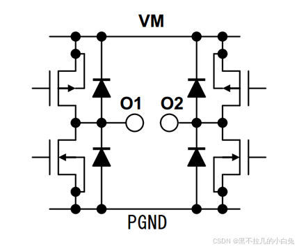

> 
> 
> TB6612是双驱动，也就是可以驱动两个电机
> 
> TB6612FNG 每个通道（A/B）内部包含一个 全H桥电路，由 4个 MOSFET 管 组成，通过开关组合控制电流方向，从而驱动电机正转或反转。4个 MOSFET 分为两组（Q1-Q2 和 Q3-Q4），通过逻辑信号控制开关状态，形成不同的电流路径。
> 
> 

下面分别是控制两个电机的IO口

- STBY口接单片机的IO口清零电机全部停止，  
    置1通过AIN1 AIN2，BIN1，BIN2 来控制正反转

- VM 接12V以内电源  
    VCC 接5V电源  
    GND 接电源负极

- PWMx 接单片机的PWM口

- A01 A02 接电机1的两个脚

- B01 B02 接电机2的两个脚

正值表：

| AIN1 | AIN2 | BIN1 | BIN2 | PWMA | PWMB | A0x/B0x |
| --- | --- | --- | --- | --- | --- | --- |
| 1 | 0 | 1 | 0 | 1 | 1 | 正转 |
| 0 | 1 | 0 | 1 | 1 | 1 | 反转 |
| 1 | 1 | 1 | 1 | 1 | 1 | 自由刹车 |
| X | X | X | X | 0 | 0 | 刹车 |

注：X为任意电平

## 模块简介

## 霍尔编码器直流有刷电机

## 编码器原理

这里使用的是**增量式编码器**。

增量式编码器是将设备运动时的位移信息变成连续的脉冲信号，脉冲个数表示位移量的大小。其特点如下：

- 增量式编码器只输出设备的位置变化和运动方向，不会输出设备的绝对位置。  
    

- 只有当**设备运动时**才会输出信号。

- 一般会输出**通道A和通道B 两组信号，并且有90° 的相位差（1/4个周期）**，同时采集这两组信号就可以计算设备的运动速度和方向。如下图，通道A和通道B的信号的周期相同，且相位相差1/4个周期，结合两相的信号值：

- 当B相和A相先是都读到高电平（1 1），再B读到高电平，A读到低电平（1 0），则为**顺时针**转

- 当B相和A相先是都读到低电平（0 0），再B读到高电平，A读到低电平（1 0），则为**逆时针**转

- 除通道A、通道B 以外，还会设置一个额外的**通道Z 信号，表示编码器特定的参考位置**如下图，传感器转一圈后Z 轴信号才会输出一个脉冲，在Z轴输出时，可以通过将AB通道的计数清零，实现对码盘绝对位置的计算。

分辨率：指编码器能够分辨的最小单位。

- 对于**增量式**编码器，其分辨率表示为编码器转轴旋转一圈所产生的脉冲数，即**脉冲数/转(Pulse Per Revolution 或PPR)**。由第一张图可知，我们的电机PPR为11，即旋转一圈产生11个脉冲。

如何采集编码器的脉冲数据呢？恰好我们的STM32单片机定时器模式中有一个**定时器的编码器模式**，我们通常用它来测量脉冲变化值。通过访问**计数器cnt**的值（编码器模式中使用上下计数）来检测接收到的脉冲数。

之前文章的工程配置里有提到，我们设置TIM2为编码器模式。

# 二、**转速测量**

统计固定时间间隔内的编码器的脉冲数，来计算速度值。我们需要根据编码器的参数来得到转速的计算方式。我们打开一个定时器中断TIM4，每隔0.01s测量一次转速。

**速度计算方法**：这里计算的是真实的电机的物理转速n（r/s）

n=M0/(C∗T0)

- C：编码器单圈总脉冲数，也有一个公式：

- C=ρ×PPR
    - ρ：电机减速比，即电机转轴转1圈，电机本身要转多少圈
    
    - PPR：编码器分辨率

- T0：每次的统计时间（单位为秒）

- M0：该时间内统计到的编码器脉冲数，通过读取这次和上次定时器计数器的值cnt得到

我们这里减速比ρ经测试是20。PPR是11，因为定时器中断为100Hz，T0为0.01。

# 三、**角度测量**

具体原理同速度测量，直接上公式：

Angle=N0C×360Angle=N0/C×360

- C：编码器单圈总脉冲数，解释见上。

- N0：该时间内统计到的编码器脉冲数，通过读取这次定时器计数器的值cnt得到
