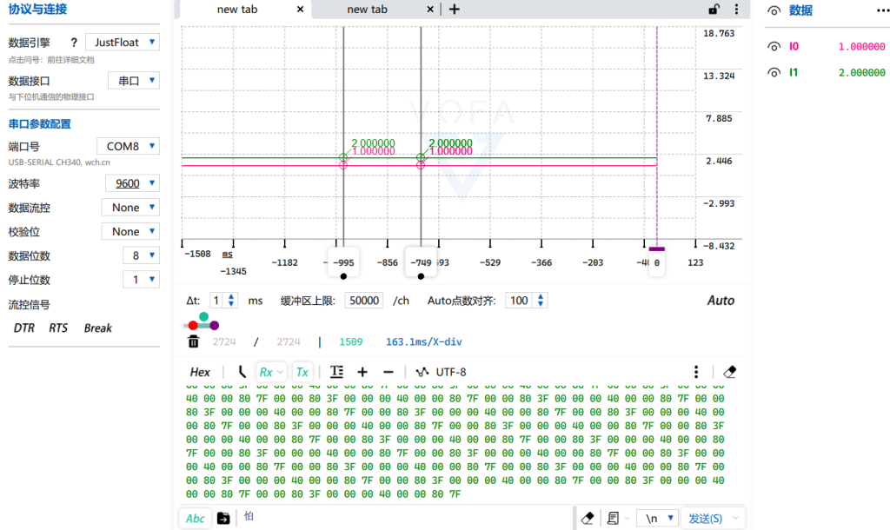

## VOFA+支持的三种数据传输协议

> Vofa支持3种数据流方式：分别为：`RawData、firewater、justfloat`。

1. `RawData`：RawData协议适用于不需要解析数据，仅仅查看字节流的需求。RawData不做采样数据解析。RawData不做采样数据解析。就相当于普通的串口助手。

3. `firewater`：本协议是CSV风格的字符串流，直观简洁，编程像printf简单。但由于字符串解析消耗更多的运算资源（无论在上位机还是下位机），建议仅在通道数量不多、发送频率不高的时候使用。

5. `justfloat`：本协议是小端浮点数组形式的字节流协议，纯十六进制浮点传输，节省带宽。此协议非常适合用在通道数量多、发送频率高的时候。

## RawData协议格式

RawData：协议适用于不需要解析数据，仅仅查看字节流的需求。【可以直接当串口助手使用】  
如果您只是想将本软件当成串口助手使用，选择RawData协议，可以保证接收到什么打印什么。

### 使用方法

意思是发什么，显示什么，可以字符串显示，可以Hex显示  
**选择RawData数据引擎**


## firewater协议格式

firewater：本协议是CSV风格的字符串流，直观简洁，编程像printf简单。但由于字符串解析消耗更多的运算资源（无论在上位机还是下位机），建议仅在通道数量不多、发送频率不高的时候使用。

### 使用方法

> FireWater`遇到换行才会打印数据`,而且`数据之间用逗号隔开，换行打印数据，并且显示数据曲线`

### 数据格式

```
 "<any>:ch0,ch1,ch2,...,chN\n"
```

> ● any和冒号可以为空，但换行(\\n)不可省略；  
> ● any不可以为"image"，这个前缀用于解析图片数据；  
> ● 此处\\n为换行，并非指字符斜杠+字符n；  
> ● \\n也可以为\\n\\r，或\\r\\n。


## justfloat协议格式

justfloat：本协议是`小端浮点数组形式`的字节流协议，`纯十六进制浮点传输，节省带宽`。此协议非常适合用在`通道数量多、发送频率高`的时候。

### 使用方法

> `小端浮点数组`的形式传输数据，适用于通道数量多，且发送频率高的场景

### 数据格式

```
#define CH_COUNT <N>
struct Frame {
    float ch_data[CH_COUNT];
    unsigned char tail[4]{0x00, 0x00, 0x80, 0x7f};
};
```

> ● ch\_data为小端浮点数组，里面放着需要发送的CH\_COUNT个通道。  
> ● tail为帧尾。

说白了就是，数据格式就是

> 浮点数据1，浮点数据2…帧尾  
> 这里的帧尾是 0x00, 0x00, 0x80, 0x7f


### 示例

大家可以看示例，发送4个数据，把浮点数转换成了4个字节数据，然后加上帧尾。


### 实现代码

> 补充：

```
//发送数组
void Usart_SendArray(uint8_t *array,uint8_t num)
{

    uint8_t i;
    while(USART_GetFlagStatus(USART1, USART_FLAG_TC) == RESET);
    for(i = 0; i<num; i++)
    {
        USART_SendData(USART1,array[i]);

      while(USART_GetFlagStatus(USART1, USART_FLAG_TC) == RESET);
    }
}
```

> **vofa\_JUSTfloat.h**

```
#ifndef VOFA_JUSTFLOAT_H
#define VOFA_JUSTFLOAT_H

#include "stm32f10x.h"

#define CH_COUNT 2  // 数据通道数量

// VOFA+ JustFloat 协议的帧结构体
typedef struct {
    float fdata[CH_COUNT];       // 存储通道数据的数组
    unsigned char tail[4];       // JustFloat 协议的尾部标识
} Frame;

typedef union
{
    float fdata;
    unsigned long ldata;
} FloatLongType;

// 初始化帧结构体的函数
void Frame_Init(Frame* frame);
void Float_to_Byte(float f,unsigned char byte[]);
void JustFloat_Test(void);    //justfloat 数据协议测试
#endif // VOFA_JUSTFLOAT_H
```

> **vofa\_JUSTfloat.c**

```
#include "vofa_JUSTfloat.h"
#include "usart.h"
//浮点型转化为4个字节发送
Frame fl;

// 初始化帧结构体
void Frame_Init(Frame* frame) {
    // 设置 JustFloat 协议的尾部标识
    frame->tail[0] = 0x00;
    frame->tail[1] = 0x00;
    frame->tail[2] = 0x80;
    frame->tail[3] = 0x7f;
}

/*
将浮点数f转化为4个字节数据存放在byte[4]中
*/
void Float_to_Byte(float f,unsigned char byte[])
{
    FloatLongType fl;
    fl.fdata=f;
    byte[0]=(unsigned char)fl.ldata;
    byte[1]=(unsigned char)(fl.ldata>>8);
    byte[2]=(unsigned char)(fl.ldata>>16);
    byte[3]=(unsigned char)(fl.ldata>>24);
}

void JustFloat_Test(void)    //justfloat 数据协议测试
{
    u8 byte[4]={0};     //float转化为4个字节数据
    Frame_Init(&fl);
    //数据位：可自行更改
  fl.fdata[0] = 1; 
    fl.fdata[1] = 2;    //发送的数据 两个通道

    //向上位机发送两个通道数据
    Float_to_Byte(fl.fdata[0],byte);
    //u1_printf("%f\r\n",a);
  Usart_SendArray(byte,4);

    //u1_SendArray(byte,4); //1转化为4字节数据 就是  0x00 0x00 0x80 0x3F

    Float_to_Byte(fl.fdata[1],byte);
    //u1_SendArray(byte,4); //2转换为4字节数据 就是  0x00 0x00 0x00 0x40 
    Usart_SendArray(byte,4);

    //发送帧尾
    //u1_SendArray(tail,4); //帧尾为 0x00 0x00 0x80 0x7f
    Usart_SendArray(fl.tail,4);

}
```



## 三种协议使用总结

- 大家如果只是想**把VOFA+当普通的串口助手**，可以`选择RawData协议`

- 大家如果对于**数据传输通道数量不多、发送频率不高**，而又**想动态显示数据曲线**的时候，可以`选择firewater协议`

- 而`justfloat协议`适用于**通道数量多、发送频率高**的时候，这是和firewater协议的最本质区别。
