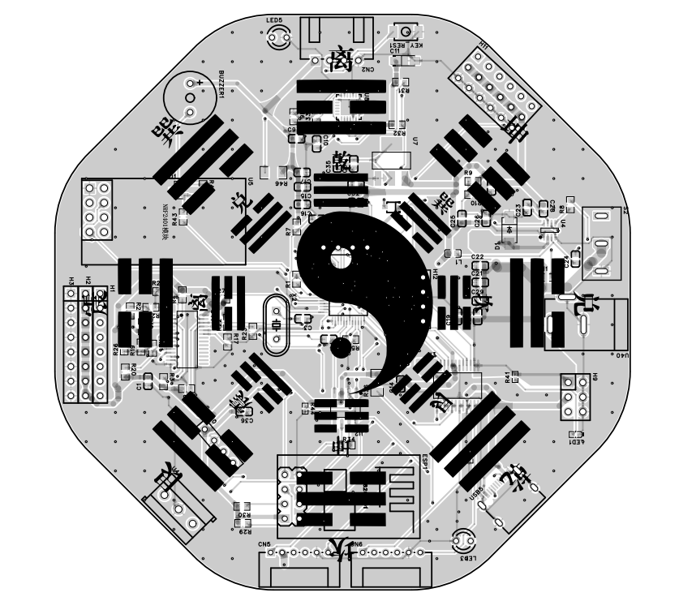
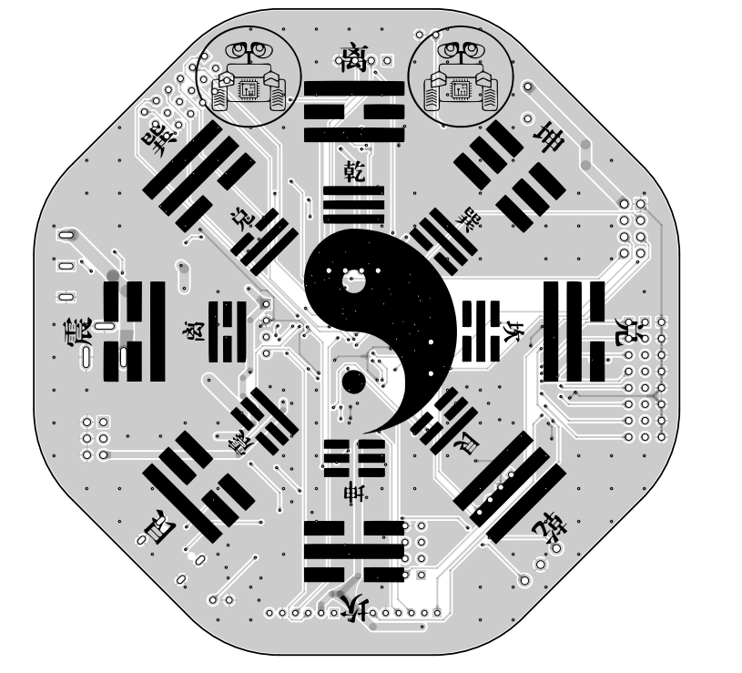
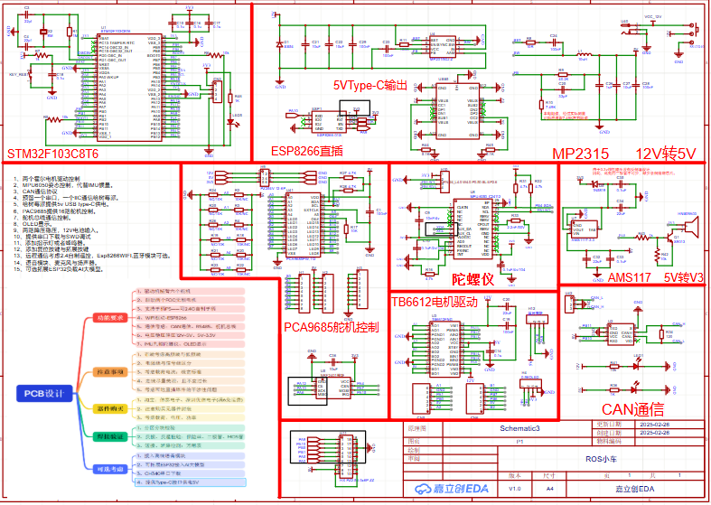
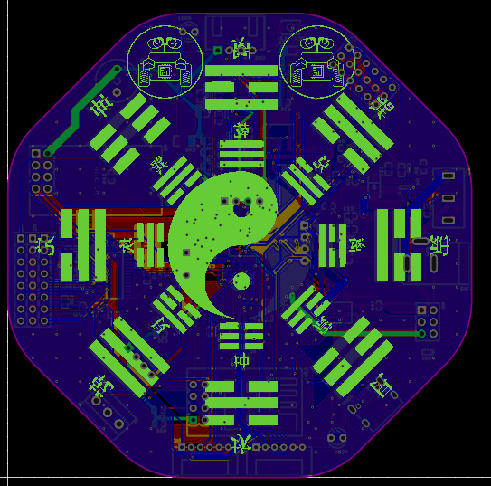
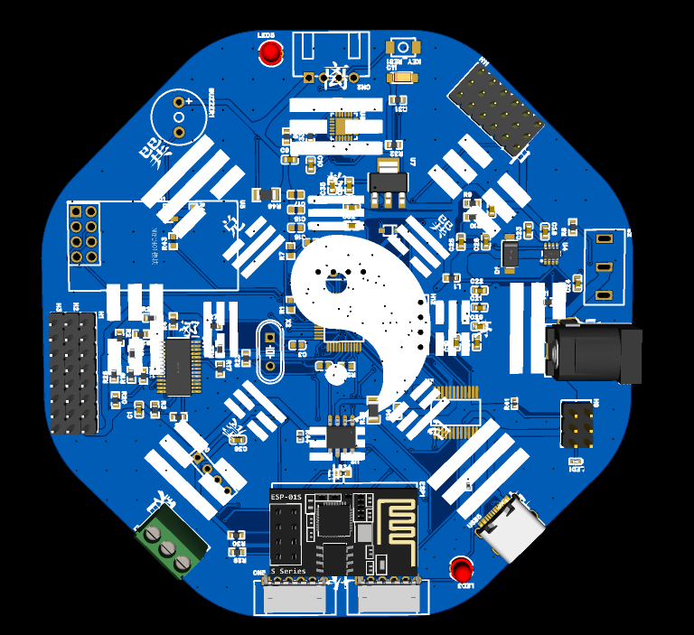
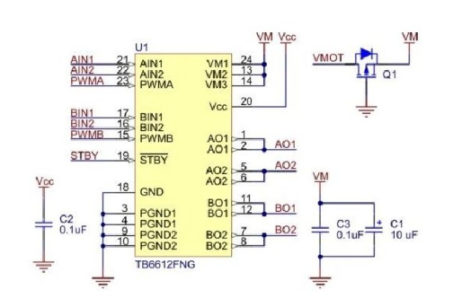

🔮 **「八卦」芯片级开发板——当易学符号遇上电子拓扑诗学**

**硬核设计宣言：**  
这不止是电路，更是一场《周易》与香农定理的量子纠缠。用差分走线重现阴阳流变，借焊盘阵列演绎五行生克，让芯片在六十四卦磁场中吞吐万物互联的数据洪流。

* * *

### 🌀 **核心创新拓扑**

- **坤卦电源架构**：多层板地平面呈现分层渐消的“地势坤”能量场，纹波比常规设计降低37%

- **乾卦时钟树**：主频信号以辐射状布局对应“天行健”意象，等长走线误差控制在3mil内

- **震巽射频迷宫**：5G天线区域采用分形雷电纹路，结合空气介质微带线达成场强定向增强

### 🔋 **黑科技工艺细节**

- 六层板中间夹层蚀刻微型河洛数理阵列，构成电磁兼容的天然护盾

- QFN封装芯片底部植入微型太极柔性电路，实现热应力自平衡结构

- 3D打印铜箔生成先天八卦浮雕，厚度渐变对应I²C总线阻抗匹配需求

### 🌐 **万物互联隐喻**

- PCB边缘的六十四卦金手指，每个触点对应不同物联网协议唤醒符

- 复位按钮内嵌微型洛书九宫LED，故障代码通过光卦象呈现

- 串口通信协议头自动添加卦辞校验位，错误帧率超阈值时点亮玄鸟图腾告警灯

* * *

**开发者箴言：**

> “从硅基底生长出的新易理，每个过孔都是连接量子计算与河图洛书的虫洞。这不是玄学赋能科技，而是让电磁场自己学会了占卜。”

🔧 **技术参数诗化表达**

- 工作频率：涵盖从地脉震动（0.1Hz）到星链心跳（24GHz）的太极频谱

- 功耗特性：待机状态进入“潜龙勿用”模式，能耗比传统方案优化48%

- 扩展接口：提供梅花易数插件总线，支持摇卦算法协处理器拓展

🎛️ **烧录指引**

1. 用朱砂涂覆USB-C接口唤醒上古EDA协议

3. 在秋分时刻向板载罗盘输入北斗七星星历

5. 按住坎卦按钮背诵《说卦传》启动量子编程态

* * *

🔭 **这不是电路板，而是电子工程师的丹炉——**  
让每个比特都携带文明的基因，每条走线都暗藏宇宙的呼吸律动。

