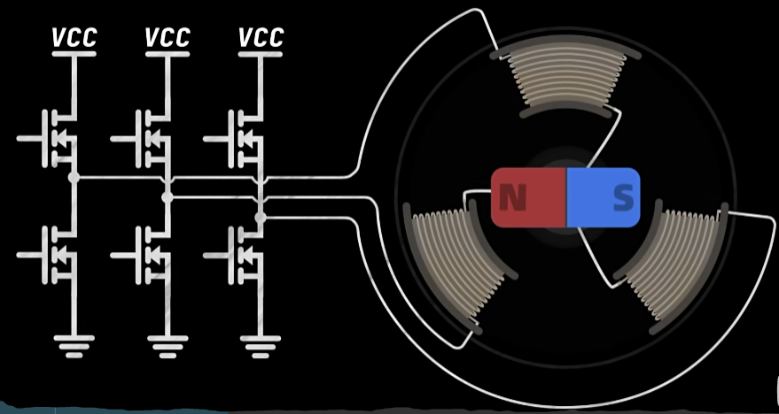
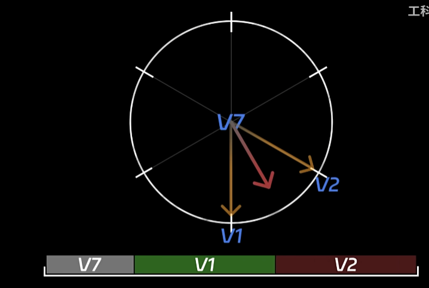
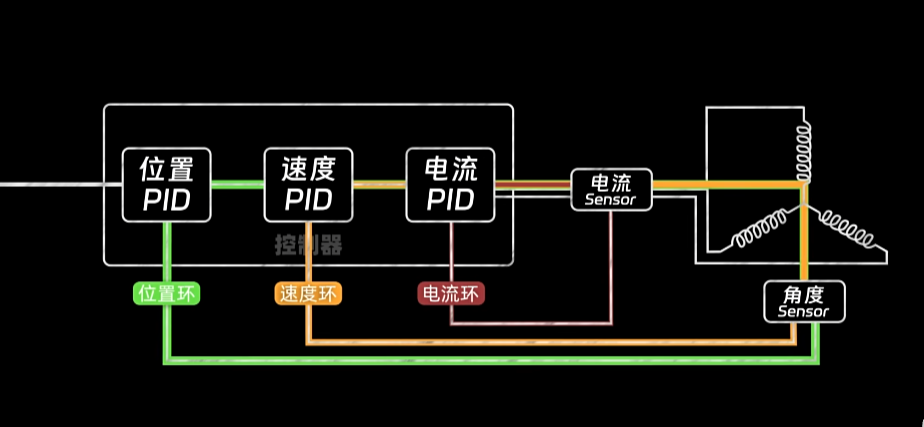
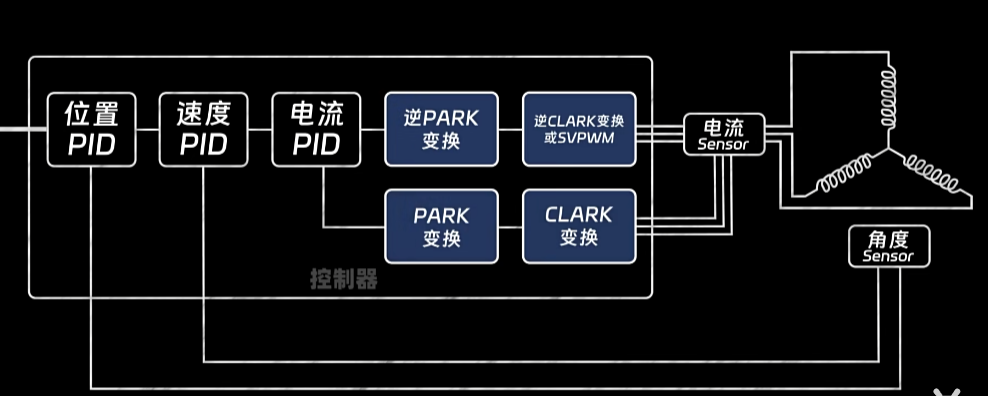

## 电机FOC定义

FOC，全称为Field-Oriented Control（磁场定向控制），也称为矢量控制（Vector Control），是一种用于电机控制的高级技术。它的主要目的是使交流电机（如无刷直流电机和永磁同步电机）能够像直流电机一样容易控制转矩和速度。

FOC技术的核心思想是将电机的三相电流和电压进行分解，转化为两个正交分量：一个是与电机转子磁场方向对齐的磁场分量（也称为磁通分量），另一个是垂直于磁场方向的转矩分量。通过分别控制这两个分量，可以实现对电机的精确控制。

具体来说，FOC控制系统通常包括以下几个步骤：

1. **电流采样**：测量电机的三相电流。

3. **Clarke变换**：将三相电流转换为两相（α-β坐标系）。

5. **Park变换**：将两相电流进一步转换到与转子磁场同步旋转的d-q坐标系中。

7. **控制器**：在d-q坐标系中，使用控制器（如PI控制器）分别控制磁通分量（d轴）和转矩分量（q轴）。

9. **逆Park变换**：将控制信号从d-q坐标系转换回α-β坐标系。

11. **逆Clarke变换和空间矢量调制（SVM）** ：将控制信号转换为三相电压，并通过PWM技术驱动电机的功率逆变器。

13. **位置和速度反馈**：使用传感器（如编码器或霍尔传感器）获取电机转子的实际位置和速度，用于闭环控制。

FOC相对于传统的梯形波控制（如六步换向控制）的优点在于能够提供更高的动态响应、更低的转矩波动和更高的效率。这使得FOC在需要高精度控制的场合，如工业驱动器、电动汽车、机器人和家用电器中得到广泛应用。

‍

## 视频讲解

[https://player.bilibili.com/player.html?bvid=BV1XvtNeaE54&page=1&high\_quality=1&as\_wide=1&allowfullscreen=true&autoplay=0&spm\_id\_from=333.337.search-card.all.click&vd\_source=f412fc178503cd4cd82f9c512d4f458d](https://player.bilibili.com/player.html?bvid=BV1XvtNeaE54&page=1&high_quality=1&as_wide=1&allowfullscreen=true&autoplay=0&spm_id_from=333.337.search-card.all.click&vd_source=f412fc178503cd4cd82f9c512d4f458d)

### 视频笔记

​

​

​

​

​

​

​

​

​

​

​

​

​

​

## STM32代码

**FOC.C**

```c
#include "foc.h"
float zero_electric_angle = 0;

float Switch_electricalAngle(void)
{
  return (float)(Correction_direction * Pole_pairs) * Get_Angle_Radian() - Electrical_angel_zero;
}

float Switch_electricalAngle_reference(float shaft_angle,int pole_pairs)
{
	return (shaft_angle * pole_pairs);
}

static float Normalize_angle(float angle)
{
	float temp_angle = fmod(angle,2*PI);
	return temp_angle >= 0 ? temp_angle : (temp_angle+ 2*PI);
}

static float Normalize_Switch_electricalAngle(void)
{
	//float Correct_electric_angle;
	//Correct_electric_angle = Switch_electricalAngle();
	return Normalize_angle((float)(Correction_direction * Pole_pairs) * Get_Angle_Radian()) - zero_electric_angle;
}

static float NoCorrect_Switch_electricalAngle(float angle)
{
	float Correct_electric_angle = 0;
	Correct_electric_angle = Switch_electricalAngle();
	return Normalize_angle((float)(Correction_direction * Pole_pairs) * angle - Correct_electric_angle);
}

void OutputPWM(float U_a,float U_b,float U_c)
{
	float u_a_dutyfactor = 0,u_b_dutyfactor = 0,u_c_dutyfactor = 0;
	//输出限幅
	U_a = _constrain(U_a,0.0f,Voltage_limit);
	U_b = _constrain(U_b,0.0f,Voltage_limit);
	U_c = _constrain(U_c,0.0f,Voltage_limit);
	//占空比计算+输出限幅
	u_a_dutyfactor = _constrain(U_a / Voltage_powerSupply,0.0f,1.0f);
	u_b_dutyfactor = _constrain(U_b / Voltage_powerSupply,0.0f,1.0f);
	u_c_dutyfactor = _constrain(U_c / Voltage_powerSupply,0.0f,1.0f);
	//PWM赋值
	//PWM_SetDutyfactor(u_a_dutyfactor*(GENERAL_TIM_Period_PWM + 1),0,u_c_dutyfactor*(GENERAL_TIM_Period_PWM + 1),u_b_dutyfactor*(GENERAL_TIM_Period_PWM + 1));
	PWM_SetDutyfactor(0,0,0,0);
	PWM_SetCompare2(u_c_dutyfactor*(GENERAL_TIM_Period_PWM + 1));
	PWM_SetCompare3(u_b_dutyfactor*(GENERAL_TIM_Period_PWM + 1));
	PWM_SetCompare4(u_a_dutyfactor*(GENERAL_TIM_Period_PWM + 1));
}
//力矩环
void SetMoment(float U_q,float U_b,float electrical_angle)
{
	float u_a_dutyfactor = 0,u_b_dutyfactor = 0,u_c_dutyfactor = 0;
	float Ualpha = 0,Ubeta = 0;

	//力矩限幅
	U_q = _constrain(U_q,-Voltage_powerSupply/2,Voltage_powerSupply/2);
	/*float Ud=0;*/
	electrical_angle = Normalize_angle(electrical_angle);
	//帕克逆变换
	Ualpha = -U_q * sin(electrical_angle);
	Ubeta  = U_q * cos(electrical_angle); 
	//克拉克逆变换
	u_a_dutyfactor = Ualpha + Voltage_powerSupply / 2;
	u_b_dutyfactor = (sqrt(3) * Ubeta-Ualpha) / 2 + Voltage_powerSupply / 2;
	u_c_dutyfactor = (-Ualpha-sqrt(3) * Ubeta) / 2 + Voltage_powerSupply / 2;
	
	OutputPWM(u_a_dutyfactor,u_b_dutyfactor,u_c_dutyfactor);
}

void FOC_Init(void)
{
	GENERAL_TIM_Init_PWM();
	//SetMoment(3,0,Normalize_angle((float)(Correction_direction * Pole_pairs) * 30));
  //Delay_ms(3000);
	PID_Init();
	SetMoment(3,0, _3PI_2);
  Delay_ms(3000);
  zero_electric_angle = Normalize_Switch_electricalAngle();
  SetMoment(0,0, _3PI_2);
}

//开始计算时间的初始化SysTick_Computation_timeBegin()
float Calculate_Velocity(void)
{
	float Ts, vel=0.0;
	float angle_prev_Velocity;				//当前角度(用于速度环)
	float vel_angle_prev_Velocity;			//上次角度(用于速度环)
	unsigned long angle_prev_ts;			//当前的运行时间
	unsigned long vel_angle_prev_ts;		//上次的运行时间

	//计算采样时间
	angle_prev_ts = SysTick->VAL;
	if(angle_prev_ts<vel_angle_prev_ts)Ts = (float)(vel_angle_prev_ts - angle_prev_ts)/9*1e-6;
	else
		Ts = (float)(0xFFFFFF - angle_prev_ts + vel_angle_prev_ts)/9*1e-6;
	//快速修复微小溢出
	if(Ts == 0 || Ts > 0.5) Ts = 1e-3f;
	//记录当前角度
	angle_prev_Velocity = Get_Angle_Radian_Accumulation();
	//变量存储
	vel = (angle_prev_Velocity - vel_angle_prev_Velocity) / Ts;
	vel_angle_prev_Velocity = angle_prev_Velocity;
	vel_angle_prev_ts = angle_prev_ts;

	return vel;
}

void SetAngle(float angle)
{
	float As5600_angle = Get_Angle_Radian_Accumulation();
	float Angle_output = pid_siteControl((angle - Sensor_direction * As5600_angle)*180/PI);
	Angle_output = _constrain(Angle_output,-6,6);
	SetMoment(Angle_output,0,Switch_electricalAngle());
	printf("%.2f,%.2f\n",As5600_angle,Angle_target);
}

void SetSpeed(float speed)
{
	float As5600_speed = Get_LowPass_Filter_Speed();
	float Speed_output = PID_speedControl(speed - As5600_speed);
	Speed_output = _constrain(Speed_output,-6,6);
	SetMoment(Speed_output,0,Normalize_Switch_electricalAngle());
	printf("%.2f,%.2f\n",As5600_speed,Speed_target);
	
}
```

**FOC.H**

```c
#ifndef __FOC_H
#define __FOC_H

#include "stm32f10x.h"
#include "as5600.h"
#include "timer.h"
#include "pid.h"
#include "systick.h"
#include "filter.h"
#include <string.h> 
#include <stdio.h>
#include <stdint.h>
#include <stdlib.h>
#include <string.h>
#include <math.h>

//1. 电角度      =   机械角度  *  极对数
//2.Electrical_angle =Mechanical_angle * Pole_pairs
#define Angle_target 3.0
#define Speed_target 5.0
#define PI_angle 180
#define _3PI_2 4.71238898038f
#define PI 3.14159265359
#define Voltage_limit 		 	10
#define Voltage_powerSupply 12.6
#define Mechanical_angle_zero 0.0
#define Electrical_angel_zero 0.0
#define Ualpha_zero 0
#define Ubeta_zero  0
#define U_a_zero 0
#define U_b_zero 0
#define U_c_zero 0
#define U_q_zero 0
#define U_d_zero 0
#define u_a_dutyfactor_zero 0
#define u_b_dutyfactor_zero 0
#define u_c_dutyfactor_zero 0
#define Pole_pairs 7
#define Correction_direction 1
#define Sensor_direction 1
#define _constrain(value,low,high) ((value)<(low)?(low):((value)>(high)?(high):(value)))

float Calculate_Velocity(void);
void OutputPWM(float U_a,float U_b,float U_c);
void SetMoment(float U_q,float U_b,float electrical_angle);
void SetAngle(float angle);
void SetSpeed(float angle);
void FOC_Init(void);
float Switch_electricalAngle(void);
float Switch_electricalAngle_reference(float shaft_angle,int pole_pairs);
#endif

```

**AS5600.H**

```c
#ifndef __AS5600_H
#define __AS5600_H

#include "stm32f10x.h"
#include "math.h"
#include "systick.h"

#define  RAW_Angle_Hi    0x0C
#define  RAW_Angle_Lo    0x0D
#define  AS5600_Address  0x36

u8 AS5600_ReadOneByte(u8 addr);
float AS5600_ReadRawAngleTwo(void);
float Get_Angle_Degree(void);
float Get_Angle_Radian(void);
float Get_Angle_Radian_Accumulation(void);
#endif

```

**AS5600.C**

```c
#include "iic.h"
#include "as5600.h"
/***************************************************************************/
u8 AS5600_ReadOneByte(u8 addr)
{
	u8 temp;		  	    																 
	
	i2c_Start();
	i2c_SendByte(AS5600_Address<<1);
	while(i2c_WaitAck());
	i2c_SendByte(addr);
	while(i2c_WaitAck()); 
  i2c_Stop();	
	
	i2c_Start();  	 	   
	i2c_SendByte((AS5600_Address<<1)+1);
	while(i2c_WaitAck());	 
	temp=i2c_ReadByte(0);		   
	i2c_Stop();
	
	return temp;
}
/***************************************************************************/
float AS5600_ReadRawAngleTwo(void)
{
	u8 dh,dl;		  	    																 
	
	i2c_Start();
	i2c_SendByte(AS5600_Address<<1);
	while(i2c_WaitAck());
	i2c_SendByte(RAW_Angle_Hi);
	while(i2c_WaitAck());
	i2c_Stop();	
	
	i2c_Start();
	i2c_SendByte((AS5600_Address<<1)+1);
	while(i2c_WaitAck());
	dh=i2c_ReadByte(1);   //1-ack for next byte
	dl=i2c_ReadByte(0);   //0-end trans
	i2c_Stop();
	
	return (((dh<<8)+dl)*0.08789);
}
/***************************************************************************/

/***********************************************
读取磁编码器360度值:(0°-360°)
***********************************************/
float Get_Angle_Degree(void)
{
	return AS5600_ReadRawAngleTwo();
}

/***********************************************
读取磁编码器归一化弧度值:(0-6.28)
***********************************************/
float Get_Angle_Radian(void)
{
	return AS5600_ReadRawAngleTwo() / 57.32484;
}
/***********************************************
磁编码器弧度制角度累计计算:(0-∞)
***********************************************/
float Get_Angle_Radian_Accumulation(void)
{
	static float angle_previou = 0,full_rotations = 0;
	float angle_current = Get_Angle_Radian();
	float deviation_angle = angle_current - angle_previou;
	//计算旋转的圈数
	//通过判断角度变化是否大于80%的一圈(0.8f*6.28318530718f)来判断是否发生了溢出
	//如果发生了溢出,则将full_rotations增加1(如果d_angle小于0)或减少1(如果d_angle大于0)
	if( fabs(deviation_angle) > (0.8f*6.28318530718f) )
		full_rotations += (deviation_angle > 0) ? -1 : 1;
	angle_previou = angle_current;
	return (float)full_rotations * 6.28318530718f + angle_previou;
}
/***********************************************/
```

**PID.H**

```c
#ifndef __PID_H
#define __PID_H

#include "stm32f10x.h"

#define Kp_site 0.0043
#define Ki_site 0.0005
#define Kd_site 0.22
#define Kp_speed 0.11
#define Ki_speed 0.005
#define kd_speed 0.0008
#define Voltage_value_zero  0
#define Integral_value_zero 0

typedef struct//定义pid结构体
{
	float Target_value;//定义目标值
	float Actual_value;//定义真实值
	float Err_value;//定义偏差值
	float Err_last_value;//定义上一个偏差值
	float Kp,Ki,Kd;//定义比例，积分，微分
	float Voltage_value;//定义电压值
	float Integral_value;//定义积分值
}PID;

void PID_Init(void);
float pid_siteControl(float angle_Err_value);
float PID_speedControl(float speed_Err_value);
#endif

```

**PID.C**

```c
#include "pid.h"
PID pid_site;//定义位置环pid
PID pid_speed;//定义距离环pid

/**********************
PID配置函数:
**********************/
void PID_Init()//初始化pid变量
{
	//位置环pid
	pid_site.Target_value=0.0;
	pid_site.Actual_value=0.0;
	pid_site.Err_value=0.0;
	pid_site.Err_last_value=0.0;
	pid_site.Voltage_value=0.0;
	pid_site.Integral_value=0.0;
	pid_site.Kp=Kp_site;
	pid_site.Ki=Ki_site;
	pid_site.Kd=Kd_site;
	
	//速度环pid
	pid_speed.Target_value=0.0;
	pid_speed.Actual_value=0.0;
	pid_speed.Err_value=0.0;
	pid_speed.Err_last_value=0.0;
	pid_speed.Voltage_value=0.0;
	pid_speed.Integral_value=0.0;	
	pid_speed.Kp=Kp_speed;
	pid_speed.Ki=Ki_speed;
	pid_speed.Kd=kd_speed;
}

float pid_siteControl(float angle_Err_value)
{
	float angle_output;
	pid_site.Err_value=angle_Err_value;
	
	pid_site.Integral_value+=pid_site.Err_value;
	
	angle_output=pid_site.Kp * pid_site.Err_value + pid_site.Ki * pid_site.Integral_value + pid_site.Kd * (pid_site.Err_value-pid_site.Err_last_value);

	pid_site.Integral_value=pid_site.Integral_value>2000?2000:(pid_site.Integral_value<(-2000)?(-2000):pid_site.Integral_value);//积分限幅
	
	pid_site.Err_last_value=pid_site.Err_value;

	return angle_output;
}

float PID_speedControl(float speed_Err_value)
{
	float speed_output;
	pid_speed.Err_value=speed_Err_value;
	
	pid_speed.Integral_value+=pid_speed.Err_value;
	
	speed_output=pid_speed.Kp * pid_speed.Err_value + pid_speed.Ki * pid_speed.Integral_value + pid_speed.Kd * (pid_speed.Err_value-pid_speed.Err_last_value);

	pid_speed.Integral_value=pid_speed.Integral_value>3000?3000:(pid_speed.Integral_value<(-3000)?(-3000):pid_speed.Integral_value);//积分限幅
	
	pid_speed.Err_last_value=pid_speed.Err_value;

	return speed_output;
}

```

**IIC.H**

```c
#include "iic.h"
//初始化IIC相关的GPIO
//配置IIC外设的工作模式
//编写IIC写入EEPROM的BYTE WRITE
//编写IIC读取EEPROM的RANDOM Read

//编写page write及 seq read并校验
//配置I2C接口
//大写开头为硬件I2C，开始，停止，发送，接受等使用固件库函数编程。stm32f10x_i2c.c
#if I2C_Select
void I2C_Config(void)
{
    GPIO_InitTypeDef  GPIO_InitStructure; 
    I2C_InitTypeDef  I2C_InitStructure; 

    /* 使能与 I2C 有关的时钟 */
    IIC_CLK_ENABLE (IIC_CLK, ENABLE );
    IIC_GPIO_CLK_ENABLE ( IIC_GPIO_CLK, ENABLE );
    
    /* I2C_SCL、I2C_SDA*/
    GPIO_InitStructure.GPIO_Pin = IIC_SCL_GPIO_PIN;
    GPIO_InitStructure.GPIO_Speed = GPIO_Speed_50MHz;
    GPIO_InitStructure.GPIO_Mode = GPIO_Mode_AF_OD;       // 开漏输出
    GPIO_Init(IIC_GPIO_SCL_PORT, &GPIO_InitStructure);
    
    GPIO_InitStructure.GPIO_Pin = IIC_SDA_GPIO_PIN;
    GPIO_InitStructure.GPIO_Speed = GPIO_Speed_50MHz;
    GPIO_InitStructure.GPIO_Mode = GPIO_Mode_AF_OD;       // 开漏输出
    GPIO_Init(IIC_GPIO_SDA_PORT, &GPIO_InitStructure);    

    /* I2C 配置 */
    I2C_InitStructure.I2C_Mode = I2C_Mode_I2C;
    
    /* 高电平数据稳定，低电平数据变化 SCL 时钟线的占空比 */
    I2C_InitStructure.I2C_DutyCycle = I2C_DutyCycle_2;
    
    I2C_InitStructure.I2C_OwnAddress1 =I2Cx_OWN_ADDRESS7; 
    I2C_InitStructure.I2C_Ack = I2C_Ack_Enable ;
     
    /* I2C的寻址模式 */
    I2C_InitStructure.I2C_AcknowledgedAddress = I2C_AcknowledgedAddress_7bit;
    
    /* 通信速率 */
    I2C_InitStructure.I2C_ClockSpeed = I2C_Speed;
    
    /* I2C 初始化 */
    I2C_Init(IIC_NUM, &I2C_InitStructure);
    
    /* 使能 I2C */
    I2C_Cmd(IIC_NUM, ENABLE);  
	}

void IIC_Write_Byte(uint8_t ID,uint8_t addr, uint8_t data)
{
    while (I2C_GetFlagStatus(IIC_NUM, I2C_FLAG_BUSY));

    I2C_GenerateSTART(IIC_NUM, ENABLE); /* IIC_Start信号 */
    while (!I2C_CheckEvent(IIC_NUM, I2C_EVENT_MASTER_MODE_SELECT)); /*EV5,主模式*/

    I2C_Send7bitAddress(IIC_NUM, ID, I2C_Direction_Transmitter);  /* 呼叫从机 */
    while (!I2C_CheckEvent(IIC_NUM, I2C_EVENT_MASTER_TRANSMITTER_MODE_SELECTED));
    I2C_SendData(IIC_NUM, addr);  /* 配置数据写入地址 */
    while (!I2C_CheckEvent(IIC_NUM, I2C_EVENT_MASTER_BYTE_TRANSMITTED));

    I2C_SendData(IIC_NUM, data);  /* 发送数据 */
    while (!I2C_CheckEvent(IIC_NUM, I2C_EVENT_MASTER_BYTE_TRANSMITTED));

    I2C_GenerateSTOP(IIC_NUM, ENABLE); /* IIC_Stop信号 */
}

#else 
	/*
*********************************************************************************************************
*	函 数 名: i2c_CfgGpio
*	功能说明: 配置I2C总线的GPIO，采用模拟IO的方式实现
*	形    参：无
*	返 回 值: 无
*********************************************************************************************************
*/
void i2c_CfgGpio(void)
{
	GPIO_InitTypeDef GPIO_InitStructure;

	RCC_APB2PeriphClockCmd(RCC_I2C_PORT, ENABLE);	/* 打开GPIO时钟 */

	GPIO_InitStructure.GPIO_Pin = I2C_SCL_PIN | I2C_SDA_PIN;
	GPIO_InitStructure.GPIO_Speed = GPIO_Speed_50MHz;
	GPIO_InitStructure.GPIO_Mode = GPIO_Mode_Out_OD;  	/* 开漏输出 */
	GPIO_Init(GPIO_PORT_I2C, &GPIO_InitStructure);

	/* 给一个停止信号, 复位I2C总线上的所有设备到待机模式 */
	i2c_Stop();
}

/*
*********************************************************************************************************
*	函 数 名: i2c_Delay
*	功能说明: I2C总线位延迟，最快400KHz
*	形    参：无
*	返 回 值: 无
*********************************************************************************************************
*/
static void i2c_Delay(void)
{
	uint8_t i;

	/*　
	 	下面的时间是通过逻辑分析仪测试得到的。
    工作条件：CPU主频72MHz ，MDK编译环境，1级优化
  
		循环次数为10时，SCL频率 = 205KHz 
		循环次数为7时，SCL频率 = 347KHz， SCL高电平时间1.5us，SCL低电平时间2.87us 
	 	循环次数为5时，SCL频率 = 421KHz， SCL高电平时间1.25us，SCL低电平时间2.375us 
	*/
	for (i = 0; i < 10; i++);
}

/*
*********************************************************************************************************
*	函 数 名: i2c_Start
*	功能说明: CPU发起I2C总线启动信号
*	形    参：无
*	返 回 值: 无
*********************************************************************************************************
*/
void i2c_Start(void)
{
	/* 当SCL高电平时，SDA出现一个下跳沿表示I2C总线启动信号 */
	I2C_SDA_1();
	I2C_SCL_1();
	i2c_Delay();
	I2C_SDA_0();
	i2c_Delay();
	I2C_SCL_0();
	i2c_Delay();
}

/*
*********************************************************************************************************
*	函 数 名: i2c_Stop
*	功能说明: CPU发起I2C总线停止信号
*	形    参：无
*	返 回 值: 无
*********************************************************************************************************
*/
void i2c_Stop(void)
{
	/* 当SCL高电平时，SDA出现一个上跳沿表示I2C总线停止信号 */
	I2C_SDA_0();
	I2C_SCL_1();
	i2c_Delay();
	I2C_SDA_1();
}

/*
*********************************************************************************************************
*	函 数 名: i2c_SendByte
*	功能说明: CPU向I2C总线设备发送8bit数据
*	形    参：_ucByte ： 等待发送的字节
*	返 回 值: 无
*********************************************************************************************************
*/
void i2c_SendByte(uint8_t _ucByte)
{
	uint8_t i;

	/* 先发送字节的高位bit7 */
	for (i = 0; i < 8; i++)
	{		
		if (_ucByte & 0x80)
		{
			I2C_SDA_1();
		}
		else
		{
			I2C_SDA_0();
		}
		i2c_Delay();
		I2C_SCL_1();
		i2c_Delay();	
		I2C_SCL_0();
		if (i == 7)
		{
			 I2C_SDA_1(); // 释放总线
		}
		_ucByte <<= 1;	/* 左移一个bit */
		i2c_Delay();
	}
}

/*
*********************************************************************************************************
*	函 数 名: i2c_ReadByte
*	功能说明: CPU从I2C总线设备读取8bit数据
*	形    参：无
*	返 回 值: 读到的数据
*********************************************************************************************************
*/
uint8_t i2c_ReadByte(u8 ack)
{
	uint8_t i;
	uint8_t value;

	/* 读到第1个bit为数据的bit7 */
	value = 0;
	for (i = 0; i < 8; i++)
	{
		value <<= 1;
		I2C_SCL_1();
		i2c_Delay();
		if (I2C_SDA_READ())
		{
			value++;
		}
		I2C_SCL_0();
		i2c_Delay();
	}
	if(!ack) i2c_NAck();
	else
		i2c_Ack();
	return value;
}

/*
*********************************************************************************************************
*	函 数 名: i2c_WaitAck
*	功能说明: CPU产生一个时钟，并读取器件的ACK应答信号
*	形    参：无
*	返 回 值: 返回0表示正确应答，1表示无器件响应
*********************************************************************************************************
*/
uint8_t i2c_WaitAck(void)
{
	uint8_t re;

	I2C_SDA_1();	/* CPU释放SDA总线 */
	i2c_Delay();
	I2C_SCL_1();	/* CPU驱动SCL = 1, 此时器件会返回ACK应答 */
	i2c_Delay();
	if (I2C_SDA_READ())	/* CPU读取SDA口线状态 */
	{
		re = 1;
	}
	else
	{
		re = 0;
	}
	I2C_SCL_0();
	i2c_Delay();
	return re;
}

/*
*********************************************************************************************************
*	函 数 名: i2c_Ack
*	功能说明: CPU产生一个ACK信号
*	形    参：无
*	返 回 值: 无
*********************************************************************************************************
*/
void i2c_Ack(void)
{
	I2C_SDA_0();	/* CPU驱动SDA = 0 */
	i2c_Delay();
	I2C_SCL_1();	/* CPU产生1个时钟 */
	i2c_Delay();
	I2C_SCL_0();
	i2c_Delay();
	I2C_SDA_1();	/* CPU释放SDA总线 */
}

/*
*********************************************************************************************************
*	函 数 名: i2c_NAck
*	功能说明: CPU产生1个NACK信号
*	形    参：无
*	返 回 值: 无
*********************************************************************************************************
*/
void i2c_NAck(void)
{
	I2C_SDA_1();	/* CPU驱动SDA = 1 */
	i2c_Delay();
	I2C_SCL_1();	/* CPU产生1个时钟 */
	i2c_Delay();
	I2C_SCL_0();
	i2c_Delay();	
}

/*
*********************************************************************************************************
*	函 数 名: i2c_CheckDevice
*	功能说明: 检测I2C总线设备，CPU向发送设备地址，然后读取设备应答来判断该设备是否存在
*	形    参：_Address：设备的I2C总线地址
*	返 回 值: 返回值 0 表示正确， 返回1表示未探测到
*********************************************************************************************************
*/
uint8_t i2c_CheckDevice(uint8_t _Address)
{
	uint8_t ucAck;

	i2c_CfgGpio();		/* 配置GPIO */

	
	i2c_Start();		/* 发送启动信号 */

	/* 发送设备地址+读写控制bit（0 = w， 1 = r) bit7 先传 */
	i2c_SendByte(_Address | I2C_WR);
	ucAck = i2c_WaitAck();	/* 检测设备的ACK应答 */

	i2c_Stop();			/* 发送停止信号 */

	return ucAck;
}

#endif
```

**IIC.H**

```c
#ifndef IIC_H
#define IIC_H
 
#include "stm32f10x.h"
#include <inttypes.h>
 
#define SUB_I2CNUM 2
#define I2C_Select 0
#define I2C_WR	0		/* 写控制bit */
#define I2C_RD	1		/* 读控制bit */

#if I2C_Select /* 条件编译： 1 选择硬件I2C, 0 选择软件I2C */
	#define IIC_NUM                  I2C1
	#define IIC_GPIO_CLK_ENABLE      RCC_APB2PeriphClockCmd
	#define IIC_GPIO_CLK             RCC_APB2Periph_GPIOB
	#define IIC_CLK_ENABLE           RCC_APB1PeriphClockCmd
	#define IIC_CLK                  RCC_APB1Periph_I2C1
	#define IIC_GPIO_SCL_PORT        GPIOB
	#define IIC_GPIO_SDA_PORT        GPIOB
	#define IIC_SDA_GPIO_PIN         GPIO_Pin_7
	#define IIC_SCL_GPIO_PIN         GPIO_Pin_6
	/* STM32 I2C 快速模式 */
  #define I2C_Speed              400000  
	/*等待超时时间*/
	#define I2CT_FLAG_TIMEOUT         ((uint32_t)0x1000)
	#define I2CT_LONG_TIMEOUT         ((uint32_t)(10 * I2CT_FLAG_TIMEOUT))
	static __IO uint32_t  I2CTimeout = I2CT_LONG_TIMEOUT; 
	/* 用户自定义超时回调函数 */
  static uint32_t I2C_TIMEOUT_UserCallback(uint8_t errorCode);
	/* 这个地址只要与STM32外挂的I2C器件地址不一样即可 */
  #define I2Cx_OWN_ADDRESS7      0X0A 
	
#else
	/* 定义I2C总线连接的GPIO端口, 用户只需要修改下面4行代码即可任意改变SCL和SDA的引脚 */
	#define GPIO_PORT_I2C	GPIOB			/* GPIO端口 */
	#define RCC_I2C_PORT 	RCC_APB2Periph_GPIOB		/* GPIO端口时钟 */
	#define I2C_SCL_PIN		GPIO_Pin_8			/* 连接到SCL时钟线的GPIO */
	#define I2C_SDA_PIN		GPIO_Pin_9			/* 连接到SDA数据线的GPIO */

/* 定义读写SCL和SDA的宏，已增加代码的可移植性和可阅读性 */
#if 1	/* 条件编译： 1 选择GPIO的库函数实现IO读写 */
 #define I2C_SCL_1()  GPIO_SetBits(GPIO_PORT_I2C, I2C_SCL_PIN)		/* SCL = 1 */
 #define I2C_SCL_0()  GPIO_ResetBits(GPIO_PORT_I2C, I2C_SCL_PIN)		/* SCL = 0 */
  
 #define I2C_SDA_1()  GPIO_SetBits(GPIO_PORT_I2C, I2C_SDA_PIN)		/* SDA = 1 */
 #define I2C_SDA_0()  GPIO_ResetBits(GPIO_PORT_I2C, I2C_SDA_PIN)		/* SDA = 0 */
  
 #define I2C_SDA_READ()  GPIO_ReadInputDataBit(GPIO_PORT_I2C, I2C_SDA_PIN)	/* 读SDA口线状态 */
#else	/* 这个分支选择直接寄存器操作实现IO读写 */
    /*　注意：如下写法，在IAR最高级别优化时，会被编译器错误优化 */
 #define I2C_SCL_1()  GPIO_PORT_I2C->BSRR = I2C_SCL_PIN				/* SCL = 1 */
 #define I2C_SCL_0()  GPIO_PORT_I2C->BRR = I2C_SCL_PIN				/* SCL = 0 */
  
 #define I2C_SDA_1()  GPIO_PORT_I2C->BSRR = I2C_SDA_PIN				/* SDA = 1 */
 #define I2C_SDA_0()  GPIO_PORT_I2C->BRR = I2C_SDA_PIN				/* SDA = 0 */
  
 #define I2C_SDA_READ()  ((GPIO_PORT_I2C->IDR & I2C_SDA_PIN) != 0)	/* 读SDA口线状态 */
#endif
#endif
 
/*GPIO 配置IIC*/
void I2C_Config(void);  //硬件I2C配置
void Oled_Write_Cmd(uint8_t cmd);
void i2c_CfgGpio(void); //软件I2C配置
void i2c_Start(void);  // 发送I2C开始信号
void i2c_Stop(void);   // 发送I2C停止信号
void i2c_SendByte(uint8_t _ucByte);  // 发送一个字节数据
uint8_t i2c_ReadByte(u8 ack);  // 读取一个字节数据
uint8_t i2c_WaitAck(void);  // 等待从机应答
void i2c_Ack(void);  // 发送应答信号
void i2c_NAck(void);  // 发送非应答信号
uint8_t i2c_CheckDevice(uint8_t _Address);  // 检查设备是否存在

#endif

```
