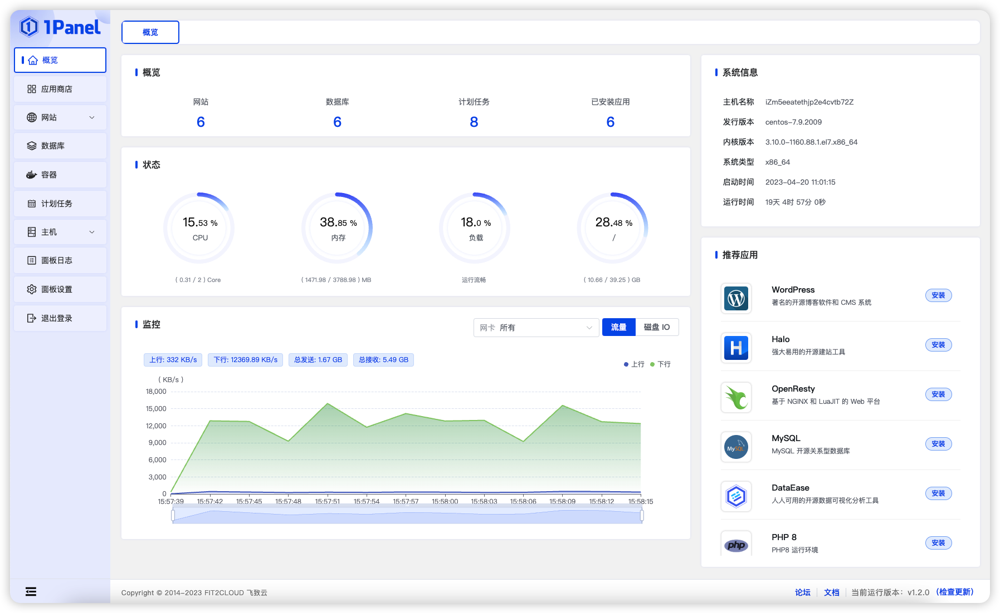

转载链接：[https://mp.weixin.qq.com/s?\_\_biz=Mzg4Njg4MTEwNw==&mid=2247484131&idx=1&sn=88b1864d15ab1fad54c3f2187d57fa43&chksm=cf93acdff8e425c97dcfe90d7ed50c48044f2658ff227bf57bb507687290c5462810903b9bfa#rd](https://mp.weixin.qq.com/s?__biz=Mzg4Njg4MTEwNw==&mid=2247484131&idx=1&sn=88b1864d15ab1fad54c3f2187d57fa43&chksm=cf93acdff8e425c97dcfe90d7ed50c48044f2658ff227bf57bb507687290c5462810903b9bfa#rd)

视频链接：[https://www.bilibili.com/video/BV1gxpue4E7T?spm\_id\_from=333.788.videopod.sections&vd\_source=f412fc178503cd4cd82f9c512d4f458d](https://www.bilibili.com/video/BV1gxpue4E7T?spm_id_from=333.788.videopod.sections&vd_source=f412fc178503cd4cd82f9c512d4f458d)



`1panel面板`是很不错的一款`运维管理面板`，不仅可以简化很多操作，而且支持`docker容器的可视化管理`，能够很大程度的`降低运维管理的难度`,所以接下来带大家安装一下1panel面板!

## **一、安装Docker服务**

```
 注意：当前使用的机器是一台刚初始化的Ubuntu机器
```

> 1.`sudo apt-get update` 是一个在Linux系统中，用于`更新本地软件包列表`的命令。

```
 sudo apt-get update
```

在终端中执行该命令，第一次会要求输入密码，输入你的用户密码（`注意：密码不会显示在屏幕上`）。

> 2.安装`vim`用于后续编辑文件。

```
 sudo apt-get install vim
```

> 3.安装Docker之前先安装一些基础依赖，`apt-transport-https、ca-certificates、curl`等等...

```
 # 安装所需的依赖 sudo apt-get install \   apt-transport-https \   ca-certificates\   curl \   gnupg-agent \   software-properties-common
```

> 4.通过镜像网站添加`GPG密钥`并设置`阿里源镜像仓库`,一路回车即可！

```
 curl -fsSL http://mirrors.aliyun.com/docker-ce/linux/ubuntu/gpg | sudo apt-key add -
```

```
 sudo add-apt-repository \ "deb [arch=amd64] http://mirrors.aliyun.com/docker-ce/linux/ubuntu \ xenial \ stable"
```

> 5.安装最新版本的 `Docker Engine-Community`

```
 sudo apt-get install docker-ce docker-ce-cli containerd.io
```

> 6.为当前用户添加Docker权限

docker安装完成后，一般用户`没有权限`启动docker服务，只能通过`sudo`来通过`root用户权限`启动docker。

为了方便，我们把`普通用户`加入到`docker组`中，`docker组`在安装docker的时候，就已经添加了，所以只需要执行两个操作即可：

```
 # $USER 需要替换为你的用户名 sudo gpasswd -a $USER docker ​ newgrp docker
```

> 7.为Docker配置镜像加速，目前Docker官方镜像国内`已经无法正常使用`。文章中的镜像在`文章发出前`均可正常使用！

```
 cd /etc/docker/ ​ sudo vim /etc/docker/daemon.json ​ {  "registry-mirrors": ["https://hub.uuuadc.top", "https://docker.anyhub.us.kg", "https://dockerhub.jobcher.com", "https://dockerhub.icu", "https://docker.ckyl.me", "https://docker.awsl9527.cn"] }
```

> 8.重启docker服务

```
 sudo systemctl daemon-reload ​ sudo systemctl restart docker
```

> 9.检验是否安装成功

```
 sudo docker run hello-world
```

至此，docker服务已经安装完成！

## **二、安装1panel面板**

`1Panel`是一个`现代化、开源的`Linux服务器运维管理面板。`开源`意味着用户可以访问源代码并进行`定制化开发`，现代化是指其采用更加`简洁美观`的UI,方便管理员对服务器进行管理和监控,以及使用`go语言`编写，可以更好的`减少资源的占用`。

> 进入1panel官网([https://1panel.cn/docs/installation/online\_installation/](https://1panel.cn/docs/installation/online_installation/)),找到在线安装

大家根据自己系统的不同来执行不同的脚本安装命令，在终端中执行。

> 1. 1panel安装目录配置

1panel安装目录默认为`/opt`下，我们可以输入路径来让其安装到指定目录,若不需要更换`直接回车即可`。

> 2.设置1panel所使用`端口号`

1panel默认会生成一个`随机端口号`，如果需要更换`输入要更换的端口号`回车，如果不需要更换`直接回车即可`。

> 3.配置1panel`安全入口`（建议自定义设置）

1panel请求路径规则为：`http://目标服务器IP地址:目标端口/安全入口`,若未携带安全入口则无法正常访问后台。

1panel默认会生成一个`字符串`，如果需要更换输入`自定义安全入口`回车，如果不需要更换`直接回车即可`。

(`建议自定义设置、建议自定义设置、建议自定义设置`)

> 4.设置用户名/密码

设置用户名密码，输入密码时终端中`不会显示密码`。

> 5.出现以下内容服务1panel安装完成

容器管理，巨好用！

到这里，1panel服务已经安装完成。
