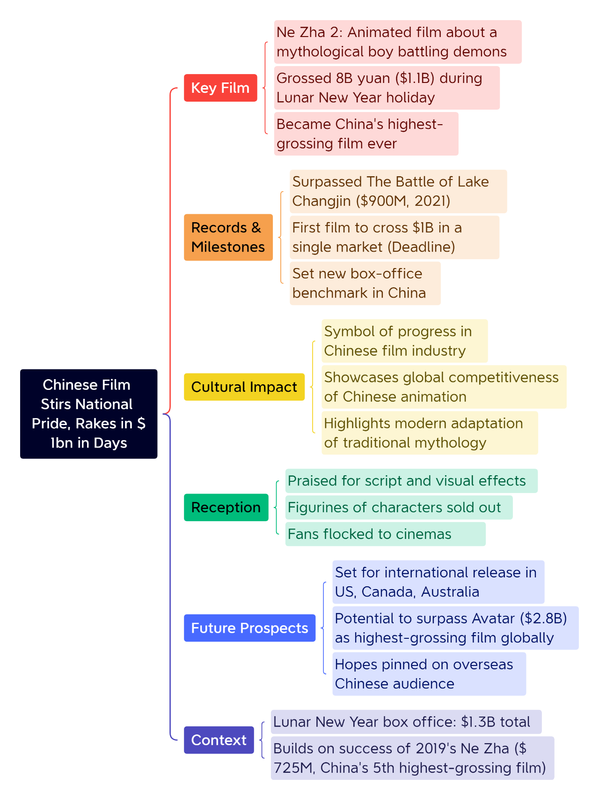

刚刚，电影《哪吒之魔童闹海》票房破84亿。

[今天你练听力了吗？](https://mp.weixin.qq.com/s?__biz=MzA5MjM3NDk5Ng==&mid=2650779477&idx=1&sn=223cace658cfd6f213b4925b684e80a4&chksm=89db97cacaf73acd1cf2d43ddc25843e6a3390ba0981ede76cfdc7a90aadf9604f2af933048a&scene=126&sessionid=1739373928&key=daf9bdc5abc4e8d0f64a31e65d4de2d6cd0bb32d3a487295d998b0c33879585fd9f59685bc8e636f9fb511ad5dfb53ce523dc68eb4f4889893a070344c8ed213291bd0b872a261b43b6b49b9a71dd50e0fc20fb7149b93e4bb9045d4dfa87d907555758bba37987628cb3217f4fffa7de337a3b1e75b1f5de30c0a3d40a02366&ascene=0&uin=MzM3NDg4NDIzOA%3D%3D&devicetype=Windows+11+x64&version=63090c11&lang=zh_CN&countrycode=CN&exportkey=n_ChQIAhIQ21fSWDP%2FN%2FOYTVv9sqD%2FGxLmAQIE97dBBAEAAAAAAOgWEsqjMFcAAAAOpnltbLcz9gKNyK89dVj0D48uS%2F9dtllg4ZI8jBRkmgh5X1bQ%2B9FbBJT6DoIyCdmjVOqU49gQznwCfY5tZ3RTLgySAcQ6edKOO%2FNMX06CzH8Tl9%2F5ff%2FNDKHeOONooVybG3%2B75vSYlb2yibl9p6NEQ5i62BTsMNvSKJXsBYMqri87JTWRt8r0G%2FRcAoGYlQt2Bbytx%2BwpX3gS8FZXZBaaeTG%2FM8FHURF6%2BQD0Pj5iBNBLbOJ2PcSjgn24%2Bb2vSac3IGReijmzP2rZlkm9JNcK&acctmode=0&pass_ticket=DBL2bhHP7UNXzKH9EknnfXZlVA3%2B%2FxK%2BGy1y6xecqGpyuT831FvTbZ%2BxcJrQy1%2Fo&wx_header=1&fasttmpl_type=0&fasttmpl_fullversion=7593620-zh_CN-zip&fasttmpl_flag=1)

🤔️小作业：

**1\. If Chinese films earned a total of 1.3 billion during the weeklong holiday period, and Ne Zha 2 alone contributed 1.1 billion, approximately what percentage of the total holiday revenue did Ne Zha 2 generate?**

A. 0.2 billion B. 1.0 billion

C. 85% D. 95%

## 无注释原文：

**Chinese film stirs national pride, rakes in $1bn in days**

**From: BBC**

An animated film about a boy who battles demons with his magical powers has become China's highest-grossing film ever and a source of national pride.

Ne Zha 2, based on a Chinese mythological character, has raked in more than 8 billion yuan ($1.1bn; £910m) during the week-long Lunar New Year holiday, according to ticket sales tracker Maoyan.

It broke the record set by 2021's The Battle of Lake Changjin, a propaganda film about the 1950s Korean War, which earned about $900m.

Ne Zha 2 is being hailed as a symbol of progress in Chinese film, which has long trailed Hollywood despite a massive domestic market.

Hot off its domestic success, Ne Zha 2 will be shown overseas next week, including in the US, Canada and Australia.

To Chinese viewers, Ne Zha 2 shows how locally-made films are becoming competitive globally.

"It not only showcases the strong power of Chinese animation after its rise, but also demonstrates the infinite possibilities of traditional Chinese mythology in the modern context," reads one review on IMDB.

Some hope it could earn another $1bn and surpass the world's highest-grossing film of all time, 2009's Avatar.

"Now it's over to the Chinese people overseas to chip in," read one comment on Weibo.

Movie ticket sales in China surge during the Lunar New Year festivities. This season saw Chinese films rake in $1.3b during the weeklong holiday period, underscoring an increase in consumer spending.

Aside from setting a new box-office benchmark in China, Ne Zha 2 is also the first movie ever to cross $1bn in a single market, according to Hollywood publication Deadline.

Ne Zha 2 has been praised for its script and visual effects. Figurines of the movie's characters have flown off the shelves as fans flock to cinemas.

It builds on the success of the 2019 film Ne Zha, which made more than $725m and is China's fifth highest-grossing film of all time.

\- ◆ -

注：完整题目见本文开头；中文文本为机器翻译并非一一对应，仅供参考

## 含注释全文：

**Chinese film** **stirs** **national pride, rakes in $1bn in days**

**From: BBC**

An animated film about a boy who battles demons with his magical powers has become China's highest-grossing film ever and a source of national pride.

一部讲述少年用法力降妖除魔的动画电影，成为中国有史以来票房最高的电影，更点燃了全民自豪感。

**stir**

stir /stɜːr/ 作动词，表示“激发，激起（强烈的感情）；引起（强烈的反应）”，英文解释为“to make someone have a strong feeling or reaction”举个🌰：The poem succeeds in stirring the imagination. 这首诗能够激发起想象力。

作名词表示“极大的兴趣；兴奋；骚动”，英文解释为“a lot of interest or excitement”举个🌰：The scandal caused/created quite a stir at the time. 那场丑闻在当时引起了极大的轰动。

stir sth up 表示“激起（不快的情感）；挑起，煽动（事端）”，英文解释为“to cause an unpleasant emotion or problem to begin or grow”举个🌰：The teacher told him to stop stirring up trouble. 老师让他不要再生事。

**animated**

animated /ˈæn.ɪ.meɪ.tɪd/ 1）表示“活跃的；生气勃勃的”，英文解释为“full of interest and energy”举个🌰：There was an extremely animated discussion on the subject. 这个话题引起了极其热烈的讨论。

2）表示“（电影等）动画制作的，动画的；（木偶、模型等）能活动的；（绘画）栩栩如生的”，英文解释为“Animated films, drawings, models, etc. are ones that are photographed or created by a computer and shown in a way that makes them move.”

**demon**

demon /ˈdiː.mən/ 1）表示“恶魔，魔鬼”，英文解释为“an evil spirit”

2）表示“技法纯熟者；劲头十足的人”，英文解释为“a person who does a particular activity with great skill or energy”举个🌰：She works like a demon. 她工作起来很玩命。

**gross**

gross /ɡrəʊs/ 可以作名词，也可以作动词，表示“总收入为，总共赚得，获得…毛利”，英文解释为“to earn a particular amount of money before tax is paid or costs are taken away”举个🌰：The film has grossed over $200 million this year. 这部电影今年总收入超过了两亿美元。

🎬电影《皮克斯的故事》（The Pixar Story）中的台词提到：making it the new highest grossing animated film in history. 成为历史上最卖座的动画电影。

Ne Zha 2, based on a Chinese mythological character, has raked in more than 8 billion yuan ($1.1bn; £910m) during the week-long Lunar New Year holiday, according to ticket sales tracker Maoyan.

票务平台猫眼（Maoyan）数据显示，根据中国神话人物改编的《哪吒2》在为期一周的春节长假期间狂揽80亿元（约合11亿美元；9.1亿英镑）票房。

**mythological**

mythological /ˌmɪθ.əlˈɒdʒ.ɪ.kəl/ 表示“神话学的；神话（中）的”，英文解释为“existing in or relating to myths (= ancient stories)”

**rake in**

表示“轻易赚（很多钱）；赚大钱”，英文解释为“to earn or get a large amount of money”举个🌰：He rakes in over $200,000 a year. 他一年能挣20多万美元。

It broke the record set by 2021's The Battle of Lake Changjin, a propaganda film about the 1950s Korean War, which earned about $900m.

该片打破了2021年《长津湖》（The Battle of Lake Changjin）创下的纪录，这是一部关于20世纪50年代朝鲜战争的主旋律电影，票房收入约为9亿美元。

**propaganda**

propaganda /ˌprɑː.pəˈɡæn.də/ 表示“宣传；鼓吹”，英文解释为“information, ideas, opinions, or images, often only giving one part of an argument, that are broadcast, published, or in some other way spread with the intention of influencing people's opinions”

propagate /ˈprɒpəˌɡeɪt/ 表示“传播，散播；宣传”，英文解释为“to spread opinions, lies, or beliefs among a lot of people”举个🌰：Such lies are propagated in the media. 这样的谎言通过媒体传播开来。

Ne Zha 2 is being hailed as a symbol of progress in Chinese film, which has long trailed Hollywood despite a massive domestic market.

《哪吒2》被誉为中国电影进步的象征，尽管国内市场规模庞大，但长期以来一直落后于好莱坞。

**hail**

hail /heɪl/ 作动词 1）表示“招呼，呼喊”，英文解释为“to call someone in order to attract their attention”举个🌰：Shall we hail a taxi? 我们要叫出租车吗？

2）hail sb/sth as sth 表示“把…称赞为，把…誉为”，英文解释为“to describe sb/sth as being very good or special, especially in newspapers, etc.”举个🌰：The conference was hailed as a great success. 会议被称颂为一次巨大的成功。

hail作不可数名词，表示“雹，冰雹”，英文解释为“small, hard balls of ice that fall from the sky like rain”，hailstones 通常复数，表示“冰雹，雹子”，英文解释为“a small, hard ball of ice that falls from the sky like rain”

📍ride-hailing 表示“约车，叫车”，英文解释为“used for or involved in the activity of asking for a car and driver to come immediately and take you somewhere”举个🌰：Do you use a ride-hailing app? 你用约车APP吗？

**trail**

trail /treɪl/ 作名词表示“小路，小径”如：a forest/mountain trail 林间/山间小道，以及“臭迹；踪迹；痕迹；蛛丝马迹，线索”等意思，英文解释为“the smell or series of marks left by a person, animal, or thing as it moves along；various pieces of information that together show where someone you are searching for has gone”举个🌰：The dogs are trained to follow the trail left by the fox. 这些狗经过特别的训练，能够追踪狐狸留下的气味。

作动词，1）表示“拖，拉”，英文解释为“to (allow something to) move slowly along the ground or through the air or water, after someone or something”举个🌰：Your skirt's trailing in the mud! 你的裙子拖在泥里了！

2）表示“（比赛中）落后，失败”，英文解释为“to be losing to your competitor in a competition”举个🌰：The Canadian team is trailing by six points. 加拿大队落后了6分。

Hot off its domestic success, Ne Zha 2 will be shown overseas next week, including in the US, Canada and Australia.

在横扫国内市场后，该片将于下周登陆美国、加拿大和澳大利亚等海外市场。

To Chinese viewers, Ne Zha 2 shows how locally-made films are becoming competitive globally.

对于中国观众来说，《哪吒2》展示了本土电影在全球范围内变得更具竞争力。

"It not only showcases the strong power of Chinese animation after its rise, but also demonstrates the infinite possibilities of traditional Chinese mythology in the modern context," reads one review on IMDB.

IMDB上的一则评论写道：“它不仅展示了中国动画崛起后的强大实力，也展现了中国传统神话在现代背景下的无限可能。”

**showcase**

showcase /ˈʃəʊ.keɪs/ 表示“展示…的优点；充分展示”，英文解释为“to show the best qualities or parts of something”举个🌰：The main aim of the exhibition is to showcase British design. 该展览的主要目的是一展英国设计的风采。

**infinite**

表示“无限的，无边的；极大的”，英文解释为“without limits; extremely large or great”举个🌰：The universe is theoretically infinite. 从理论上来讲，宇宙是无边无际的。

**mythology**

mythology /mɪˈθɒlədʒɪ/ 表示“神话”，英文解释为“myths in general”举个🌰：She's fascinated by the stories of classical mythology (= ancient Greek and Roman myths). 她被古典神话故事迷住了。

Some hope it could earn another $1bn and surpass the world's highest-grossing film of all time, 2009's Avatar.

部分影迷甚至期待它能冲击10亿美元票房，超越2009年《阿凡达》（Avatar）保持的全球影史纪录。

**surpass**

surpass /səˈpɑːs/ 表示“超过，优于，胜过”，英文解释为“to do or be better than”举个🌰：His time for the 100 metres surpassed the previous world record by one hundredth of a second. 他以0.01秒的优势打破了100米短跑的前世界纪录。

"Now it's over to the Chinese people overseas to chip in," read one comment on Weibo.

微博上的一则评论写道：“现在就看海外华人的贡献了。”

**chip in**

chip /tʃɪp/ in 1）表示“插嘴，插话；打断别人的话”，英文解释为“to interrupt a conversation in order to say something”举个🌰：I'll start and you can all chip in with your comments. 我现在开始，你们随时都可以插话发表意见。

2）chip (sth) in表示“共同支付；凑钱，凑份子”，英文解释为“to give some money when several people are giving money to pay for something together”举个🌰：They all chipped in £100 and bought their mother a trip to Greece. 他们每人凑了100英镑，让母亲到希腊旅游一趟。

Movie ticket sales in China surge during the Lunar New Year festivities. This season saw Chinese films rake in $1.3b during the weeklong holiday period, underscoring an increase in consumer spending.

今年春节档期中国电影票房激增。在为期一周的假期中，中国电影票房收入达13亿美元，凸显了消费支出的增长。

**surge**

surge /sɜːdʒ/ 1）作动词，表示“急剧上升；飞涨；剧增”，英文解释为“If something surges, it increases suddenly and greatly, after being steady or developing only slowly.”举个🌰：The company's profits have surged. 公司的利润激增。

2）表示“涌动，蜂拥向前”，英文解释为“to move quickly and powerfully”举个🌰：An angry crowd surged through the gates of the president's palace. 愤怒的人群涌进了总统府的大门。

3）作名词，表示“剧增”，英文解释为“A surge is a sudden large increase in something that has previously been steady, or has only increased or developed slowly.”举个🌰：An unexpected surge in electrical power caused the computer to crash. 突然出现的电压剧增导致电脑死机。

🎬电影《雷神2：黑暗世界》（Thor: The Dark World）中的台词提到：But she will not survive the amount of energy surging within her. 但她体内涌动的能量太大 她撑不住的。

Aside from setting a new box-office benchmark in China, Ne Zha 2 is also the first movie ever to cross $1bn in a single market, according to Hollywood publication Deadline.

据好莱坞媒体Deadline报道，《哪吒2》不仅在中国创下了新的票房纪录，也是有史以来第一部在单一市场票房突破10亿美元的电影。

**benchmark**

benchmark /ˈbentʃ.mɑːk/ 表示“基准（点）”，英文解释为“a level of quality that can be used as a standard when comparing other things”举个🌰：Her outstanding performances set a new benchmark for singers throughout the world. 她的精彩表演为全世界歌手树立了新典范。

Ne Zha 2 has been praised for its script and visual effects. Figurines of the movie's characters have flown off the shelves as fans flock to cinemas.

《哪吒2》的剧本和视觉效果都受到了好评。随着影迷蜂拥至影院观看，该电影中角色玩偶已被抢购一空。

**script**

script /skrɪpt/ 表示“剧本；电影剧本；广播（或讲话等）稿”，英文解释为“a written text of a play, film/movie, broadcast, talk, etc.”举个🌰：That line isn't in the original script. 原剧本中没有那句台词。

**figurine**

figurine /ˌfɪɡ.əˈriːn/ 表示“（陶瓷）小雕像，小塑像”，英文解释为“a small model of a human, usually made of clay or porcelain”

**fly off the shelves**

表示“抢购一空；销售火爆”，英文解释为“to sell very quickly, to be very popular”

**flock**

flock /flɒk/ 表示“成群结队地去，蜂拥而至”，英文解释为“if people flock to a place, they go there in large numbers because something interesting or exciting is happening there”举个🌰：People have been flocking to the exhibition. 看展览的人络绎不绝。

It builds on the success of the 2019 film Ne Zha, which made more than $725m and is China's fifth highest-grossing film of all time.

这部续作延续了2019年前作《哪吒》的辉煌——后者曾以7.25亿美元票房收入位列中国影史第五。

\- 词汇盘点 -

stir、 animated、 demon、 gross、 mythological、 rake in、 propaganda、 hail、 trail、 showcase、 infinite、 mythology、 surpass、 chip in、 surge、 benchmark、 script、 figurine、 fly off the shelves、 flock

\- 词汇助记 By DeepSeek -

_An animated film based on mythological demons surpassed box office benchmarks, raking in gross profits. Fans flocked to buy figurines, which flew off the shelves. The script, praised for showcasing infinite creativity, stirred a surge in propaganda, hailing it as a cultural trailblazer._
