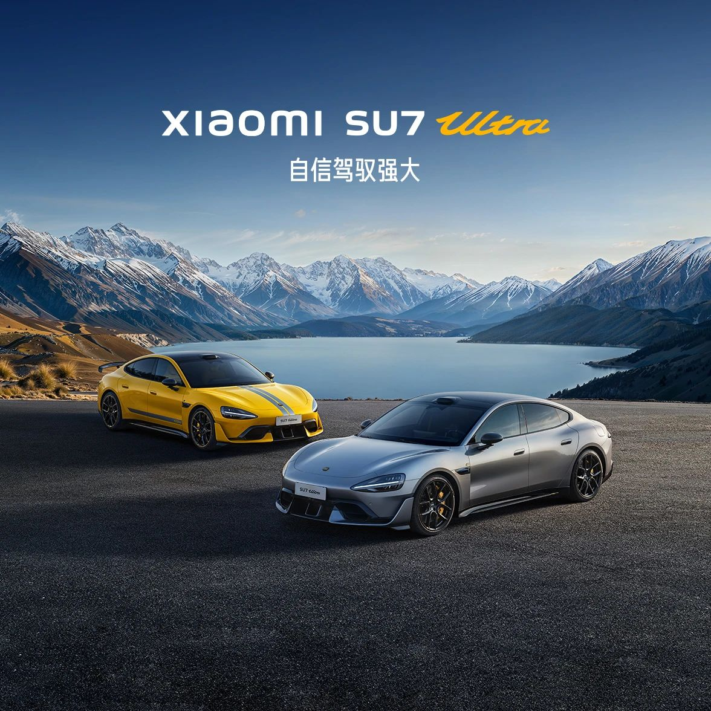
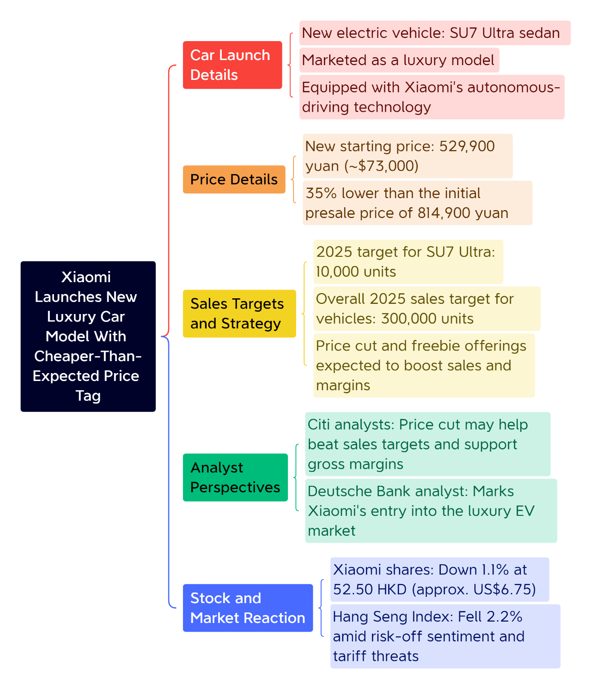

> 小米SU7 Ultra正式发布 定价52.99万元起

昨晚，小米SU7 Ultra正式发布，定价52.99万元起；开售2小时，大定过10000台。

[今天你练听力了吗？](https://mp.weixin.qq.com/s?__biz=MzA5MjM3NDk5Ng==&mid=2650779723&idx=1&sn=2e6ad17d84b52369ecbb4009766c7f42&chksm=8979b481436c878441f9427feba9b500ff1e70bab561341ab9b66175ebc760c00eb47a06553e&scene=126&sessionid=1740810243&key=daf9bdc5abc4e8d08db044e1cdc71d7e1902736ec9a38fd52e66dd2f0fc24cc23310e93564ff8d1f48f1ba013029687142bd64095556c378767170d5e6e6086c0f315eeae991a766cca450ca940475f604df40d40dab518c2fedb9ffa3686fb49010bb874afac08b4f8d2ab075c8dcbc96e373d5bb917c58f70983f8222061e9&ascene=0&uin=MzM3NDg4NDIzOA%3D%3D&devicetype=Windows+11+x64&version=63090c29&lang=zh_CN&countrycode=CN&exportkey=n_ChQIAhIQWAHL01KtwWSZ2H%2F0eAKhWhLmAQIE97dBBAEAAAAAAAVPNymYSyYAAAAOpnltbLcz9gKNyK89dVj0XG2QS8r6tziyVLl9%2FHJt%2BUBKibS3rKSklPlX3%2B5i4hAuJdn5FCH%2BBeGlzGkzr%2BD0RAR%2F58WzQ%2FJgiyaqOWui8Q51uafKtFhPJjJLrw1tZjxmBgMZFmiqyKnbqnZVSTTCr%2Fh3osp4fO%2Bq%2FGxipoKe1dGvqUtrUVrlvAztUie7EeSUbI39LGEdyFQ9icmC1YKfugFy1sHDkgGlZwRE0yREKP%2FaARqTrPp34lSZiQRiVGoDv%2FBKIBWXWUIJBBchNrPd&acctmode=0&pass_ticket=uKSnDlfWX3itvo9WaWIQlEkZDpPwqUZTqMp%2FhZ4GYnMJ0WPIIclz3MtPH%2BKPZVgH&wx_header=1&fasttmpl_type=0&fasttmpl_fullversion=7613465-zh_CN-zip&fasttmpl_flag=1)

🤔️小作业：

**1\. If Xiaomi's sales target for the SU7 Ultra model is 10,000 units and the overall vehicle sales target for 2025 is 300,000 units, approximately what percentage of the total target does the SU7 Ultra represent?**

A. 1.5% B. 3.3%

C. 10% D. 15%

## 无注释原文：

**Xiaomi Launches New Luxury Car Model With Cheaper-Than-Expected Price Tag**

**From: Dow Jones Newswires**

Chinese consumer-electronics giant Xiaomi launched its new luxury electric vehicle with a lower-than-expected price tag, as competition ramps up in China's electric-vehicle market.

Xiaomi is selling its new four-door SU7 Ultra sedan at a starting price of 529,900 yuan, equivalent to around $73,000, Chief Executive Lei Jun said late Thursday. That is 35% lower than the 814,900 yuan starting price quoted when presales started in October.

"We believe SU7 Ultra could beat its \[sales\] target given the price cut and freebie offerings as well as a precise target marketing effect, which provides higher gross margin support for the overall EV business," Citi analysts said in a note.

Earlier this month, Lei had said Xiaomi's 2025 sales target for the SU7 Ultra model was 10,000 units.

Xiaomi is marketing the new sedan as a luxury model, targeting the high-end segment, which Deutsche Bank analyst Bin Wang says marks the company's entry into the luxury EV market.

The SU7 Ultra will be equipped with Xiaomi's autonomous-driving technology, which Wang thinks should help the company grow its market share.

Overall, Xiaomi said it aims to sell 300,000 vehicles in 2025.

Xiaomi's shares were last down 1.1% at 52.50 Hong Kong dollars, equivalent to US$6.75, in Friday trading. The benchmark Hang Seng Index fell 2.2%, as risk-off sentiment dominated following the fresh tariff threats overnight.

\- ◆ -

注：完整题目见本文开头；中文文本为华尔街日报官方译文，仅供参考

## 含注释全文：

**Xiaomi Launches New Luxury Car Model With Cheaper-Than-Expected Price Tag**

**From: Dow Jones Newswires**

Chinese consumer-**electronics** **giant** Xiaomi launched its new luxury electric vehicle with a lower-than-expected **price tag**, as competition **ramps up** in China's electric-vehicle market.

中国消费电子产品巨头小米集团(Xiaomi)正式发布了一款定价低于预售价的新款豪华电动汽车，目前中国电动汽车市场竞争正加剧。

**electronics**

electronics /ˌel.ekˈtrɒn.ɪks/ 1）表示“电子学”，英文解释为“the scientific study of electric current and the technology that uses it”如：a degree in electronics 电子学学位。

2）表示“电子电路；电子器件”，英文解释为“the electronic circuits and components (= parts) used in electronic equipment”如：a fault in the electronics 电子电路故障。

3）表示“电子产品；电子设备”，英文解释为“products that use electronic parts”

**giant**

giant /ˈdʒaɪ.ənt/表示“巨头，大公司”，英文解释为“Giant is often used to refer to any large, successful business organization or country.”如：Japanese electronics giant, Sony 日本的电子业巨头——索尼公司。

📍这个词来自希腊神话中的“巨人”（Gigantes），表示在某个领域或行业内非常强大或巨大的实体。

类似的还有：

📍mogul /ˈməʊɡəl/表示“（尤指新闻、影视界的）大人物；大亨”，英文解释为“A mogul is an important, rich, and powerful businessman, especially one in the news, film, or television industry.”如：an international media mogul一位国际传媒大亨。

📍magnate /ˈmæɡneɪt, -nɪt/ 表示“大亨，巨头”，英文解释为“a rich and powerful person in industry or business”

📍tycoon /taɪˈkuːn/ 表示“巨头，大亨（工商界）”，英文解释为“someone who is successful in business or industry and has a lot of money and power”如：property tycoon 房地产大亨。

📍conglomerate /kənˈglɒmərɪt/ 表示“联合大公司；企业集团”，英文解释为“A conglomerate is a large business firm consisting of several different companies.”如：the world's second-largest media conglomerate 世界第二大传媒集团。

📍behemoth /ˈbiːhɪmɒθ/ 表示“巨头（指规模庞大、实力雄厚的公司或机构）”，英文解释为“a very big and powerful company or organization”

📍titan /ˈtaɪ.tən/表示“巨人；巨头”，英文解释为“If you describe someone as a titan of a particular field, you mean that they are very important and powerful or successful in that field.”

**price tag**

price tag /ˈpraɪs ˌtæɡ/ 表示“（挂在商品上的）价格标签；价格”，英文解释为“a piece of paper with a price that is attached to a product, or the amount that something costs”举个🌰：How much is it? I can't find the price tag. 这多少钱？——我找不到价格标签。

**ramp up**

1）表示“加快（速度）；增加（威力）；提高（费用）”，英文解释为“to increase the speed, power, or cost of something”举个🌰：Announcement of the merger is expected to ramp up share prices over the next few days. 预计公司合并的消息发布后，接下来的几天里股票价格会上扬。

2）表示“（公司）扩大，增加，增多（业务等）”，英文解释为“If a business ramps up its activity, it increases it.”举个🌰：The company announced plans to ramp up production to 10,000 units per month. 这家公司宣布了每月生产1万件的增产计划。

📍《经济学人》（The Economist）一篇讲述新型冠状病毒抗体检测的文章中提到：Even when they are cleared for general use it will take time for manufacturers to ramp up the production of tests, 即便在检测设备被获准通用之后，制造商要扩大生产也需要时间，

Xiaomi is selling its new four-door SU7 Ultra **sedan** at a starting price of 529,900 yuan, **equivalent** to around $73,000, Chief Executive Lei Jun said late Thursday. That is 35% lower than the 814,900 yuan starting price **quoted** when presales started in October.

小米首席执行官雷军周四晚间表示，小米新款四门轿车SU7 Ultra的起售价为人民币52.99万元，相当于7.3万美元。这一价格相较于去年10月预售开始时公布的人民币81.49万元起售价低了35%。

**sedan**

sedan /sɪˈdæn/ 表示“小轿车；（三厢）四门轿车”，英文解释为“a car with four doors and a boot/trunk (= space at the back for carrying things) which is separated from the part where the driver and passengers sit”如：a five-seater family sedan 五座家庭式轿车。

**equivalent**

equivalent /ɪˈkwɪv.əl.ənt/ 1）作形容词，表示“（价值、数量、意义、重要性等）相等的，相同的”，英文解释为“equal in value, amount, meaning, importance, etc.”举个🌰：Eight kilometres is roughly equivalent to five miles. 八公里约等于五英里。

2）作名词，表示“相等的东西；等量；对应词”，英文解释为“a thing, amount, word, etc. that is equivalent to sth else”

**quote**

可以作名词，也可以作动词，1）表示“引用，引述，援引”，英文解释为“to repeat the words that someone else has said or written”举个🌰：He's always quoting from LearnAndRecord. 他总是引用《LearnAndRecord》上的内容。

📍听听力时有时候会听到「quote... unquote」指的就是“引文起…引文止”，英文解释为“said to show that you are repeating someone else's words, especially if you do not agree”，可以理解为念的是引号内的内容，举个🌰：She says they're quote "just good friends" unquote. 她说她们，引号，“只是好朋友而已”，引号完。

2）表示“报价”，英文解释为“to give a price, especially one that will be charged for doing a piece of work”举个🌰：The architect has quoted £90,000 to build a patio. 对露台部分，建筑师开价9万英镑。

"We believe SU7 Ultra could beat its \[sales\] target given the price cut and freebie offerings as well as a precise target marketing effect, which provides higher gross margin support for the overall EV business," Citi analysts said in a note.

花旗分析师在一份报告中表示：“我们相信，鉴于降价和赠品以及精准的目标营销效果，SU7 Ultra能够超越其\[销售\]目标，这为整个电动汽车业务提供了更高的毛利率支撑。”

**freebie**

freebie /ˈfriː.bi/ 表示“免费品，赠品”，英文解释为“something that is given to you without you having to pay for it, especially as a way of attracting your support for or interest in something”举个🌰：The company's marketing rep was giving out pens and mugs - the usual freebies. 该公司的销售代表在分发钢笔和杯子——都是些常见的赠品。

**gross margin**

表示“毛利率”，英文解释为“a company's profit from selling goods or services in a particular period before costs not directly related to producing them are taken away. Gross margin is often shown as a percentage of sales”

Earlier this month, Lei had said Xiaomi's 2025 sales target for the SU7 Ultra model was 10,000 units.

本月早些时候，雷军曾表示，小米SU7 Ultra车型的2025年销售目标是1万辆。

Xiaomi is marketing the new sedan as a luxury model, targeting the high-end segment, which Deutsche Bank analyst Bin Wang says marks the company's entry into the luxury EV market.

小米将这款新轿车定位为豪华车型，目标客户是高端市场，德意志银行(Deutsche Bank)分析师Bin Wang称此举标志着小米进入了豪华电动汽车市场。

**segment**

segment /ˈseɡ.mənt/ 1）作名词，可以表示“（群体或事物的）部分，片，段；（柑橘、柠檬的）瓣；（圆的一部分）弓形”，举个🌰：She cleaned a small segment of the painting. 她擦干净了这幅画的一小部分。

2）表示“分割；划分”，英文解释为“to divide sth into different parts”举个🌰：Market researchers often segment the population on the basis of age and social class. 市场研究人员常常按年龄和社会阶层划分人口。

3）表示“（电视、广播或互联网节目的）节，段”，英文解释为“a short piece of film that forms part of a television or radio programme, or that is broadcast on the internet”举个🌰：CNN last week broadcast a segment on homicides in the city. CNN上周播出了有关这座城市凶杀状况节目的一段。

The SU7 Ultra will be equipped with Xiaomi's autonomous-driving technology, which Wang thinks should help the company grow its market share.

SU7 Ultra将搭载小米的自动驾驶技术，Wang认为这将有助于该公司扩大市场份额。

Overall, Xiaomi said it aims to sell 300,000 vehicles in 2025.

小米称2025年的总体目标是交付30万辆汽车。

Xiaomi's shares were last down 1.1% at 52.50 Hong Kong dollars, equivalent to US$6.75, in Friday trading. The benchmark Hang Seng Index fell 2.2%, as risk-off sentiment dominated following the fresh tariff threats overnight.

周五，小米股价最新下跌1.1%，至52.50港元，相当于6.75美元。由于前夜的新关税威胁，避险情绪占据主导地位，香港基准恒生指数下跌2.2%。

**benchmark**

benchmark /ˈbentʃ.mɑːk/ 表示“基准（点）”，英文解释为“a level of quality that can be used as a standard when comparing other things”举个🌰：Her outstanding performances set a new benchmark for singers throughout the world. 她的精彩表演为全世界歌手树立了新典范。

**sentiment**

sentiment /ˈsen.tɪ.mənt/表示“观点；意见；看法；情绪”，英文解释为“a thought, opinion, or idea based on a feeling about a situation, or a way of thinking about something”举个🌰：I don't think she shares my sentiments. 我认为她不同意我的观点。

**tariff**

tariff /ˈtærɪf/ 表示“关税”，英文解释为“A tariff is a tax that a government collects on goods coming into a country.”

## \- 词汇盘点 -

electronics、 giant、 price tag、 ramp up、 sedan、 equivalent、 quote、 freebie、 gross margin、 segment、 benchmark、 sentiment、 tariff

## \- 词汇助记 By DeepSeek -

_An electronics giant ramped up production of a luxury sedan, setting a high price tag to boost gross margin. Despite tariff pressures, its benchmark sentiment remained strong, offering freebies to match rivals' quotes in the premium segment, achieving equivalent value._
