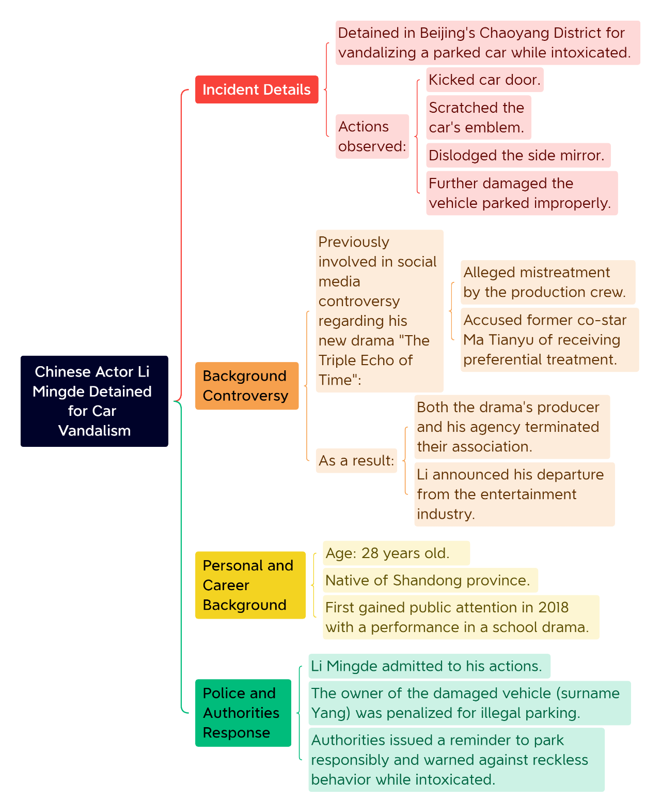
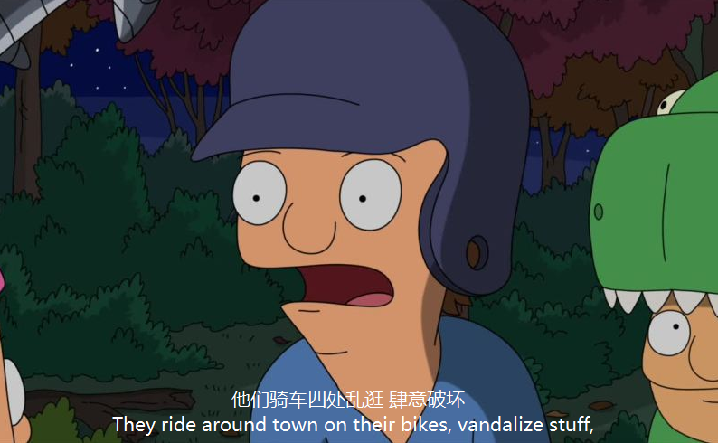
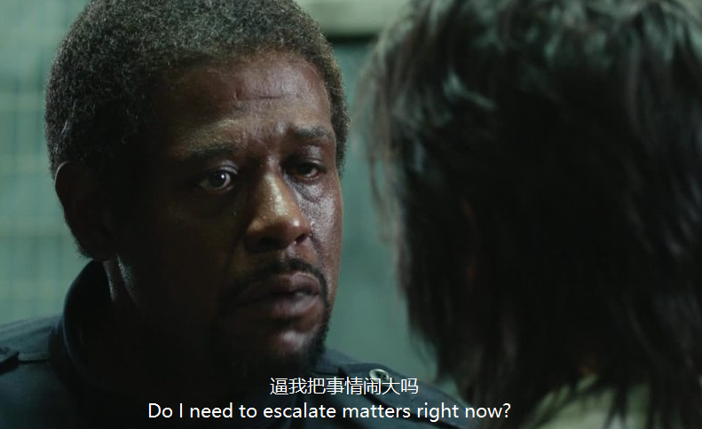

据平安北京朝阳，近日，公共停车位因前车不规范停放影响同行人停车，李某某借着“酒劲”踢车门、抠车标、踹掉反光镜……升级成砸车毁财违法犯罪行为。

[今天你练听力了吗？](https://mp.weixin.qq.com/s?__biz=MzA5MjM3NDk5Ng==&mid=2650779519&idx=1&sn=8fc736255cc9420a6bb863b74bdcb653&chksm=894e388fc93b1d70cdfa42efc344044f501da1f2e2c02be95b5c908a04c942ee1076e88495b9&scene=126&sessionid=1739460358&key=daf9bdc5abc4e8d0492148f51ec142133d4872b627e8987475b1cd242f2f0428412d40b83b2bf3325e0ea5f74544e2a246261dfc1490f4e354c6a45c077ce30735ea6b749a3ef416d560960c083ef9590b8907bfe3f0f368dcc63cf788bc1a919be645a9ae3f0e1067a337e73acdbecd7480c9ba431847742af6b55769e256a9&ascene=0&uin=MzM3NDg4NDIzOA%3D%3D&devicetype=Windows+11+x64&version=63090c11&lang=zh_CN&countrycode=CN&exportkey=n_ChQIAhIQMKfXGERbfIPD%2FdRju%2BMXfRLmAQIE97dBBAEAAAAAAOPoDnMgQ6EAAAAOpnltbLcz9gKNyK89dVj0qBkDxG4MLjZPh%2Fc2ZYbkh8UOAdu2eo8fg2EpcjZceCW3sAvGLigFBVtHUccWL8h6wI2UmWSzEtM7B%2Bvu1MucKDaqSWcUny5DfNcG0RKJIMRagXcc51CG8hYS%2FZBEi%2Bh2JU%2FxVPZVwjH%2BlkSSRH7UQqbLJZBqAx%2BuOi31oWvUKEjpZaaPV3grC8wTN5RYCj27hmusrghHmoijxRzWOsBiblSnflYLBI0xpJrUlXOmkPNUCv9dvP2c8BZ5cBTu05XR&acctmode=0&pass_ticket=LXGFF21uR60Qvw%2FXcOB61uhwjf98G38IIKRYU4cQL7CInu7yX1MW0UdE1gmul9Z5&wx_header=1&fasttmpl_type=0&fasttmpl_fullversion=7600761-zh_CN-zip&fasttmpl_flag=1)

🤔️小作业：

**1\. Which of the following best describes the article's structure?**

A. It begins with a detailed description of the vandalism incident and then provides background on Li Mingde's recent controversies.

B. It opens with a history of Li Mingde's acting career and then discusses the incident as a minor episode.

C. It starts with the social media reaction and concludes with police statements about the incident.

D. It focuses primarily on legal procedures before briefly mentioning Li Mingde's controversies.

## 无注释原文：

**Chinese Actor Li Mingde Detained for Car Vandalism While Intoxicated**

**From: ChatGPT**

Beijing's Chaoyang District police reported on Thursday that 28‑year‑old actor Li Mingde has been criminally detained for vandalizing a parked car while under the influence of alcohol.

According to a statement from the district's public security department, Li was apprehended in the Balizhuang area after being observed kicking a car door, scratching its emblem, dislodging its side mirror, and further damaging the vehicle—which had been parked improperly in a public space.

Chinese media have identified the suspect as Li Mingde, who recently stirred controversy on social media by alleging mistreatment by the crew of his new drama, The Triple Echo of Time, and claiming that his former co-star Ma Tianyu was receiving preferential treatment. In the aftermath, both the drama's producer and Li's agency terminated their association with him, and Li announced his departure from the entertainment industry.

The drama began filming in late December, but tensions escalated when Li posted several critical comments online in early January. He accused the production team of substandard treatment and claimed that Ma was acting like a “big shot.” Both the producer and Ma denied these allegations—citing Li's failure to attend scheduled makeup and script-reading sessions as the cause of filming delays.

A native of Shandong province, Li first gained public attention in 2018 with an impressive performance in a school drama, marking his official entry into film and television.

The police statement noted that Li has admitted to his actions, while the owner of the damaged vehicle, surnamed Yang, was issued an administrative penalty for illegal parking. Authorities reminded citizens to park responsibly for the benefit of all and warned against reckless behavior when intoxicated, emphasizing that such actions will inevitably have consequences.

\- ◆ -

注：完整题目见本文开头；中文文本为机器翻译并非一一对应，仅供参考

## 含注释全文：

**Chinese Actor Li Mingde Detained for Car Vandalism While Intoxicated**

**From: ChatGPT**

Beijing's Chaoyang District police reported on Thursday that 28‑year‑old actor Li Mingde has been criminally detained for vandalizing a parked car while under the influence of alcohol.

据北京朝阳区警方周四通报，28岁的演员李明德因醉酒期间破坏一辆违规停放的车辆，已被刑事拘留。

**detain**

detain /dɪˈteɪn/ 1）表示“拘留；扣押”，英文解释为“When people such as the police detain someone, they keep them in a place under their control.”举个🌰：Police have detained two suspects in connection with the attack. 警方拘留了2名与该袭击事件有关的嫌疑人。

2）表示“耽搁；留住；阻留”，英文解释为“To detain someone means to delay them, for example, by talking to them.”举个🌰："Thank you. We won't detain you any further." “谢谢您。我们不再耽搁您了。”

📍词根“tain-”来自拉丁语“tenere”，意味着“持有，保留”，前缀“de-”表示“向下”，整体表示“向下持有”，即“拘留”或“扣留”。近义词：arrest（逮捕），同根词：detention（拘留），常用短语：be detained for questioning（被拘留接受询问）

**vandalize**
vandalize/vandalise 表示“故意破坏，肆意破坏（尤指公共财物）”，英文解释为“to damage sth, especially public property, deliberately and for no good reason”举个🌰：The walls had been horribly vandalized with spray paint. 这些墙壁已被人用喷漆破坏得一塌糊涂。

📺动画片《鲍勃汉堡店》（Bob's Burgers）中的台词提到：They ride around town on their bikes, vandalize stuff, 他们骑车四处乱逛 肆意破坏。

According to a statement from the district's public security department, Li was apprehended in the Balizhuang area after being observed kicking a car door, scratching its emblem, dislodging its side mirror, and further damaging the vehicle—which had been parked improperly in a public space.

警方在通报中表示，李明德在八里庄附近因醉酒失控，被现场目击踢踹车辆：他不仅踢车门、抠车标，还踢掉反光镜，致使车辆遭到严重损坏，而该车辆当时正停放在公共区域内。
**apprehend**

apprehend /ˌæp.rɪˈhend/ 1）表示“逮捕；拘捕”，英文解释为“to catch and arrest someone who has not obeyed the law”举个🌰：The police have finally apprehended the killer. 警察终于抓住了凶手。

2）表示“领会；理解；懂得”，英文解释为“to understand something”

**scratch**

表示“抓；搔；擦；划”，英文解释为“to cut or damage a surface or your skin slightly with or on something sharp or rough”举个🌰：Be careful not to scratch yourself on the roses. 当心不要被玫瑰刺扎伤。

**emblem**

emblem /ˈem.bləm/ 表示“象征；标志；符号；徽章”，英文解释为“a picture of an object that is used to represent a particular person, group, or idea”举个🌰：A rose is the national emblem of England. 玫瑰是英格兰的标志。

**dislodge**

dislodge /dɪˈslɒdʒ/ 表示“（尤指在外力作用下）使移位；（把某物）强行去除，取出，移动；使免职”，英文解释为“to remove something or someone, especially by force, from a fixed position”举个🌰：The earthquake dislodged stones from the walls and the roof. 地震震落了墙壁和屋顶上的石头。

Chinese media have identified the suspect as Li Mingde, who recently stirred controversy on social media by alleging mistreatment by the crew of his new drama, The Triple Echo of Time, and claiming that his former co-star Ma Tianyu was receiving preferential treatment. In the aftermath, both the drama's producer and Li's agency terminated their association with him, and Li announced his departure from the entertainment industry.

媒体报道称，嫌疑人李明德近期在社交平台上掀起争议，他指责新剧《三人行》剧组对他态度恶劣，并声称前搭档马天宇受到特殊照顾。事件发生后，剧组制片人与李明德所属经纪公司均宣布解除合作，李明德也随即宣布退圈。

**stir**

stir /stɜːr/ 作动词，表示“激发，激起（强烈的感情）；引起（强烈的反应）”，英文解释为“to make someone have a strong feeling or reaction”举个🌰：The poem succeeds in stirring the imagination. 这首诗能够激发起想象力。

作名词表示“极大的兴趣；兴奋；骚动”，英文解释为“a lot of interest or excitement”举个🌰：The scandal caused/created quite a stir at the time. 那场丑闻在当时引起了极大的轰动。

stir sth up 表示“激起（不快的情感）；挑起，煽动（事端）”，英文解释为“to cause an unpleasant emotion or problem to begin or grow”举个🌰：The teacher told him to stop stirring up trouble. 老师让他不要再生事。

**preferential**

preferential /ˌpref.ərˈen.ʃəl/ 表示“优先的；优待的，优惠的”，英文解释为“used to say that something that someone is given is better than what other people receive”举个🌰：Inmates claimed that some prisoners had received preferential treatment. 犯人声称有些囚犯受到了优待。

The drama began filming in late December, but tensions escalated when Li posted several critical comments online in early January. He accused the production team of substandard treatment and claimed that Ma was acting like a “big shot.” Both the producer and Ma denied these allegations—citing Li's failure to attend scheduled makeup and script-reading sessions as the cause of filming delays.

该剧于去年十二月底开机拍摄，但今年初李明德在网上多次发文抱怨剧组待遇欠佳，并指责马天宇仗势欺人。对此，剧组制片人否认指控，称李明德未按约定参加化妆和试戏，擅自离场，导致拍摄进度延误；马天宇也通过微博对指控作出否认。

**escalate**

escalate /ˈɛskəˌleɪt/ 表示“使…加剧；加剧”，英文解释为“If a bad situation escalates or if someone or something escalates it, it becomes greater in size, seriousness, or intensity.”举个🌰：They fear the dispute could escalate. 他们都害怕争端会加剧。

🎬电影《死亡实验》（The Experiment）中的台词提到：Do I need to escalate matters right now? 逼我把事情闹大吗？

📍de-escalate /ˌdiːˈes.kə.leɪt/ 表示“（使）缓和，（使）缓解”，英文解释为“to (cause to) become less dangerous or difficult”举个🌰：There are signs that the confrontation is beginning to de-escalate. 有迹象表明对立已经开始缓和。

**substandard**

substandard /sʌbˈstæn.dəd/ 表示“低于标准的，不合格的”，英文解释为“below a satisfactory standard”如：substandard housing / accommodation 不够标准的住宅 / 住处。

**big shot**

big fish/cheese/gun/noise/shot/wheel表示“大人物，要人”，英文解释为“a person who has an important or powerful position in a group or organization”

**makeup**

make-up/makeup 表示“化妆品”，英文解释为“coloured substances used on your face to improve or change your appearance”举个🌰：I put on a little eye make-up. 我在眼部上了淡妆。

**script**

script /skrɪpt/ 表示“剧本；电影剧本；广播（或讲话等）稿”，英文解释为“a written text of a play, film/movie, broadcast, talk, etc.”举个🌰：That line isn't in the original script. 原剧本中没有那句台词。

A native of Shandong province, Li first gained public attention in 2018 with an impressive performance in a school drama, marking his official entry into film and television.

来自山东的李明德早在2018年凭借校园剧中的出色表现进入影视圈，并迅速受到关注。

The police statement noted that Li has admitted to his actions, while the owner of the damaged vehicle, surnamed Yang, was issued an administrative penalty for illegal parking. Authorities reminded citizens to park responsibly for the benefit of all and warned against reckless behavior when intoxicated, emphasizing that such actions will inevitably have consequences.

警方声明还指出，李明德对自己涉嫌犯罪事实供认不讳，而受损车辆车主（姓杨）因违法停车被处以行政处罚。警方提醒市民务必规范停车，于人于己都方便，同时警告酒后莫任性，否则必将自食其果。

**surname**

surname /ˈsɜː.neɪm/ 表示“姓，姓氏”，英文解释为“the name that you share with other members of your family; last name”举个🌰：Her first name is Sarah but I don't know her surname. 她名叫萨拉，但是我不知道她姓什么。

**reckless**

reckless /ˈrek.ləs/ 表示“鲁莽的；轻率的；不顾后果的”，英文解释为“showing a lack of care about danger and the possible results of your actions”举个🌰：He showed a reckless disregard for his own safety. 他对个人安危全然无所顾忌。

**intoxicated**

intoxicated /ɪnˈtɒk.sɪ.keɪ.tɪd/ 1）表示“喝醉的；（毒品）麻醉的”，英文解释为“under the influence of alcohol or drugs”举个🌰：He appeared intoxicated, police said. 他看上去好像是喝醉了，警察说。

2）表示“陶醉的；极其兴奋的；忘乎所以的”，英文解释为“excited, happy, and slightly out of control because of love, success, etc.”举个🌰：She was understandably intoxicated by her success in the national competition. 她因在全国比赛中获胜而欣喜若狂是可以理解的。

\- 词汇盘点 -

detain、 vandalize、 apprehend、 scratch、 emblem、 dislodge、 stir、 preferential、 escalate、 substandard、 big shot、 makeup、 script、 surname、 reckless、 intoxicated

\- 词汇助记 By DeepSeek -

_A reckless, intoxicated big shot vandalized a city emblem, scratching its surface and dislodging part of it. Authorities detained him, but his preferential treatment stirred public outrage, causing tensions to escalate. His surname and makeup became part of the script in media coverage._
