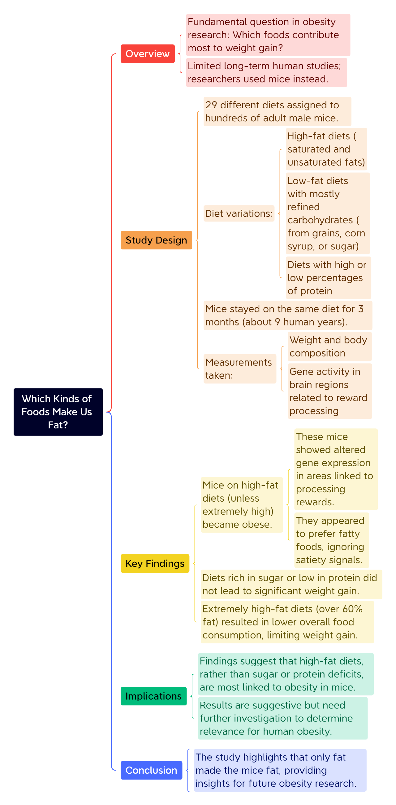

## 体重管理，国家出手了

国家卫生健康委员会主任称，“有些同志体重管理得不太好，腰围大了，体重也超了，有的还患上了慢性病，需要专业医生和专业医疗机构的帮助。”

国家卫健委：实施“体重管理年”3年行动。

[今天你练听力了吗？](https://mp.weixin.qq.com/s?__biz=Mzk3NTQzNTM1Mg==&mid=2247532855&idx=1&sn=a3588851db3a61160fc540013661a2c0&chksm=c53a825f5878c9a09ccc67452aa74011f5eec2ab0d583d6daa2c938448e498cb8e3ec434855d&scene=126&sessionid=1741827315&key=daf9bdc5abc4e8d09cf380d4a0115d3a0e4fc003b474350ab55ffd9efd59756692bc81b3fff449a55009bc08c7d97a2eb22a274e98d65924c2d2ed72159f1efcaf5675a1ea4667648e0d5a0c7c273d49ec15b90d9dc036f17f948ef5c2d98825d8b184121cbddc86d1e28fc540ec9037aa71a061bde1e129e618bb6925789ef7&ascene=0&uin=MzM3NDg4NDIzOA%3D%3D&devicetype=Windows+11+x64&version=63090c2d&lang=zh_CN&countrycode=CN&exportkey=n_ChQIAhIQaSoBMde1Ta1SNrhriZkS8RLmAQIE97dBBAEAAAAAAL2iLBJn60YAAAAOpnltbLcz9gKNyK89dVj0Zv297vtN2CiBIjtL%2BJg3M%2FnpDFAZ%2FU6VTKgj7NvrfNLyF8pZHN34VS3vIdXbaNWdzHBeVXLiM5zfwn9ioZ3Ps6HDOist6KC92zQM%2B8JJzBdRgPwj9UJTbK6A%2FDOizWTadV8fp3nf1CqpS2J2S%2BIWBpu%2FXg98bqN68JBbPqUIxX7jF0LRD6N7nucML7BWHgyWnhbDmpDyGprZrqml%2Fk%2Bc1aTZBPmTr75OjTe37%2FFOUhf1alo0tINsNHmcJu4N34wX&acctmode=0&pass_ticket=OsyRk6UH4fmxdoY6t4DWgEdIM6e3VgmF67hoWB8QgL2eecWZx6eeN7IA58dzNMmI&wx_header=1&fasttmpl_type=0&fasttmpl_fullversion=7641322-zh_CN-zip&fasttmpl_flag=1)

🤔️小作业：

**1\. Which of the following observations was made regarding mice on super-high-fat diets?**

A. They gained more weight than those on moderate high-fat diets.

B. They consumed more food overall than mice on lower-fat diets.

C. They showed a reduction in food intake, possibly due to the high fat content.

D. They exhibited significant changes in gene expression in reward-processing areas.

## 无注释原文：

**Which Kinds of Foods Make Us Fat?**

**From: The New York Times**

One fundamental and unanswered question in obesity research is what kind of foods contribute most to the condition. Experts variously blame, for example, fatty or sugary fare or foods that lack protein, which may prompt us, unconsciously, to overeat. Plenty of anecdotal evidence can be marshaled against any of the culprits, but there has been little long-term, large-scale experimental research on people’s comparative eating habits. It is neither ethical nor practical to have healthy subjects gorge themselves on one diet for years until they are obese.

It is possible, though, to conduct this sort of experiment on mice. For a diet study published this summer in Cell Metabolism, researchers randomly assigned one of 29 different diets to hundreds of adult male mice. (The scientists hope to include female mice in later experiments.)

Some diets supplied up to 80 percent of their calories in the form of saturated and unsaturated fats, with few carbohydrates; others included little fat and consisted largely of refined carbohydrates, mostly from grains and corn syrup, although in some variations the carbs came from sugar. Yet other diets were characterized by extremely high or low percentages of protein.

The mice stayed on the same diet for three months — estimated to be the equivalent of roughly nine human years — while being allowed to eat and move about their cages at will. The mice were then measured by weight and body composition, and their brain tissue was examined for evidence of altered gene activity.

Only some of the mice became obese — almost every one of which had been on a high-fat diet. These mice showed signs of changes in the activity of certain genes too, in areas of the brain related to processing rewards; fatty kibble made them happy, apparently. None of the other diets, including those rich in sugar, led to significant weight gain or changed gene expression in the same way. Even super-high-fat diets, consisting of more than 60 percent fat, did not lead to significant weight gains, and the mice on those diets consumed less food over all than their counterparts, presumably because they simply could not stomach so much fat.

These findings were replicated in subsequent experiments with four other murine breeds. Male mice on relatively high fat diets became obese. The others did not.

“It looks like consuming high-fat diets, if they aren’t extremely high fat, leads to weight gain, if you are a mouse,” says John Speakman, a professor at the Chinese Academy of Sciences in Beijing and at the University of Aberdeen in Scotland, who oversaw the study. Speakman and his co-authors believe that the fatty meals stimulated and altered parts of the brains, causing the mice to want fatty food so much that they ignored other bodily signals indicating that they had already consumed enough energy.

The study was focused on weight gain, not loss, and its subjects were mice, of course, not humans. But the results are suggestive. Sugar did not make the mice fat, and neither did protein deficits. Only fat made them fat.

\- ◆ -

## 含注释全文：

**Which Kinds of Foods Make Us Fat?**

**From: The New York Times**

One _fundamental_ and _unanswered_ question in **obesity** research is what kind of foods contribute most to the condition. Experts variously _blame_, for example, _fatty_ or _sugary_ fare or foods that lack protein, which may _prompt_ us, unconsciously, to overeat. Plenty of **anecdotal** evidence can be **marshaled** against any of the **culprits**, but there has been little long-term, large-scale experimental research on people's comparative eating habits. It is neither ethical nor practical to have healthy subjects **gorge** themselves on one diet for years until they are obese.

肥胖研究中一个基本且尚未解决的问题是什么样的食物最导致肥胖。专家们提出的原因各不相同，例如含脂肪或糖的食物或缺乏蛋白质的食物，因其可能会在不知不觉中使我们吃得太多。针对任何一个肥胖元凶，都可以汇集不少琐碎的反驳证据，但在比较饮食习惯方面长期且大规模的实验研究却很少。让健康的受试者多年暴食某一种食物直到肥胖，这既不道德也不现实。

obesity

obesity /oʊˈbiːsəti/ 表示“肥胖”，英文解释为“the fact of being extremely fat, in a way that is dangerous for health”

📍词根“obes-”来自拉丁语“obesus”，意味着“肥胖的”。近义词：overweight（超重），同根词：obese（肥胖的），常用短语：combat obesity（对抗肥胖症）

fare

fare /feər/ 1）表示“出租车乘客”，英文解释为“someone who pays to be driven somewhere in a taxi”

2）表示“车费；车票价”，英文解释为“the money that you pay for a journey in a vehicle such as a bus or train”举个🌰：Train fares are going up again. 火车票又涨价了。

3）表示“（餐馆的）饭菜”，英文解释为“the type of food that is served in a restaurant”

4）熟词僻义，表示“常见的东西；供大众使用的东西（尤指娱乐活动）”，英文解释为“material provided for use, consumption, or enjoyment”

protein

protein /ˈprəʊ.tiːn/ 表示“蛋白质”，英文解释为“one of the many substances found in food such as meat, cheese, fish, or eggs, that is necessary for the body to grow and be strong”

prompt

prompt /prɒmpt/ 作名词，1）表示“（计算机屏幕上的）提示符（显示计算机已经准备好接受指令）”，英文解释为“a sign on a computer screen that shows that the computer is ready to receive your instructions”

📍在ChatGPT火热的今天，prompt通常指的是给模型的输入，用来激发或引导模型生成特定的输出或回答。简而言之，prompt是指用户提供给语言模型的一段文字或命令，以便模型据此理解用户的需求并给出相应的响应或信息。例如，在与像ChatGPT这样的大语言模型交互时，用户提出的问题或指令就是一个“prompt”。模型会根据这个prompt的内容分析、处理并生成回答或执行相关的任务。Prompt对于大语言模型来说是非常关键的，因为它直接决定了模型如何理解和回应用户的需求。

📍prompt中文里有译为“提示词”，prompt engineering 就是“提示工程/提示词工程”。

2）表示“（给演员的）提词，提白”，英文解释为“words that are spoken to an actor who has forgotten what he or she is going to say during the performance of a play”

3）作动词，表示“促使；导致；激起”，英文解释为“to make sb decide to do sth; to cause sth to happen”举个🌰：His speech prompted an angry outburst from a man in the crowd. 他的讲话激起了人群中一男子的愤怒。

📺美剧《斯巴达克斯：血与沙》（Spartacus: Blood and Sand）中的台词提到：One cannot but wonder what would prompt such an act 不知他们为何遭此不幸。

4）作动词，表示“（尤指）给（演员）提词”，英文解释为“to help someone, especially an actor, to remember what they were going to say or do”举个🌰：I forgot my line and had to be prompted. 我忘词了，只好让人提词。

anecdotal

anecdotal /ˌænɪkˈdəʊt(ə)l/ 表示“逸事的；趣闻的；传闻的”，英文解释为“based on anecdotes and possibly not true or accurate”，如：anecdotal evidence 传闻的证据。

marshal

marshal /'mɑrʃəl/ 1) 表示“整理（思路、想法等）”，英文解释为“to organize your thoughts, ideas etc so that they are clear, effective, or easy to understand”如：marshal your thoughts/arguments etc，举个🌰：When working on my doctoral thesis, I often pause for a moment to marshal my thoughts. 我写博士论文时经常停顿片刻，整理下思路。

2) 表示“整理调集，集结（力量）”，英文解释为“to organize all the people or things that you need in order to be ready for a battle, election etc”

culprit

1）表示“罪犯；造成破坏（问题）的人；过失者；责任人”，英文解释为“the person who is guilty of a crime or doing something wrong”

2）表示“问题的起因；罪魁祸首”，英文解释为“a fact or situation that is the reason for something bad happening”举个🌰：Children in this country are getting much too fat, and sugar and sweets are the main culprits. 该国儿童过于肥胖，糖和甜食是罪魁祸首。

ethical

ethical /ˈeθ.ɪ.kəl/ 表示“道德的；伦理的”，英文解释为“relating to beliefs about what is morally right and wrong”如：ethical and legal issues 道德和法律问题。

gorge

gorge /ɡɔːdʒ/ 作动词，表示“狼吞虎咽；塞饱”，英文解释为“to eat until you are unable to eat any more”举个🌰：If you gorge yourself on snacks like that, you won't eat your dinner. 你要是那样一个劲儿地吃零食，晚饭你就吃不下了。

作名词，表示“（通常指河流冲刷而成的）峡，峡谷”，英文解释为“a deep, narrow valley with steep sides, usually formed by a river or stream cutting through hard rock”

It is possible, though, to conduct this sort of experiment on _mice_. For a diet study published this summer in Cell Metabolism, researchers **randomly** assigned one of 29 different diets to hundreds of adult male mice. (The scientists hope to include female mice in later experiments.)

但是，对小鼠进行这种实验却是可能的。今年夏天在《细胞代谢》杂志（Cell Metabolism）发表的一项饮食研究中，研究人员随机将29种不同饮食中的一种分配给数百只成年雄性小鼠（科学家希望在之后的实验中纳入雌性小鼠）。

randomly

randomly /ˈræn.dəm.li/ 表示“随机的；任意的”，英文解释为“in a way that is unexpected or does not seem to have any reason or cause”举个🌰：He just randomly shouts stuff. 他只是随意地喊着什么。

Some diets supplied up to 80 percent of their calories in the form of **saturated** and unsaturated fats, with few **carbohydrates**; others included little fat and consisted largely of refined carbohydrates, mostly from grains and corn **syrup**, although in some variations the **carbs** came from sugar. Yet other diets were characterized by extremely high or low percentages of protein.

有些食物以饱和及不饱和脂肪的形式提供最多达80％的卡路里，碳水化合物则很少；另一些则脂肪很少，大部分由主要来自谷物和玉米糖浆（corn syrup）的精制碳水化合物组成，尽管其中有些版本的碳水化合物来自食糖。而另一种饮食的特征是含有极高或极低百分比的蛋白质。

calorie

calorie /ˈkæl.ər.i/ 表示“卡，卡路里（测量食物所含热量的单位）”，英文解释为“a unit of energy, often used as a measurement of the amount of energy that food provides”举个🌰：There are about 50 calories in an apple. 一个苹果大约含有50卡路里的热量。

saturated

saturated /ˈsætʃ.ər.eɪ.tɪd/ 表示“（溶液）饱和的；使湿透；浸透；渗透”，英文解释为“completely wet”举个🌰：It's pouring down outside - I'm absolutely saturated! 外面下着倾盆大雨——我全身都湿透了！

carbohydrate

carbohydrate /ˌkɑːbəʊˈhaɪdreɪt/表示“碳水化合物；含碳水化合物的食物”，英文解释为“Carbohydrates are substances, found in certain kinds of food, that provide you with energy. Foods such as sugar and bread that contain these substances can also be referred to as carbohydrates. ”如：carbohydrates such as bread, pasta, or potatoes. 含碳水化合物的食物，如面包、意大利面或马铃薯。

carb /kɑːb/，carbohydrate的非正式说法，表示“碳水化合物”，英文解释为“informal for carbohydrate ”举个🌰：Studies have indicated a low-carb diet can pose heart and kidney risks. 研究表明低碳水化合物饮食对心脏和肾脏造成风险。

syrup

syrup /ˈsɪr.əp/ 表示“浓糖水，糖浆”，英文解释为“a very sweet, thick liquid”举个🌰：Make a syrup by boiling 100 g sugar in 300 ml water. 煮沸300毫升含100克糖的水，制成糖浆。

variation

variation /ˌveə.riˈeɪ.ʃən/ 表示“变种，变体；变化了的东西”，英文解释为“something that is slightly different from the usual form or arrangement”举个🌰：The medical tests showed some variation in the baby's heart rate. 医学检验表明婴儿的心率有些不齐。

The mice stayed on the same diet for three months — estimated to be the **equivalent** of roughly nine human years — while being allowed to eat and move about their _cages_ at will. The mice were then measured by weight and body composition, and their brain **tissue** was examined for evidence of altered gene activity.

这些小鼠保持相同的饮食三个月——估计大约相当于人类的九年——同时允许它们随意进食和在笼子里走动。然后研究人员测量小鼠的体重和身体组成，并检查其脑组织是否存在基因活动被改变的证据。

equivalent

equivalent /ɪˈkwɪv.əl.ənt/ 1）作形容词，表示“（价值、数量、意义、重要性等）相等的，相同的”，英文解释为“equal in value, amount, meaning, importance, etc.”举个🌰：Eight kilometres is roughly equivalent to five miles. 八公里约等于五英里。

2）作名词，表示“相等的东西；等量；对应词”，英文解释为“a thing, amount, word, etc. that is equivalent to sth else”

composition

composition /ˌkɒm.pəˈzɪʃ.ən/ 表示“成分；构成；结构”，英文解释为“the parts, substances, etc. that something is made of”如：the composition of the atmosphere 大气的构成。

Only some of the mice became obese — almost every one of which had been on a high-fat diet. These mice showed signs of changes in the activity of certain genes too, in areas of the brain related to processing rewards; fatty _kibble_ made them happy, apparently. None of the other diets, including those rich in sugar, led to significant weight gain or changed gene expression in the same way. Even super-high-fat diets, consisting of more than 60 percent fat, did not lead to significant weight gains, and the mice on those diets consumed less food over all than their **counterparts**, **presumably** because they simply could not **stomach** so much fat.

只有一些小鼠变得肥胖——几乎全是高脂肪饮食。这些小鼠在与处理奖励相关的大脑区域中也显示出基因活动被改变的迹象；显然，肥的食物让它们开心。其他饮食，包括那些富含食糖的饮食，都没有导致显著的体重增加或相同方式的基因表达改变。即使是含有超过60％脂肪的超高脂肪饮食，也不能显著增加体重，而且这种饮食中的小鼠比其他同类消耗的食物少，可能是因为它们根本无法吃下如此多的脂肪。

kibble

kibble /ˈkɪb.əl/ 表示“（给动物的球形）粗磨饲料”，英文解释为“food for animals in the form of hard round balls”如：a bag of dog kibble 一袋粗磨狗粮。

counterpart

counterpart一词经常出现，counter-表示“相反的；对立的；相应的”（opposite; against; in return; corresponding），和part一起就是“对立的，相应的事物”，从而表示“职位相当的人；作用相当的事物”，英文解释为“Somene's or something's counterpart is another person or thing that has a similar function or position in a different place.”

presumably

presumably /prɪˈzuː.mə.bli/ 表示“据推测，大概，可能”，英文解释为“used to say what you think is the likely situation”举个🌰：They can presumably afford to buy a bigger apartment. 他们大概买得起一套大一点的公寓。

These findings were **replicated** in **subsequent** experiments with four other _murine_ _breeds_. Male mice on relatively high fat diets became obese. The others did not.

这些发现同样出现在随后另外四个鼠科种类的实验中。相对高脂肪饮食的雄性小鼠变得肥胖，其他则没有。

replicate

replicate /ˈrep.lɪ.keɪt/ 表示“使复现；重复；复制”，英文解释为“to make or do something again in exactly the same way”举个🌰：Researchers tried many times to replicate the original experiment. 研究者们作了很多次努力，试图重复这一实验。

subsequent

subsequent /ˈsʌb.sɪ.kwənt/ 表示“随后的，接着的；后来的；之后的；接后的”，英文解释为“happening after something else”举个🌰：The book discusses his illness and subsequent resignation from politics. 书中讲述了他患病及随后隐退政坛的事。

“It looks like consuming high-fat diets, if they aren't extremely high fat, leads to weight gain, if you are a mouse,” says John Speakman, a professor at the Chinese Academy of Sciences in Beijing and at the University of Aberdeen in Scotland, who _oversaw_ the study. Speakman and his co-authors believe that the fatty meals **stimulated** and altered parts of the brains, causing the mice to want fatty food so much that they ignored other bodily signals _indicating_ that they had already consumed enough energy.

负责该项研究的北京中国科学院及苏格兰阿伯丁大学教授约翰·斯皮克曼（John Speakman）说：“看起来，如果你是一只小鼠，吃高脂肪的饮食，并且不是极度高脂肪的话，会导致体重增加。”斯皮克曼和他的合著者认为，含脂肪膳食刺激并改变了大脑的某些区域，导致小鼠非常想吃含脂肪食物，以至于忽略了提示它们已经摄入足够能量的其他身体信号。

stimulate

stimulate /ˈstɪm.jə.leɪt/ 1）表示“刺激，使兴奋；使感兴趣”，英文解释为“to make someone excited and interested about something”举个🌰：The show was intended to stimulate and amuse. 这部电影的主要目的是助兴和娱乐。

2）表示“激发，激励；促进”，英文解释为“to encourage something to grow, develop, or become active”

The study was focused on weight gain, not loss, and its subjects were mice, of course, not humans. But the results are suggestive. Sugar did not make the mice fat, and neither did protein deficits. Only fat made them fat.

该研究的重点是体重增加，而不是减少，其受试者显然是小鼠，而不是人类。但其结果是提示性的。食糖没有使小鼠变胖，缺乏蛋白质也没有。只有脂肪使它们变胖。

deficit

deficit /ˈdef.ɪ.sɪt/ 1）表示“赤字；逆差；亏损”，英文解释为“the amount by which money spent or owed is greater than money earned in a particular period of time”举个🌰：The UK's deficit in manufactured goods fell slightly in the last three months. 在过去的3个月里，英国制造业的亏损略有好转。

2）表示“不足额；缺款额；缺少”，英文解释为“the amount by which sth, especially an amount of money, is too small or smaller than sth else”举个🌰：The team has to come back from a 2–0 deficit in the first half. 这支队得扳回上半场0:2的落后局面。

\- 词汇盘点 -gre

\- 词汇助记 By DeepSeek

\-_A study linked obesity to high-calorie diets rich in saturated fats and carbohydrates, with sugary syrup as a culprit. Researchers marshaled anecdotal evidence, prompting ethical debates on replicating pet kibble's protein-rich composition for humans to stimulate weight loss and address calorie deficits._
