## PID定义

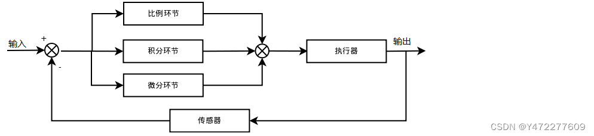​

PID是比例-积分-微分控制器（Proportional-Integral-Derivative Controller）的缩写，是一种广泛应用于工业控制和自动化系统中的反馈控制算法。PID控制器通过调整控制变量，以使系统的输出尽可能接近期望的设定点（setpoint）。

具体来说，PID控制器的工作原理可以分为三个部分：

1. **比例（P）控制**：

- **作用**：根据当前误差（即设定值与实际值之间的差异）来产生控制输出。

- **公式**：$( P\_{\\text{out}} = K\_p \\cdot e(t) )$

- **解释**：( e(t) ) 是当前误差，( K\_p ) 是比例增益。比例控制能够快速响应误差，但可能会导致系统振荡或超调。

1. **积分（I）控制**：

- **作用**：消除系统中的稳态误差。积分控制通过累积过去的误差来产生控制输出。

- **公式**：$( I\_{\\text{out}} = K\_i \\cdot \\int\_{0}^{t} e(t') , dt' )$

- **解释**：( K\_i ) 是积分增益，积分控制能够逐渐消除稳态误差，但也可能导致系统的响应变慢或产生过冲。

1. **微分（D）控制**：

- **作用**：预测未来的误差趋势，通过误差的变化率来产生控制输出，以减少超调和振荡。

- **公式**：$( D\_{\\text{out}} = K\_d \\cdot \\frac{de(t)}{dt} )$

- **解释**：( K\_d ) 是微分增益，微分控制能够提高系统的稳定性和响应速度，但可能会对噪声敏感。

PID控制器的总输出是这三个部分的和：  
$( \\text{PID}_{\\text{out}} = P_{\\text{out}} + I\_{\\text{out}} + D\_{\\text{out}} )$

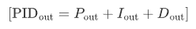

PID控制器的参数（( K\_p )、( K\_i )、( K\_d )）需要根据具体的控制系统和应用场景进行调整，通常通过试验和调试来优化控制性能。PID控制器因其简单、有效和广泛适用性，在温度控制、速度控制、压力控制等多种工业应用中得到了广泛应用。

### 通俗理解

- **简单来说，就是将误差进行比例放大，微分阻尼，积分误差补偿**

- **输出=(p**​**_偏差)+(i_**​**偏差和)+(d\*(偏差-上偏差))**

- **比例是现在。微分是未来。积分是过去**

## 常用PID算法

### ①PI算法：

特点：

- 从时域上看，只要存在偏差，积分就会不停对偏差积累，因此稳态时误差一定为零

- 不足：比例与积分动作都是对过去控制误差进行操作， 不对未来控制误差进行预测，限制了控制性能。

- PI调节将比列调节的快速反应与积分调节消除静差的特点结合，实现好的调节效果。

- PI调节适用于控制通道滞后较小、负荷变化不大、 工艺参数不允许有静差的系统。

### ②PD算法：

适用于舵机快速响应，对于惯性较大的对象，常常希望能加快控制速度， 此时可增加微分作用。

特点：

- 比例控制对于惯性较大对象，控制过程缓慢，控制品质不佳。比例微分控制可提高控制速度，对惯性较大对象，可改善控制质量，减小偏差，缩短控制时间。

- 理想微分作用持续时间太短， 执行器来不及响应。实际使用中，一般加以惯性延迟，称为实际微分。

- PD 调节以比例调节为主，微分调节为辅，PD调节是有差调节。

- PD 调节具有提高系统稳定性、抑制过渡过程最大动态偏差的作用。

- PD 调节有利于提高系统响应速度。

- PD 调节抗干扰能力差，一般只能应用于被调参数 变化平稳的生产过程。

- 微分作用太强时，容易造成系统振荡。

### ③PID算法：

将比例、积分、微分三种调节规律结合在一起， 只要三项作用的强度配合适当，既能快速调节，又能消除余差，可得到满意的控制效果。

特点：

- PID 控制作用中，比例作用是基础控制；微分作用是 用于加快系统控制速度；积分作用是用于消除静差。

- 只要比例、积分、微分三种控制规律强度配合适当， 既能快速调节，又能消除余差，可得到满意控制效果。

- Kp 较小时，系统对微分和积分环节的引入较为敏感，积分会引起超调，微分可能会引起振荡，而振荡剧烈的时候超调也会增加。

- Kp 增大时，积分环节由于滞后产生的超调逐渐减小，此时如果想要继续减少超调可以适当引入微分环节。继续增大 Kp 系统可能会不太稳定，因此在增加 Kp 的同时引入 Kd 减小超调，可以保证在 Kp 不是很大的情况下也能取得较好的稳态特性和动态性能。

- Kp 较小时，积分环节不宜过大，Kp 较大时积分环节也不宜过小（否则调节时间会非常地长），当使用分段PID ，在恰当的条件下分离积分，可以取得更好的控制效果。原因在于在稳态误差即将满足要求时，消除了系统的滞后。因此系统超调会明显减少。

### 位置式 PID 算法 :

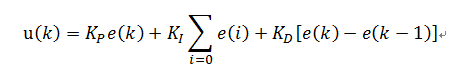​

e(k): 用户设定的值（目标值） - 控制对象的当前的状态值

比例P : e(k)

积分I : ∑e(i) 误差的累加

微分D : e(k) - e(k-1) 这次误差-上次误差

也就是位置式PID是当前系统的实际位置，与你想要达到的预期位置的偏差，进行PID控制，因为有误差积分 ∑e(i)，一直累加，也就是当前的输出u(k)与过去的所有状态都有关系，用到了误差的累加值；（误差e会有误差累加），输出的u(k)对应的是执行机构的实际位置，，一旦控制输出出错(控制对象的当前的状态值出现问题 )，u(k)的大幅变化会引起系统的大幅变化，并且位置式PID在积分项达到饱和时,误差仍然会在积分作用下继续累积，一旦误差开始反向变化，系统需要一定时间从饱和区退出，所以在u(k)达到最大和最小时，要停止积分作用，并且要有积分限幅和输出限幅，所以在使用位置式PID时，一般我们直接使用PD控制，而位置式 PID 适用于执行机构不带积分部件的对象，如舵机和平衡小车的直立和温控系统的控制

### 增量式PID

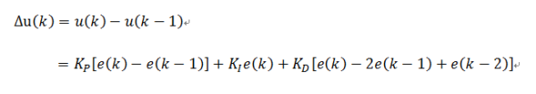​

比例P : e(k)-e(k-1) 这次误差-上次误差

积分I : e(i) 误差

微分D : e(k) - 2e(k-1)+e(k-2) 这次误差-2\*上次误差+上上次误差

增量式PID根据公式可以很好地看出，一旦确定了 KP、TI 、TD，只要使用前后三次测量值的偏差， 即可由公式求出控制增量，而得出的控制量▲u(k)对应的是近几次位置误差的增量，而不是对应与实际位置的偏差 ，没有误差累加，也就是说，增量式PID中不需要累加。控制增量Δu(k)的确定仅与最近3次的采样值有关，容易通过加权处理获得比较好的控制效果，并且在系统发生问题时，增量式不会严重影响系统的工作。

总结：增量型 PID，是对位置型 PID 取增量，这时控制器输出的是相邻两次采样时刻所计算的位置值之差，得到的结果是增量，即在上一次的控制量的基础上需要增加（负值意味减少）控制量。

### 增量式与位置式区别：

1. 增量式算法不需要做累加，控制量增量的确定仅与最近几次偏差采样值有关，计算误差对控制 量计算的影响较小。而位置式算法要用到过去偏差的累加值，容易产生较大的累加误差。

3. 增量式算法得出的是控制量的增量，例如在阀门控制中，只输出阀门开度的变化部分，误动作 影响小，必要时还可通过逻辑判断限制或禁止本次输出，不会严重影响系统的工作。 而位置式的输出直接对应对象的输出，因此对系统影响较大。

5. 增量式PID控制输出的是控制量增量，并无积分作用，因此该方法适用于执行机构带积分部件的对象，如步进电机等，而位置式PID适用于执行机构不带积分部件的对象，如电液伺服阀。

7. 在进行PID控制时，位置式PID需要有积分限幅和输出限幅，而增量式PID只需输出限幅

#### 位置式PID优缺点：

优点：①位置式PID是一种非递推式算法，可直接控制执行机构（如平衡小车），u(k)的值和执行机构的实际位置（如小车当前角度）是一一对应的，因此在执行机构不带积分部件的对象中可以很好应用

缺点：  
①每次输出均与过去的状态有关，计算时要对e(k)进行累加，运算工作量大。

#### 增量式PID优缺点：

优点：

①误动作时影响小，必要时可用逻辑判断的方法去掉出错数据。

②手动/自动切换时冲击小，便于实现无扰动切换。当计算机故障时，仍能保持原值。

③算式中不需要累加。控制增量Δu(k)的确定仅与最近3次的采样值有关。

缺点：  
①积分截断效应大，有稳态误差；

②溢出的影响大。有的被控对象用增量式则不太好；

## PID优化方法：

### ①抗积分饱和：

如果系统总是存在统一的方向偏差，就可能无限累加而进行饱和，极大影响系统性能

所谓积分饱和就是指系统存在一个方向的偏差，PID控制器的输出由于积分作用的不断累加而扩大，从而导致控制器输出不断增大超出正常范围进入饱和区。当系统出现反响的偏差时，需要首先从饱和区退出，而不能对反向的偏差进行快速的响应。

为了解决积分饱和的问题，人们引入了抗积分饱和的PID算法。所谓抗积分饱和算法，其思路是在计算U(k)的时候，先判断上一时刻的控制量U(k-1)是否已经超出了限制范围。若U(k-1)>Umax，则只累加负偏差；若U(k-1)<Umin，则只累加正偏差。从而避免控制量长时间停留在饱和区。

几种方法抗饱和积分：

- 积分分离或者称为去积分算法，变速积分（积分项和误差相映射）；

- [增量式PID分步积分与变速积分的融合实现\_control\_zj的博客-CSDN博客](https://blog.csdn.net/control_zj/article/details/79811958)

- 在饱和的时候将积分器的累计值初始化到一个比较理想的值；

- 若积分饱和因为目标值突然变化而产生，将目标值以适当斜率的斜坡变化可避免此情形；

- 将积分累计量限制上下限，避免积分累计量超过限制值；

- 如果PID输出已经饱和，重新计算积分累计量，使输出恰好为合理的范围；

- [PID的TRICK(一)简述五种PID积分抗饱和（ANTI-Windup）方法 - 知乎 (zhihu.com)](https://zhuanlan.zhihu.com/p/49572763)

系统对于积分项的要求是，系统偏差大时，积分作用应该减弱甚至是全无，而在偏差小时，则应该加强。积分系数取大了会产生超调，甚至积分饱和，取小了又不能短时间内消除静差。因此，根据系统的偏差大小改变积分速度是有必要的。 变积分PID的基本思想是设法改变积分项的累加速度，使其与偏差大小相对应：偏差越大，积分越慢; 偏差越小，积分越快。

### ②不完全微分：

[不完全微分\_百度百科 (baidu.com)]([不完全微分_百度百科]\(https://baike.baidu.com/item/不完全微分/19155734?noadapt=1\))

不完全的微分它使得在偏差作阶跃式变化时出现的输出瞬时跳变得到一定程度的缓和，因而在实际的PID控制算法中得到广泛采用。在PID 控制中，微分信号的引入可以改善系统的动态特性，但也易引入高频干扰，在误差扰动突变的时候尤其显出微分项的不足。要想解决这个问题，可以在控制算法中加入低通滤波器

标准微分会产生短时间跳变，实际系统不能完全响应，效果不好，会震荡。

### ③微分先行：

某些给定值频繁且大幅变化的场合，微分项常常会引起系统的振荡。为了适应这种给定值频繁变化的场合，人们设计了微分先行算法。

类似于不完全微分（不完全微分是通过削弱变化量来尽可能的实现完全响应，而微分先行PID控制是只对输出量进行微分，而对给定指令不起微分作用），微分部分只与测量值有关，而且与连续的几个测量值都有关。而与设定值没有关系，设定值的阶跃变化不会造成高频的干扰。

### ④带死区PID控制：

在偏差小到一点程度时PID不起作用

[PID控制器开发笔记之八：带死区的PID控制器的实现\_木南创智-CSDN博客](https://blog.csdn.net/foxclever/article/details/80778748)

在计算机控制系统中，由于系统特性和计算精度等问题，致使系统偏差总是存在，系统总是频繁动作不能稳定。为了解决这种情况，我们可以引入带死区的PID算法。

带死区的PID控制算法就是检测偏差值，若是偏差值达到一定程度，就进行调节。若是偏差值较小，就认为没有偏差。用公式表示如下：

其中的死区值得选择需要根据具体对象认真考虑，因为该值太小就起不到作用，该值选取过大则可能造成大滞后。

带死区的PID算法，对无论位置型还是增量型的表达式没有影响，不过它是一个非线性系统。

除以上描述之外还有一个问题，在零点附近时，若偏差很小，进入死去后，偏差置0会造成积分消失，如是系统存在静差将不能消除，所以需要人为处理这一点。

引入死区的主要目的是消除稳定点附近的波动，由于测量值的测量精度和干扰的影响，实际系统中测量值不会真正稳定在某一个具体的值，而与设定值之间总会存在偏差，而这一偏差并不是系统真实控制过程的反应，所以引入死区就能较好的消除这一点。

当然，死区的大小对系统的影响是不同的。太小可能达不到预期的效果，而太大则可能对系统的正常变化造成严重滞后，需要根据具体的系统对象来设定。

### ⑤串级PID

类比于小车上坡，因为单环PID输出的速度 V 不一定是真实的速度 V，所以内环再加上速度环PID，构成串级PID（外环为位置环，输出的值是小车的理论速度，内环为速度环，输入是小车的理论速度，希望尽可能的使输出为理论速度），外环的输出是内环的输入

同样类比于四轴，外环为角度环，输出的是期望达到该角度所需要的PWM（也就是角速度，也可以理解为角速度和PWM的映射），内环为角速度环，输入是期望的角速度和自身真实的角速度，输出为最终的PWM（角速度）

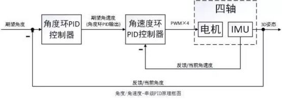​

串级PID可增加系统的稳定性，抗干扰

为什么外环的输入是内环的期望呢？因为你在设计控制器的时候，内环的目的就是实现用执行器控制直接能改变的变化量，外环的目的就是找到合适的曲线，来引导目标的微分变化，从而达到间接控制的效果。

## 视频介绍

[https://player.bilibili.com/player.html?bvid=BV1et4y1i7Gm&page=1&high\_quality=1&as\_wide=1&allowfullscreen=true&autoplay=0&spm\_id\_from=333.337.search-card.all.click&vd\_source=f412fc178503cd4cd82f9c512d4f458d](https://player.bilibili.com/player.html?bvid=BV1et4y1i7Gm&page=1&high_quality=1&as_wide=1&allowfullscreen=true&autoplay=0&spm_id_from=333.337.search-card.all.click&vd_source=f412fc178503cd4cd82f9c512d4f458d)

[在线模拟程序](https://rossning92.github.io/pid-simulation)

### 视频笔记

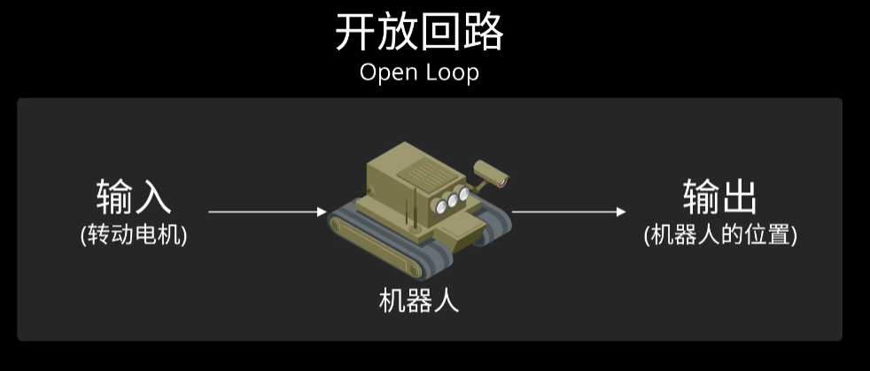​

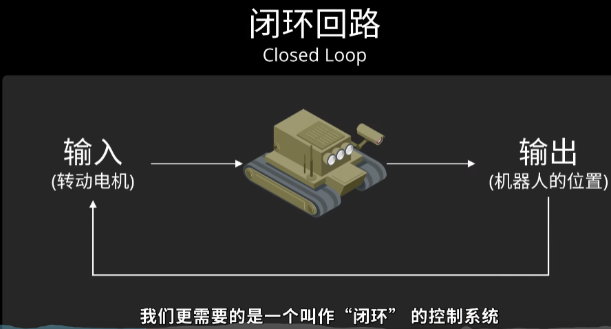​

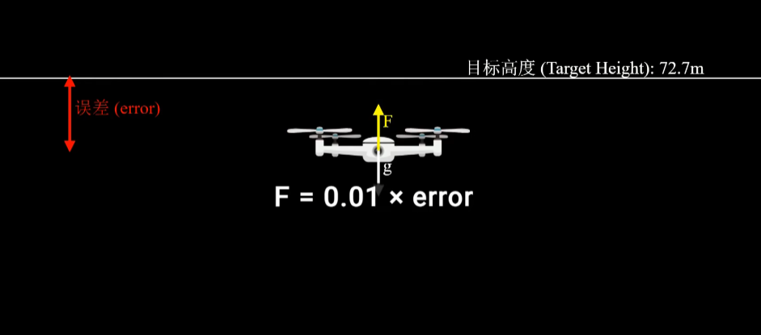​

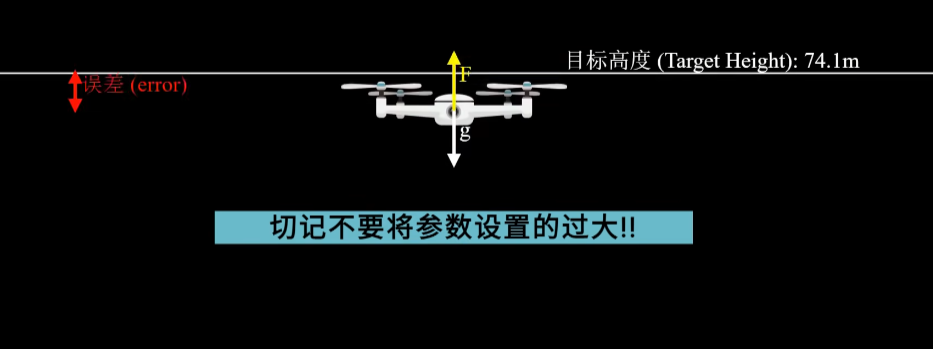​

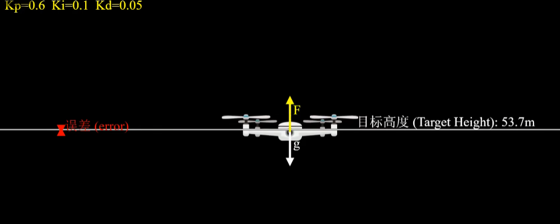​

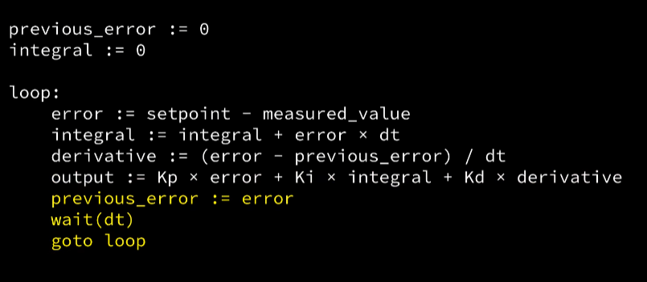​

## PID调参

在确定PID控制器参数时，可以根据控制器的参数与系统动态性能和稳态性能之间的定性关系，用实验的方法来调节控制器的参数。

### PID调试一般原则：

a.在输出不振荡时，增大比例增益P。

b.在输出不振荡时，减小积分时间常数Ti。

c.在输出不振荡时，增大微分时间常数Td。

### 参数调整一般步骤

由于自动控制系统被控对象的千差万别，PID的参数也必须随之变化，调试PID参数的一般步骤：

a.确定比例增益

确定比例增益P时，首先去掉PID的积分项和微分项，一般是令Ti=0、Td=0，PID为纯比例调节。输入设定为系统允许的最大值的60%70%，由0逐渐加大比例增益P，直至系统出现振荡；再反过来，从此时的比例增益P逐渐减小，直至系统振荡消失，记录此时的比例增益P，设定PID的比例增益P为当前值的60%70%。比例增益P调试完成。

b.确定积分时间常数

比例增益P确定后，设定一个较大的积分时间常数Ti的初值，然后逐渐减小Ti，直至系统出现振荡，之后在反过来，逐渐加大Ti，直至系统振荡消失。记录此时的Ti，设定PID的积分时间常数Ti为当前值的150%~180%。积分时间常数Ti调试完成。

c.确定微分时间常数

微分时间常数Td一般不用设定，为0即可。若要设定，与确定P和Ti的方法相同，取不振荡时的30%。

d.系统空载、带载联调，再对PID参数进行微调，直至满足要求。

### PID常用口诀

参数整定寻最佳，从大到小顺次查。  
先是比例后积分，最后再把微分加。  
曲线振荡很频繁，比例度盘要放大。  
曲线漂浮绕大弯，比例度盘往小扳。  
曲线偏离回复慢，积分时间往下降。  
曲线波动周期长，积分时间再加长。  
理想曲线两个波，调节过程高质量。

## 代码程序

### C程序

#### 位置式PID算法

```
// 位置式PID控制算法
struct _pid
{
    float SetSpeed;           //定义设定值
    float ActualSpeed;        //定义实际值
    float err;                //定义偏差值
    float err_last;           //定义上一个偏差值
    float Kp;                 //定义比例系数
    float Ki;                 //定义积分系数
    float Kd;                 //定义微分系数
    float voltage;            //定义电压值（控制执行器的变量）
    float integral;           //定义积分值
}pid;
void PID_init()
{
    pid.SetSpeed=0.0;
    pid.ActualSpeed=0.0;
    pid.err=0.0;
    pid.err_last=0.0;
    pid.voltage=0.0;
    pid.integral=0.0;
    pid.Kp=0.2;
    pid.Ki=0.015;
    pid.Kd=0.2;
}
float PID_realize(float speed)
{
    pid.SetSpeed=speed;
    pid.err=pid.SetSpeed-pid.ActualSpeed;
    pid.integral+=pid.err;
    pid.voltage=pid.Kp*pid.err+pid.Ki*pid.integral+pid.Kd*(pid.err-pid.err_last);
    pid.err_last=pid.err;
    pid.ActualSpeed=pid.voltage*1.0;
    return pid.ActualSpeed;
}

int main()
{
    PID_init();
    int count=0;
    while(count<1000)
    {
        float speed=PID_realize(100.0);
        printf("%f\n",speed);
        count++;
    }
    return 0;
}
```

#### 增量式PID算法

```c++
struct _pid{
    float SetSpeed;            //定义设定值
    float ActualSpeed;        //定义实际值
    float err;                //定义偏差值
    float err_next;            //定义上一个偏差值
    float err_last;            //定义最上前的偏差值
    float Kp;                 //定义比例系数
    float Ki;                 //定义积分系数
    float Kd;                 //定义微分系数
}pid;

void PID_init()
{
    pid.SetSpeed=0.0;
    pid.ActualSpeed=0.0;
    pid.err=0.0;
    pid.err_last=0.0;
    pid.err_next=0.0;
    pid.Kp=0.15;
    pid.Ki=0.20;
    pid.Kd=0.25;
}
float PID_realize(float speed)
{
    pid.SetSpeed=speed;
    pid.err=pid.SetSpeed-pid.ActualSpeed;
    float incrementSpeed=pid.Kp*(pid.err-pid.err_next)+pid.Ki*pid.err+pid.Kd*(pid.err-2*pid.err_next+pid.err_last);
    pid.ActualSpeed+=incrementSpeed;
    pid.err_last=pid.err_next;
    pid.err_next=pid.err;
    return pid.ActualSpeed;
}
int main()
{
    PID_init();
    int count=0;
    while(count<1000)
    {
        float speed=PID_realize(100.0);
        printf("%f\n",speed);
        count++;
    }
    return 0;
}
```

### C++程序

#### 位置式PID算法

```c++
//位置式PID
class PID_position
{
private:
    float kp;//比例系数
    float ki;//积分系数
    float kd;//微分系数
    float target;//目标值
    float actual;//实际值
    float e;//误差
    float e_pre;//上一次误差
    float integral;//积分项
public:
    PID_position();
    ~PID_position(){};
    PID_position(float p,float i,float d);
    float pid_control(float tar,float act);//执行PID控制
    void pid_show();//显示PID控制器的内部参数
};
//位置PID
PID_position::PID_position():kp(0),ki(0),kd(0),target(0),actual(0),integral(0)
{
    e=target-actual;
    e_pre=e;
}
PID_position::PID_position(float p,float i,float d):kp(p),ki(i),kd(d),target(0),actual(0),integral(0)
{
   e=target-actual;
   e_pre=e;
}
float PID_position::pid_control(float tar,float act)
{
    float u;
    target=tar;
    actual=act;
    e=target-actual;
    integral+=e;
    u=kp*e+ki*integral+kd*(e-e_pre);
    e_pre=e;
    return u;
}
void PID_position::pid_show()
{
    using std::cout;
    using std::endl;
    cout<<"The infomation of this position PID controller is as following:"<<endl;
    cout<<"       Kp="<<kp<<endl;
    cout<<"       Ki="<<ki<<endl;
    cout<<"       Kd="<<kd<<endl;
    cout<<" integral="<<integral<<endl;
    cout<<"   target="<<target<<endl;
    cout<<"   actual="<<actual<<endl;
    cout<<"        e="<<e<<endl;
    cout<<"    e_pre="<<e_pre<<endl;
}
```

#### 增量式PID算法

```c++
//增量式PID
class PID_incremental
{
private:
    float kp;
    float ki;
    float kd;
    float target;
    float actual;
    float e;
    float e_pre_1;
    float e_pre_2;
    float A;
    float B;
    float C;
public:
    PID_incremental();
    PID_incremental(float p,float i,float d);
    float pid_control(float tar,float act);
    void pid_show();
};
//增量PID
PID_incremental::PID_incremental():kp(0),ki(0),kd(0),e_pre_1(0),e_pre_2(0),target(0),actual(0)
{
   A=kp+ki+kd;
   B=-2*kd-kp;
   C=kd;
   e=target-actual;
}
PID_incremental::PID_incremental(float p,float i,float d):kp(p),ki(i),kd(d),e_pre_1(0),e_pre_2(0),target(0),actual(0)
{
   A=kp+ki+kd;
   B=-2*kd-kp;
   C=kd;
   e=target-actual;
}
float PID_incremental::pid_control(float tar,float act)
{
   float u_increment;
   target=tar;
   actual=act;
   e=target-actual;
   u_increment=A*e+B*e_pre_1+C*e_pre_2;
   e_pre_2=e_pre_1;
   e_pre_1=e;
   return u_increment;
}

void PID_incremental::pid_show()
{
    using std::cout;
    using std::endl;
    cout<<"The infomation of this incremental PID controller is as following:"<<endl;
    cout<<"     Kp="<<kp<<endl;
    cout<<"     Ki="<<ki<<endl;
    cout<<"     Kd="<<kd<<endl;
    cout<<" target="<<target<<endl;
    cout<<" actual="<<actual<<endl;
    cout<<"      e="<<e<<endl;
    cout<<"e_pre_1="<<e_pre_1<<endl;
    cout<<"e_pre_2="<<e_pre_2<<endl;
}
```

#### 测试

```c++
#include<iostream>
#include"pid_controller.h"
using namespace std;
int main()
{
    //测试增量PID
    PID_incremental pid1(0.35,0.65,0.005);
    float target=1000.0;
    float actual=0;
    float pid_increment=0.0;
    int N=50;
    pid1.pid_show();
    cout<<"target="<<target<<endl;
    for(;N>0;N--)
    {
        pid_increment=pid1.pid_control(target,actual);
        actual+=pid_increment;
        cout<<"N="<<50-N<<"   actual="<<actual<<endl;
    }
    pid1.pid_show();

    //测试位置PID
    PID_position pid2(0.59,0.35,0.002);
    pid2.pid_show();
    cout<<"target="<<target<<endl;
    N=100;
    for(;N>0;N--)
    {
        actual=pid2.pid_control(target,actual);
        cout<<"N="<<100-N<<"   actual="<<actual<<endl;
    }
    pid2.pid_show();

    system("pause");
    return 0;
}
```

### Python程序

#### 位置式PID算法

```c++
#位置式PID系统
class PositionalPID:
    def __init__(self, P: float, I: float, D: float):
        self.Kp = P
        self.Ki = I
        self.Kd = D

        self.PIDOutput = 0.0  # PID控制器输出
        self.SystemOutput = 0.0  # 系统输出值
        self.LastSystemOutput = 0.0  # 系统的上一次输出

        self.PIDErrAdd = 0.0
        self.ResultValueBack = 0.0
        self.Error = 0.0
        self.LastError = 0.0

    def SetStepSignal(self, StepSignal):
        self.Error = StepSignal - self.SystemOutput

        KpWork  = self.Kp *self.Error
        KiWork = self.Ki* self.PIDErrAdd
        KdWork = self.Kd * (self.Error- self.LastError)
        self.PIDOutput = KpWork + KiWork + KdWork
        self.PIDErrAdd += self.Error
        self.LastError = self.Error

        # 以一阶惯性环节为例子演示控制效果

    def SetInertiaTime(self, IntertiaTime, SampleTime):
        self.SystemOutput = (IntertiaTime * self.LastSystemOutput + SampleTime * self.PIDOutput) / (
                    SampleTime + IntertiaTime)
        self.LastSystemOutput = self.SystemOutput
```

#### 增量式PID算法

```c++
#增量式PID系统
class IncrementalPID:
    def __init__(self, P:float ,I:float ,D:float ):
        self.Kp = P
        self.Ki = I
        self.Kd = D

        self.PIDOutput =0.0         #PID控制器输出
        self.SystemOutput = 0.0     #系统输出值
        self.LastSystemOutput = 0.0 #系统的上一次输出

        self.Error = 0.0
        self.LastError = 0.0
        self.LastLastError = 0.0

    #设置PID控制器参数
    def SetStepSignal(self,StepSignal):
        self.Error = StepSignal - self.SystemOutput
        #计算增量
        IncrementalValue = self.Kp*(self.Error - self.LastError)\
            + self.Ki * self.Error +self.Kd *(self.Error -2*self.LastError +self.LastLastError)
        #计算输出
        self.PIDOutput += IncrementalValue
        self.LastLastError = self.LastError
        self.LastError = self.Error

    #以一阶惯性环节为例子演示控制效果
    def SetInertiaTime(self,IntertiaTime,SampleTime):
        self.SystemOutput = (IntertiaTime*self.LastSystemOutput + SampleTime *self.PIDOutput)/(SampleTime + IntertiaTime)
        self.LastSystemOutput = self.SystemOutput
```

#### 效果对比

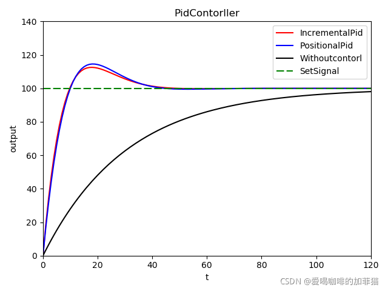​

‍
