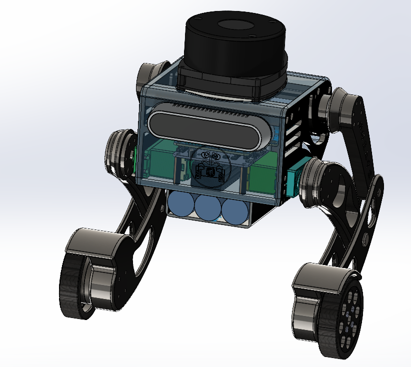

# 基于非线性轮-弹簧加载倒立摆模型的跳跃控制

## 0. 前言知识

### 0.1 非线性弹性力学

非线性结构问题是指结构的刚度随其变形而改变。所有的物理结果均是非线性的。

* 材料非线性－[Newton-Raphson 迭代](https://zhida.zhihu.com/search?content_id=176353046&content_type=Article&match_order=1&q=Newton-Raphson%E8%BF%AD%E4%BB%A3&zhida_source=entity)(隐式)，中心差分，R-K（显式）
* 边界非线性－接触(约束，连接，摩擦，滑移）Lagrange 乘子，罚函数
* 几何非线性－考虑 Jaumann 率的大变形算法，弧长法（[Riks](https://zhida.zhihu.com/search?content_id=176353046&content_type=Article&match_order=1&q=Riks&zhida_source=entity)）

  ​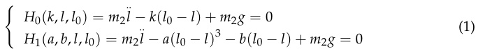​

### 0.2 运动学模型

‍

### 0.3 动力学模型

‍

### 0.4 静力学模型

‍

### 0.5 PID

#### 位置PID

‍

#### 速度PID

‍

## 1. 现有研究

研 究 人 员[11,12]将 这 些 机 器 人简 化 为 质 心 模 型 ， 并 通 过 运 动 学 和 动 力 学 分 析 规 划 其 轨 迹 。

> 11. ‍
>
> Hutter, M.; Remy, C.D.; Hoepflinger, M.A.; Siegwart, R. ScarlETH: Design and Control of a Planar Running Robot. In Proceedings
>
> of the 2011 IEEE/RSJ International Conference Intelligent Robots and Systems (IROS), San Francisco, CA, USA, 25–30 September
>
> 2011; pp. 562–567.
>
> 12. ‍
>
> Bian, Y.; Shao, J.; Yang, J.; Liang, A. Jumping Motion Planning for Biped Robot Based on Hip and Knee Joints Coordination
>
> Control. J. Mech. Sci. Technol. 2021, 35, 1223–1234. [CrossRef]

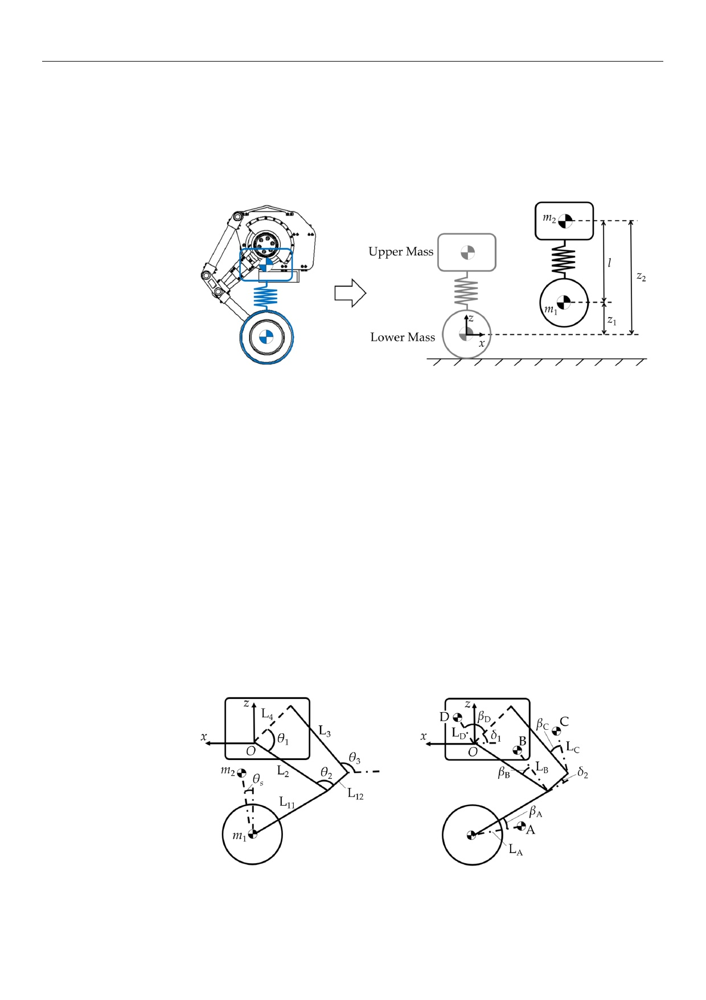​

其 他 研 究 人 员 建 立 了 简 化 的 虚 拟 模 型 来 描 述 机 器 人 的 基 本 动 力 学 特 征 。 轨 迹 是 基 于 这 些 虚 拟 模 型 规 划 的 ， 并 映 射 到 关 节 空 间 。

* Luo[13]和 Piovan[14]利 用 SLIP 模 型 来 规 划 轨 迹 ， 实 现 了 稳 定 的 跳 跃
* Mathis[15]进 一 步 提 出 了 一 种 双 质 量 弹 簧 模 型 ， 该 模 型 通 过 考 虑 跳 跃 过 程 中 较 低 的 质 心 来 提 高 精 度 。
* 一 些 研 究 基 于 最 优 控 制[16]和 稳 定 性 [17]制 定 了 跳 跃 轨 迹 。

> 13. ‍
>
> Luo, G.; Du, R.; Song, S.; Yuan, H.; Huang, Z.; Zhou, H.; Gu, J. Stable and Fast Planar Jumping Control Design for a Compliant
>
> One-Legged Robot. Micromachines 2022, 13, 1261. [CrossRef]Biomimetics 2025, 10, 246
>
> 19 of 19
>
> 14. ‍
>
> Piovan, G.; Byl, K. Approximation and Control of the SLIP Model Dynamics via Partial Feedback Linearization and Two-Element
>
> Leg Actuation Strategy. IEEE Trans. Robot. 2016, 32, 399–412. [CrossRef]
>
> 15. ‍
>
> Mathis, F.B.; Mukherjee, R. Apex Height Control of a Two-Mass Robot Hopping on a Rigid Foundation. Mech. Mach. Theory 2016,
>
> 105, 44–57. [CrossRef]
>
> 16. ‍
>
> Tian, D.; Gao, J.; Liu, C.; Shi, X. Simulation of Upward Jump Control for One-Legged Robot Based on QP Optimization. Sensors
>
> 2021, 21, 1893. [CrossRef]
>
> 17. ‍
>
> Zhang, Z.; Wang, L.; Liao, J.; Zhao, J.; Zhou, Z. Dynamic Stability of Bio-Inspired Biped Robots for Lateral Jumping in Rugged
>
> Terrain. Appl. Math. Model. 2021, 97, 113–137. [CrossRef]

* Chen[18]提 出 了 一 种 车 轮 弹 簧 载 荷 倒 立 摆 模 型 来 表 征 机 器 人 在 跳 跃 过 程 中 的 动 力 学 特 性 ， 并 通 过 二 次 规 划 来 处 理 姿 态 和 飞 行 阶 段 的 轨 迹 规 划 。
* 庄[19]引 入 了 轮 式 双 足 跳 跃 动 力 学 模 型 来 优 化 高 度 控 制 和 贝 叶 斯 优 化 来 进 行 扭 矩 规 划 。
* Hao[20]还 将 机 器 人 简 化 为 两 个 质 量 ， 并 使 用 非 线 性 规 划 绘 制 了 跑 跳 轨 迹 。
* Li[21-24]基 于 双 质 量 弹 簧 阻 尼 倒 立 摆 模 型 ， 将 跳 跃 序 列 划 分 为 4 个 阶 段 ， 对 每 个 阶 段 进 行 轨 迹 规 划 ， 并 在 WLR-3P 上 进 行 检 验 。

以上模型均为，线 性 轮 弹 簧 加 载 倒 立 摆(LW-SLIP)模 型 由 于 动 力 学 建 模 的 困 难 和 车 轮 的 不 可 忽 略 质 量 ， 采 用 LW-SLIP 模 型 作 为 虚 拟 模 型 来 规 划 wbr 的 跳 跃 轨 迹 。然 而 ， 该 模 型 对 关 节 输 出 能 力 的 高 要 求 阻 碍 了 大 多 数 机 器 人 的 实 验 验 证 。

> 18. ‍
>
> Chen, H.; Wang, B.; Hong, Z.; Shen, C.; Wensing, P.M.; Zhang, W. Underactuated Motion Planning and Control for Jumping with
>
> Wheeled-Bipedal Robots. IEEE Robot. Autom. Lett. 2020, 6, 747–754. [CrossRef]
>
> 19. ‍
>
> Zhuang, Y.; Xu, Y.; Huang, B.; Chao, M.; Shi, G.; Yang, X.; Zhang, K.; FU, C. Height Control and Optimal Torque Planning for
>
> Jumping with Wheeled-Bipedal Robots. In Proceedings of the 2021 6th IEEE International Conference on Advanced Robotics and
>
> Mechatronics (ICARM), Chongqing, China, 3–5 July 2021; pp. 477–482.
>
> 20. ‍
>
> Hao, Y.; Lu, B. Run-and-Jump Planning and Control of a Compact Two-Wheeled Legged Robot. In Proceedings of the 2022 7th
>
> Asia-Pacific Conference on Intelligent Robot Systems (ACIRS), Tianjin, China, 1–3 July 2022; pp. 1–6.
>
> 21. ‍
>
> Li, X.; Fan, Y.; Yu, H.; Zhou, H.; Feng, H.; Fu, Y. Stable Jump Control for the Wheel-Legged Robot Based on TMS-DIP Model. Ind.
>
> Rob. 2022, 49, 212–225. [CrossRef]
>
> 22. ‍
>
> Li, X.; Yu, H.; Feng, H.; Zhang, S.; Fu, Y. Design and Control for WLR-3P: A Hydraulic Wheel-Legged Robot. Cybrog Bionic Syst.
>
> 2023, 4, 0025. [CrossRef] [PubMed]
>
> 23. ‍
>
> Li, X.; Zhang, S.; Zhou, H.; Feng, H.; Fu, Y. Locomotion Adaption for Hydraulic Humanoid Wheel-Legged Robots over Rough
>
> Terrains. Int. J. Hum. Robot 2021, 18, 2150001. [CrossRef]
>
> 24. ‍
>
> Yu, H.; Li, X.; Tao, Z.; Feng, H.; Zhang, S.; Fu, Y. Hierarchical Jumping optimization for Hydraulic Biped Wheeled-Legged Robots.
>
> Control Eng. Pract. 2023, 141, 105721. [CrossRef]

介 绍 了 一 种 新 的 仿 真 非 线 性 轮 弹 簧 加 载 倒 立 摆 (NW-SLIP)模 型 [25-27]。 双 质 量 模 型 有 效 地 捕 获 了 WBR 的 关 键 动 态 特 性。

利 用 二 次 规 划 (Quadratic Programming, QP)和 对 分 法 对 每 个 阶 段 的 轨 迹 进 行 迭 代 优 化

纳 入 了 腿 部 静 力 学 模 型 来 计 算 前 馈 关 节 扭 矩 ， 提 高 了 轨 迹 跟 踪 性 能 。映 射 虚 拟 模 型 与 关 节 空 间 之 间 的 关 系 。

与 动 力 学 模 型 相 比 ， 这 种 方 法 提 供 了 优 越 的  运 算 效 率 和 增 强 的 实 时 处 理 能 力 。

> 25. ‍
>
> Cormie, P. McBride, J.M.; McCaulley, G.O. Power-Time, Force-Time, and Velocity-Time Curve Analysis during the Jump Squat:
>
> Impact of Load. J. Appl. Biomech. 2008, 24, 112–120. [CrossRef]
>
> 26. ‍
>
> Pérez-Castilla, A.; Rojas, F.J.; Gómez-Martínez, F.; García-Ramos, A. Vertical Jump Performance is Affected by the Velocity and
>
> Depth of the Countermovement. Sport. Biomech. 2021, 20, 1015–1030. [CrossRef]
>
> 27. ‍
>
> Janicijevic, D.; Knezevic, O.M.; Mirkov, D.M.; Pérez-Castilla, A.; Petrovic, M.; Samozino, P.; Garcia-Ramos, A. The Force-Velocity
>
> Relationship Obtained during the Squat Jump Exercise is Meaningfully Influenced by the Initial Knee Angle. Sport. Biomech. 2022,
>
> 21, 1136–1145. [CrossRef] [PubMed]

### 1.1 缺陷

* 面 对 非 结 构 化 地 形 时 ， 跳 跃 已 经 成 为 高 级 wbr 克 服 障 碍 的 基 本 功 能 之 一
* 动 力 学 建 模 的 困 难
* 车 轮 的 不 可 忽 略 质 量
* 关 节 输 出 能 力 的 高 要 求
* 机 身 质 心 不 可 控 的 前 向 位 移
* 减 少 了 传 感 器 噪 声 的 影 响
* 无 法 平 衡 计 算 负 荷 和 轨 迹 跟 踪 性 能

## 2. 结构设计

由 于 腿 部 伸 展 导 致 机 身 质 心 向 前 位 移 ， 在 跳 跃 过 程 中 会 产 生 俯 仰 加 速 度 ， 这 对 机 器 人 着 陆 后 的 自 平 衡 能 力 提 出 了 挑 战 。

这 种 位 移 不 能 通 过 控 制 来 消 除 ， 而 只 能 通 过 结 构 设 计 来 最 小 化 ， 这 对 稳 定 跳 变 至 关 重 要 。

​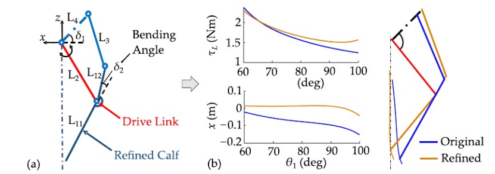​

​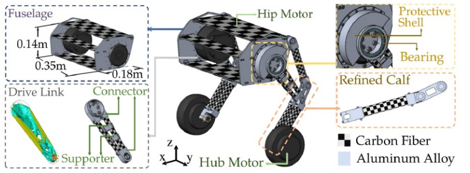​

​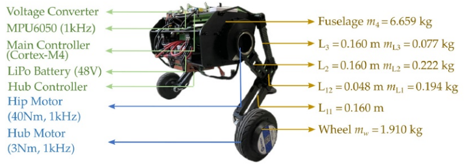​

## 3. 跳跃模型构建

	建 立 了NW-SLIP模 型 进 行 轨迹 规 划 。 建 立 了 运 动 学 模 型 和 腿 静 力 学 模 型 ， 定 义 了 映 射 关 系。机 身和腿连杆被认为是上部质量,而两个轮毂电机被认为是下部质量。

### 等效弹簧模型

​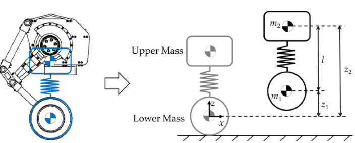​

$$
\left\{\begin{array}{l}H_0(k,l,l_0)=m_2\ddot{l}-k(l_0-l)+m_2g=0\\H_1(a,b,l,l_0)=m_2\ddot{l}-a(l_0-l)^3-b(l_0-l)+m_2g=0\end{array}\right.
$$

	l0表示弹簧的自然长度,而a、b、k表示弹簧的刚度系数。为了在后续讨 论中保持清晰和一致,我们用H1(a, b, l, 10)表示NW-SLIP模型的约束,而用  H0(k, l, 10)表示LW-SLIP模型的约束。

### 运动学模型

	建立运动学模型,计算目标俯仰角,建立虚拟弹簧的长度和速度与髋关 节的角度和角速度之间的映射关系。A、B、C、D,分别代表 每条腿节和机身的质心,共同构成了上部质量。

​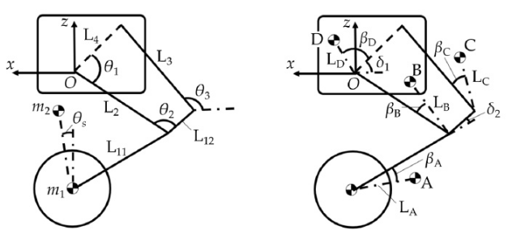​

得到上下质量的坐标为(x1, z1)和(x2, z2)。最后,确定虚拟弹簧的目标俯仰角、长 度和速度:

$$
\begin{aligned}&\theta_{s}=\arctan(\frac{x_{1}-x_{2}}{z_{2}-z_{1}})\\&l(\theta_{1})=\sqrt{\left(x_{2}-x_{1}\right)^{2}+\left(z_{2}-z_{1}\right)^{2}}\\&\dot{l}(\theta_{1},\dot{\theta}_{1})=\frac{2[(x_{2}-x_{1})(\dot{x}_{2}-\dot{x}_{1})+(z_{2}-z_{1})(\dot{z}_{2}-z_{1})]}{\sqrt{\left(x_{2}-x_{1}\right)^{2}+\left(z_{2}-z_{1}\right)^{2}}}\end{aligned}
$$

$$
\left\{\begin{array}{l}x_2=\frac{2m_Ax_A+2m_Bx_B+2m_Cx_C+m_Dx_D}{2m_A+2m_B+2m_C+m_D}\\z_2=\frac{2m_Az_A+2m_Bz_B+2m_Cz_C+m_Dz_D}{2m_A+2m_B+2m_C+m_D}\end{array}\right.
$$

### 4.0 腿部静力学模型

	使用动力学模型将显著增加计算时间,对 实时控制系统的响应速度和稳定性产生不利影响。相比之下,静力学模型提供了足 够精确的关节转矩预测,同时大大降低了计算复杂度,使其更适合实时应用。此外, 静力学模型不易受到外部干扰和传感器噪声的影响。

​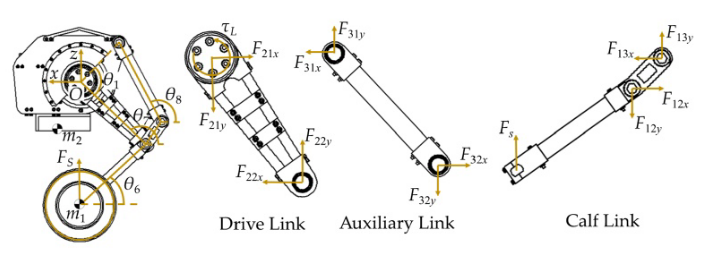​

	在自平衡匀速运动时,上部质量保持在轴正上方(即x1 = x2),允许根据式(2)求得θ 6,采用牛顿-欧拉法建立腿静力学模型,受力分析如下:

$$
\begin{aligned}&F_{s}=F_{12y}-F_{13y}\\&F_{13y}=-F_{13x}\tan\theta_{8}=-F_{12x}\tan\theta_{8}\\&F_{s}L_{11}\cos\theta_{6}=L_{12}(F_{13x}\sin\theta_{7}-F_{13y}\cos\theta_{7})\\&\tau_{L}=F_{22y}L_{2}\sin\theta_{9}+F_{22x}L_{2}\cos\theta_{9}\end{aligned}
$$

$$
\left\{\begin{array}{l}\theta_7=\theta_6+\delta_2\\\theta_8=\pi+\theta_7-a\cos\frac{L_{12}^2+L_3^2-L_2^2+2L_2L_4\cos\theta_1}{2L_{12}L_3}\\\theta_9=\theta_7+\theta_2\end{array}\right.
$$

最后,得到髋关节扭矩与弹簧力的关系为

$$
\tau_{L}=F_{s}L_{2}[L_{12}\sin(\theta_{7}-\theta_{8})\cos\theta_{9}+L_{11}\cos\theta_{6}\sin(\theta_{9}-\theta_{8})]/L_{12}\sin(\theta_{7}-\theta_{8})
$$

#### 注

	随着机身高度的降低,关节腿产生的地面支撑力减小,而直线弹簧的 力增大。在LW-SLIP模型中,这导致接头的输出能力未得到充分利用。研究表明, 为了获得更大的跳跃高度,人类在推力阶段最大限度地利用地面支撑力,这 与身体高度呈非线性关系[25-27]。因此,NW-SLIP模型的本质在于模拟这种高 效的跳跃机制,以充分利用关节的输出能力。从代数的角度来看,也可以证明,在 相同的压缩和力下,非线性弹簧可以存储更多的弹性势能,从而实现更高的跳 跃。

$$
\left\{\begin{array}{l}\triangle F_e=F_{e1}-F_{e2}=k\Delta l-a\Delta l^3-b\Delta l\\\triangle E_e=E_{e1}-E_{e2}=k\Delta l^2/2-a\Delta l^4/4-b\Delta l^2/2\end{array}\right.
$$

	其中∆l表示压缩,Fe1和Fe2表示弹簧力,Ee1和Ee2对应弹性势能。∆F e = 0时,弹 性势能的差值由

$$
\Delta E_e=E_{e1}-E_{e2}=a\Delta l^4/4
$$

	当a为负时,非线性弹簧储存的弹性势能更多,从而实现更高的 跳跃。基于非线性弹簧,可以灵活设计最大力所对应的压缩,以适应关节的输出特 性,充分发挥机器人的跳跃能力。

> 25. Cormie, P. McBride, J.M.; McCaulley, G.O. Power-Time, Force-Time, and Velocity-Time Curve Analysis during the Jump Squat: Impact of Load. J. Appl. Biomech. 2008, 24, 112–120. [CrossRef]
> 26.  Pérez-Castilla, A.; Rojas, F.J.; Gómez-Martínez, F.; García-Ramos, A. Vertical Jump Performance is Affected by the Velocity and Depth of the Countermovement. Sport. Biomech. 2021, 20, 1015–1030. [CrossRef]
> 27. Janicijevic, D.; Knezevic, O.M.; Mirkov, D.M.; Pérez-Castilla, A.; Petrovic, M.; Samozino, P.; Garcia-Ramos, A. The Force-Velocity Relationship Obtained during the Squat Jump Exercise is Meaningfully Influenced by the Initial Knee Angle. Sport. Biomech. 2022, 21, 1136–1145. [CrossRef] [PubMed]

## 5.0 轨迹规划与跳跃控制

	跳跃序列分为四个 阶段:推力、上升、下降和着陆

​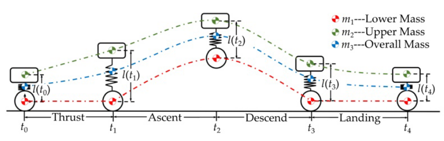​

	轨迹规划过程以目标跳跃高度为输入,以关节力矩最小为目标。确定每个 阶段开始和结束时间的弹簧长度,以及弹簧的自然长度和刚度系数。由此,推 导出质心轨迹和弹簧力的基于时间的曲线。因此,每个阶段的轨迹规划可以看 作是一个有约束的非线性优化问题。

### 跳跃控制方法

PID控制 器的控制参数采用Z-N法确定[28,29]。腿部控制器通过状态估计和运动学模型确定虚拟模型的实时弹簧长度。通过PID控 制计算轨迹跟踪所需的弹簧力Fe,并将规划的弹簧力F组合得到最终的弹簧力F。然 后利用腿静力学模型将此最终力映射到关节空间。在弹簧长度跟踪过程中加入前馈 弹簧力可以有效增强跳跃控制的鲁棒性。

> 28. Mintsa, H.A.; Eny, G.E.; Senouveau, N.; Nzue, R.M.A. Optimal Tuning PID Controller Gains from Ziegler-Nichols Approach for an Electrohydraulic Servo System. J. Eng. Res. Rep. 2023, 25, 158–166. [CrossRef]
> 29. 29. Fajuke, I.D.; Raji, A. Optimal Tuning of PID Controller for Speed Control of DC Motor Using Equilibrium Optimizer. Indones. J. Electr. Eng. Comput. Sci. 2023, 30, 89–101.

​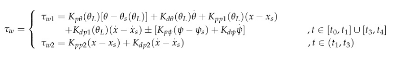​

### 推力级轨迹规划

	基于NW-SLIP模型,采用三次插值法规划跳跃轨迹,并建立相应的代价函 数。在保 证跳跃精度的同时最小化所需的关节扭矩。

$$
\begin{aligned}&\text{min}&&\Delta E_{\mathrm{s}}^{2}(a,b,l,l_{0},t)+G^{2}(F_{\mathrm{s}},l_{0})\\&\text{s.t.}&&H_{1}(a,b,l_{0})=0\\&&&q\in c_{l}Q,F_{\mathrm{s}}\in N\\&&&F_{\mathrm{s}}(t_{1})=-m_{1}g\end{aligned}
$$

$$
\left\{\begin{array}{l}E_{s}(a,b,l,l_{0},t)=\frac{1}{4}a(l(t)-l_{0})^{4}+\frac{1}{2}b(l(t)-l_{0})^{2}+m_{2}gl(t)+\frac{1}{2}m_{2}\dot{l}(t)^{2}\\\Delta E_{s}(a,b,l,l_{0},t)=E_{s}(a,b,l,l_{0},t_{1})-E_{s}(a,b,l,l_{0},t_{0})\\G(F_{s},l)=\frac{\max(F_{s})}{F_{\max}(l)}\end{array}\right.
$$

	基于NW-SLIP模型制定成本函数,在保 证跳跃精度的同时最小化所需的关节扭矩。为了达到机器人整体质心的期望高度,关 节必须产生相应的动能。因此,支配力系数G(Fs, 10)是更有效地衡量计划轨迹在利用 关节输出方面的效率,而不是扭矩的积分。

|插值方法|多项式阶数|光滑性|计算复杂度|适用场景|
| ----------| ------------| ---------| ------------| ----------|
|线性插值|1阶|C⁰连续|低|简单数据|
|二次插值|2阶|C¹连续|中等|一般应用|
|**三次插值**|**3阶**|**C²连续**|**较高**|**高精度要求**|
|高阶插值|≥4阶|Cⁿ连续|高|特殊需求|

三次插值法概述

三次插值法（Cubic Interpolation）是一种常用的数值插值方法，属于高阶插值技术。它使用三次多项式来逼近已知数据点之间的函数关系。

主要特点

1. **多项式阶数**：使用三次多项式（最高三次方）
2. **光滑性**：比线性插值和二次插值具有更好的光滑性
3. **精度**：通常比低阶插值方法精度更高
4. **计算复杂度**：适中，比线性插值复杂但比更高阶插值简单

数学表达

对于给定的数据点 (xi,yi)(xi,yi)，三次插值法在区间 [xi,xi+1][xi,xi+1] 上寻找一个三次多项式：

P(x)\=ax3+bx2+cx+dP(x)\=ax3+bx2+cx+d

其中系数 a,b,c,da,b,c,d 通过满足插值条件和光滑性条件来确定。

### 上升段轨迹规划

	由于NW-SLIP模型缺乏解析轨迹时间解,而LW-SLIP模型仍未充分利用联合 输出,因此采用三次插值法根据上下质量的加速度来规划轨迹。

**利用三次插值法的计算效率和精度优势，来解决SLIP模型在轨迹规划方面的局限性**。

现有问题：

* **NW-SLIP模型**：缺乏解析轨迹时间解，即无法通过数学公式直接计算出完整的运动轨迹
* **LW-SLIP模型**：仍未充分利用联合输出，即轮子和腿部的协同作用没有完全发挥

$$
H_2(z_1,c_i,t)=\ddot{z}_1(t)-c_1t^3-c_2t^2-c_3t-c_4=0
$$

$$
\begin{aligned}&\text{min}&&L^{2}(c_{i},t_{2})+G^{2}(F_{s},l)\\&\text{s.t.}&&H_{2}(z_{1},c_{i},t)=0\\&&&q\in\mathbb{Q},F_{s}\in N\\&&&\dot{z}_{1}(t_{2})=0\\&L(c_{i},t_{2})=\frac{1}{20}c_{1}t_{2}^{5}+\frac{1}{12}c_{2}t_{2}^{4}+\frac{1}{6}c_{3}t_{2}^{3}+\frac{1}{2}c_{4}t_{2}^{2}-h_{s}\end{aligned}
$$

### 下降阶段轨迹规划

为 了缓解这种情况,臀部在下降阶段保持静止,为腿部稳定留出更多时间。（是否可以考虑不静止，提前预测高度，实现腿部的更快着陆）

‍

### 着陆级弹道规划

	最小化能量误差函数,确保在着陆阶段结束时所有动能和重力能都转化为弹 性能,便于机器人过渡到自平衡状态。

$$
\begin{aligned}\text{min}&\Delta E_{s}^{2}(a,b,l,l_{0},t)+G^{2}(F_{s},l)\\\text{s.t.}&H_{1}(a,b,l,l_{0})=0\\&q_{1}\in Q_{1},F_{s}\in N\end{aligned}
$$

这个过程的目的是最小化髋部电机的 最大转矩和速度,提高轨迹跟踪的可行性。利用对分法提高优化过程的迭代效率。

|优化方法|计算复杂度|收敛速度|稳定性|适用场景|
| ----------| ------------------| -------------| --------| ------------|
|**对分法**|O(log⁡n)O(logn)|线性|高|单峰函数|
|梯度下降|O(n)O(n)|线性/超线性|中等|多维优化|
|牛顿法|O(n2)O(n2)|二次|低|需导数信息|
|遗传算法|O(n⋅m)O(n⋅m)|慢|高|多模态优化|

（对分法适用于线性变化，可以提高优化迭代效率，但是针对于非线性的变化，还是存在问题）通过优化得到跳跃轨迹，弹簧的刚度系数和自然长度,以及着陆阶段开始和结束时的弹簧长度。

### 未来发展

1. 引入更高阶的刚度系数，提高设计的灵活性
2. 能量约束纳入成本函数中，减少能量的消耗
3. 传感器的噪声引入，放大噪声与延迟噪声的比例
4. 地面的顺应性，是最为复杂的因素
5. 更高的鲁棒性有待提高
6. 空中姿态的调整，实现更多功能

### 创新点策略

1.  结构上，关节点与轮点保持在一条垂直线上，包括在高低腿上，也尽可能的在一条垂直线上，从硬件层面上，减少跳跃过程中的前倾力，对于平衡的影响。
2. 关于等价倒立摆模型的方案，传统的等效倒立摆模型，将左右完全等价于一体化，在平衡纠正上，仅仅只考虑了俯仰角对平衡的影响，而忽略了，四连杆机构具有结构上的灵活性，韧性，不能单单等效于一根杆件，而应该考虑偏航角的平衡姿态影响。已经考虑传感器的偏差，导致的偏航角的增长，从而影响机器人的直线行走能力，与力的方向。
3. 相较于传统的运动学一键到底的方式，为了提高整体的机器人性能，应该考虑的整体方案是，对驱动轮做静力学建模，构建运动学方程，也就是牛顿第二定律。减去动力学建模的动态复杂性。对针对虚拟腿高上，做动力学建模，考虑实时的变化效果。对关节力到驱动轮的施加力上，采用VMC方案，等效为一个弹簧加阻尼的模型，将传统的运动学的刚性力，转化为柔性力，从而实现更加逼真的力学反馈。

‍
