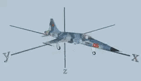
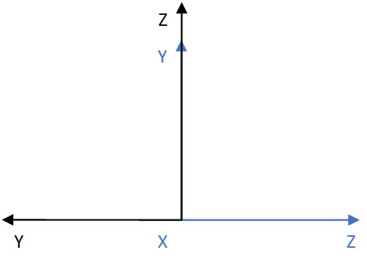
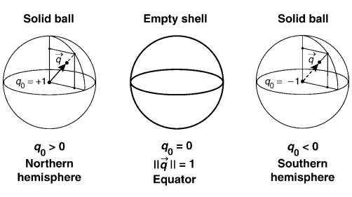
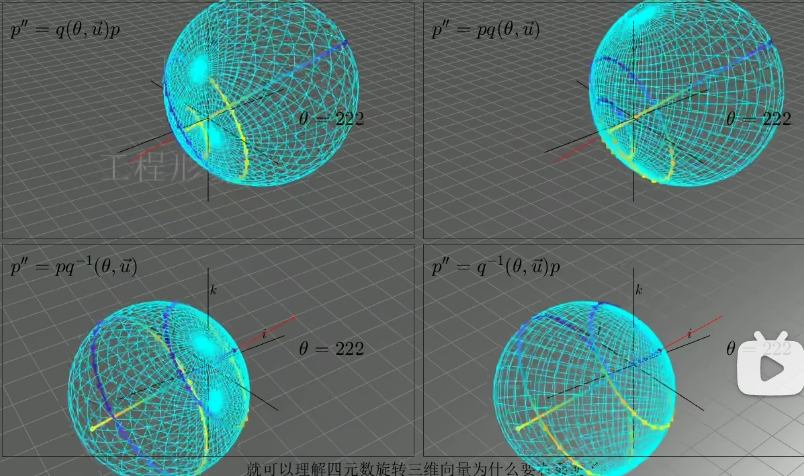

> 三维空间中的坐标变换，包括旋转矩阵、欧拉角和四元数在表示旋转中的应用。介绍了坐标变换的实质——投影，以及位姿变换的概念。深入讲解了欧拉角的旋转顺序、弊端以及四元数的优势，如避免死锁问题和简化计算。同时阐述了四元数的定义、性质及其与三维旋转的关系，最后讨论了四元数与旋转矩阵及欧拉角之间的转换。  
> 
> 四元数可视化链接：[点击](https://quaternions.online/)

## 补充知识

理解视频链接：[点击](https://www.bilibili.com/video/BV1b34y1y7nF/?spm_id_from=888.80997.embed_other.whitelist&t=5.618464&bvid=BV1b34y1y7nF&vd_source=f412fc178503cd4cd82f9c512d4f458d)

## 旋转矩阵

### [坐标变换](https://so.csdn.net/so/search?q=%E5%9D%90%E6%A0%87%E5%8F%98%E6%8D%A2&spm=1001.2101.3001.7020)的作用

在一个机器人系统中，每个测量元件测量同一物体得出的信息是不一样的，原因就在于“每个测量元件所测量的数据是基于不同坐标系所测量的”，例如：

在这辆车中有激光雷达M和激光雷达W，这两个雷达测量的数据截然不同，但是这辆汽车相对于测量物体的位置是唯一的，这就说明“由不同位置雷达测量的数据代表的物理含义（即都表示汽车与被测物体的相对位置）是相同的”。那既然被测物体在不同坐标系中的坐标不同但物理含义相同，这就涉及到不同坐标系中坐标的相互转化。  

### 位姿变换

基于O1的世界坐标系与基于O2的坐标系如下所示：

在描述机器人运动时，我们常常提及“位姿”，其实位姿是一个合成词，我们可以将其拆解为“位置+姿态”。位置就是指“机器人某个运动关节/测量传感器在世界坐标系中的具体位置，姿态就是”**基于该点的坐标系**相较于**世界坐标系**所进行的旋转“，如下所示：

## [欧拉角](https://so.csdn.net/so/search?q=%E6%AC%A7%E6%8B%89%E8%A7%92&spm=1001.2101.3001.7020)

### 欧拉角的作用

欧拉角遵循的是右手系规则，即大拇指指向坐标轴正方向，四指旋转的方向即为转动的正方向，欧拉角包含三个自由量：yaw(偏航角)、pitch(俯仰角)、roll(翻滚角)。

> 由于“绕谁谁不变”的原则

### 欧拉角的弊端

欧拉角有三个分别为yaw(偏航角)、pitch(俯仰角)、roll(翻滚角)，代表着绕着Z/Y/X轴旋转的角度，相当于有三个独立变量（自由度）控制一架飞机进行如下旋转操作：

但是当任何一个坐标轴旋转角度为90度时，就会有两个轴的旋转动作起到对总体旋转结果相同的效果，这就被称为“死锁“，动态图如下所示：

上面的动画展示了绕X轴旋转90度之后，Y轴与Z轴正方向同向，这就导致绕Y轴旋转θ度与绕Z轴的正方向旋转θ度有同样的效果，即丢失了一个自由度。“丢失了一个自由度“也就意味着真正起到旋转作用的只有Y轴和X轴（或者Z轴和X轴），即飞机无法绕着原Z轴正方向进行旋转操作。

”死锁“现象在二维平面图中如下所示：  

无论绕X轴正方向/反方向旋转90度，都会导致Y/Z轴正方向罗在一条直线上！为了解决“死锁“的问题，我们要使用四个自由量，这就引出了”四元数“的概念。

## 四元数

四元数可视化理解视频：[点击](https://www.bilibili.com/video/BV1SW411y7W1/?from=search&seid=2286694305504614618&spm_id_from=333.337.0.0&vd_source=f412fc178503cd4cd82f9c512d4f458d)

四元数的三维表达晦涩难懂，但是四元数的表达式可以优雅的表达三维中的旋转操作，不但避免了欧拉角的死锁问题而且也避免了旋转矩阵的复杂计算。

- 四元数（以后不特指**四元数=单位四元数**）是四维空间中一个超球上面的点，满足w²+x²+y²+z²=1；而纯四元数是四维空间在w=0时的一个子空间的点，形式为{0, **q**}，特别注意的是纯四元数与四元数是不同的概念。

- 四元数是复数虚部扩展的结果，复数的虚部为1个，而四元数虚部有3个，且两两互相正交，其中实部是cosθ/2，而虚部为一个単位轴乘以sinθ/2。

- 四元数自由度并没有四个维度，由于存在w²+x²+y²+z²=1这个约束，它的自由度其实只有3，且每个四元数可以对应一个特征向量，即**n**。但请记住四元数并不是与特征向量一一对应的，后文会有说。

由于四元数存在于四维空间，所以如何利用低维信息去理解高维信息就显得尤为重要。我们这里先用三维举个例子，三维的球用代数表示为x²+y²+z²=1，虽然球上面的点是由x，y，z三个参数来确定，但实际上我们只需要两个。假设取x和z表示，其中y可以通过x和z进行求解。那么，我们将y轴信息给隐去，只看投影平面，如下图所示。这张图的意思是，整个球在XOZ平面上投影是一个圆，当球面一点投影在圆上时，y=0；投影的位置位于圆内时，则分别两种情况，y>0处于北半球，y<0处于南半球。所以我们仅通过投影后的圆即可还原出整个球体。

让我们推广到四维，w²+x²+y²+z²=1中取x、y和z来表示超球。如下图所示，四维空间投影到三维超平面（w=0）可能是一个two-sphere。当投影点在整个two-sphere的边缘时，w一定为0，值得一提的是在这个空间内的四元数是一个纯四元数。当投影点落在two-sphere的内部时，也分为两种情况，w>0和w<0。但是我们可以发现这两种情况下对应的特征向量是一样的，所以我们将旋转矩阵向四元数转换时，是有两个对应值的，四元数的范围是2倍覆盖于3D旋转（2:1 mapping）。

四元数相比其他形式的优点：

- 解决万向节死锁（[Gimbal Lock](https://zhida.zhihu.com/search?content_id=3175762&content_type=Article&match_order=1&q=Gimbal+Lock&zhida_source=entity)）问题

- 仅需存储4个浮点数，相比矩阵更加轻量

- 四元数无论是求逆、串联等操作，相比矩阵更加高效

#### 问题

- 为什么旋转三维向量要用四元数？

- 为什么旋转要左乘一个四元数，右乘一个逆？

- 为什么单位四元数中的角度值要除以2？

左边乘以q，右边乘以q的逆，这两个乘法的扩张收缩运动，在一边扩张时，另一边收缩，所以扩张收缩运动是相互抵消的，但旋转运动是向相同方向旋转的，旋转角度要叠加在一起。可以仔细观察一下最后的四幅扩张收缩旋转图的对比

