# 轮腿算法总结

# 一、基础知识

[Gaint bipedal wheeled robot: StackForce 大轮足机器人开源项目](https://gitee.com/StackForce/gaint_bipedal_wheeled_robot)

​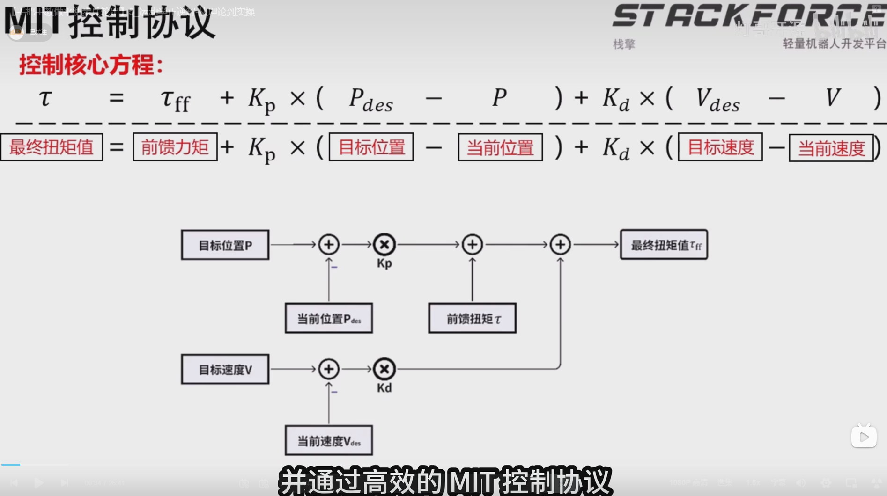​

## 拉格朗日方程

​​

式中T为系统用各广义坐标qj和各广义速度q'j所表示的动能；Qj为对应于qj的[广义力](https://baike.baidu.com/item/%E5%B9%BF%E4%B9%89%E5%8A%9B/0?fromModule=lemma_inlink);N(\=3n-k)为这完整系统的自由度；n为系统的质点数；k为完整约束方程个数。

​[https://baike.baidu.com/pic/%E6%8B%89%E6%A0%BC%E6%9C%97%E6%97%A5%E6%96%B9%E7%A8%8B/1948406/0/034965f4cfa1289bf2d38590?fr=lemma&amp;fromModule=lemma_content-image](https://baike.baidu.com/pic/%E6%8B%89%E6%A0%BC%E6%9C%97%E6%97%A5%E6%96%B9%E7%A8%8B/1948406/0/034965f4cfa1289bf2d38590?fr=lemma&fromModule=lemma_content-image "完整系的拉格朗日方程")完整系的拉格朗日方程

从虚位移原理可以得到受理想约束的质点系不含约束力的平衡方程，而动静法([达朗贝尔原理](https://baike.baidu.com/item/%E8%BE%BE%E6%9C%97%E8%B4%9D%E5%B0%94%E5%8E%9F%E7%90%86/0?fromModule=lemma_inlink))则将列写平衡方程的静力学方法应用于建立质点系的动力学方程，将这两者结合起来，便可得到不含约束力的质点系动力学方程,这就是[动力学普遍方程](https://baike.baidu.com/item/%E5%8A%A8%E5%8A%9B%E5%AD%A6%E6%99%AE%E9%81%8D%E6%96%B9%E7%A8%8B/0?fromModule=lemma_inlink)。而拉格朗日方程则是动力学普遍方程在广义坐标下的具体表现形式。

​[https://baike.baidu.com/pic/%E6%8B%89%E6%A0%BC%E6%9C%97%E6%97%A5%E6%96%B9%E7%A8%8B/1948406/0/9319cf09f4a8d6c0d1581b9d?fr=lemma&amp;fromModule=lemma_content-image](https://baike.baidu.com/pic/%E6%8B%89%E6%A0%BC%E6%9C%97%E6%97%A5%E6%96%B9%E7%A8%8B/1948406/0/9319cf09f4a8d6c0d1581b9d?fr=lemma&fromModule=lemma_content-image "完整系的拉格朗日方程")完整系的拉格朗日方程

拉格朗日方程可以用来建立不含约束力的动力学方程，也可以用来在给定系统运动规律的情况下求解作用在系统上的主动力。如果要想求约束力，可以将拉格朗日方程与[动静法](https://baike.baidu.com/item/%E5%8A%A8%E9%9D%99%E6%B3%95/0?fromModule=lemma_inlink)或[动量定理](https://baike.baidu.com/item/%E5%8A%A8%E9%87%8F%E5%AE%9A%E7%90%86/0?fromModule=lemma_inlink)(或[质心运动定理](https://baike.baidu.com/item/%E8%B4%A8%E5%BF%83%E8%BF%90%E5%8A%A8%E5%AE%9A%E7%90%86/0?fromModule=lemma_inlink))联用。

## 运动学

​​

​​

​​

​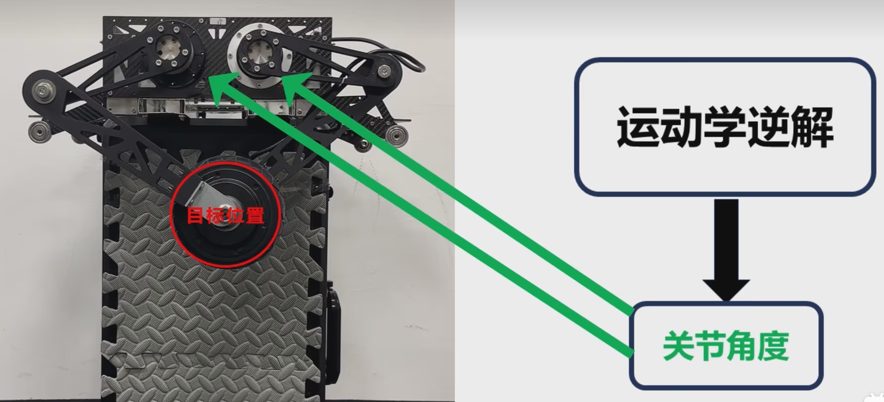​

​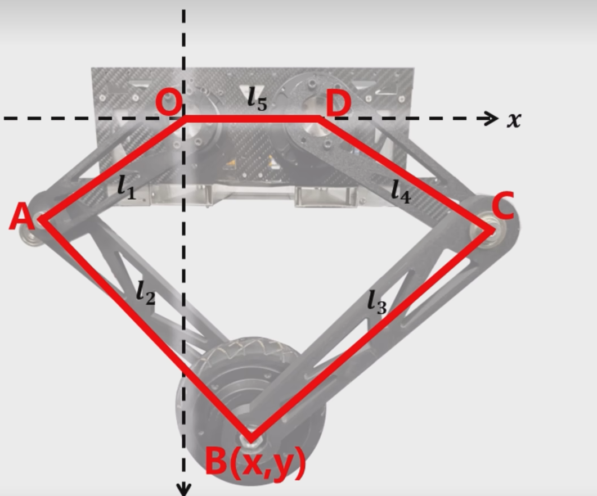​

​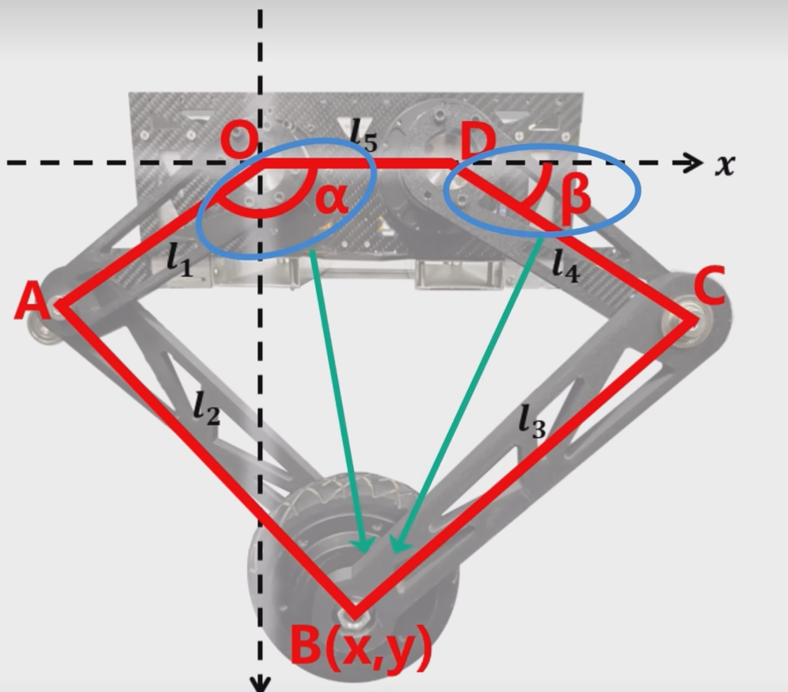​

​​

‍

### 正解

​​

 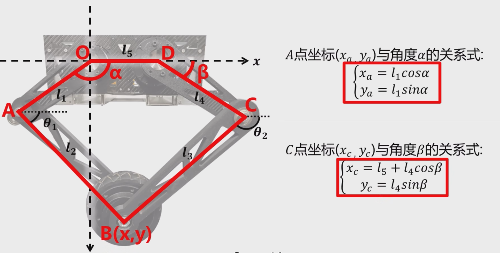​

​​

​​

​​

​​

​​

​​

​​

​​

​​

‍

### 逆解

​​

​​

​​

​​

​​

​​

​​

​​

‍

​​

​​

​​

‍

​​

​​

​​

‍

## 虚功原理

<span data-type="text" style="background-color: var(--b3-card-error-background); color: var(--b3-card-error-color);">虚功原理是指在满足约束条件的情况下，系统在平衡状态下外力所做的虚功等于内力所做的虚功</span>

​​

## 雅可比矩阵

​​

‍

​​

## 卡尔曼滤波

​​

​​

​​

​​

​​

​​

‍

​​

​​

## 状态空间方程

[状态空间方程](https://zhida.zhihu.com/search?content_id=257872685&content_type=Article&match_order=1&q=%E7%8A%B6%E6%80%81%E7%A9%BA%E9%97%B4%E6%96%B9%E7%A8%8B&zhida_source=entity)是[现代控制理论](https://zhida.zhihu.com/search?content_id=257872685&content_type=Article&match_order=1&q=%E7%8E%B0%E4%BB%A3%E6%8E%A7%E5%88%B6%E7%90%86%E8%AE%BA&zhida_source=entity)中描述动态系统行为的数学模型，它以状态变量为核心，将系统的输入、输出和内部状态联系起来，适用于**多输入多输出系统（MIMO）系统**、非线性系统等复杂场景。

​​

# 二、LQR算法

[https://www.bilibili.com/video/BV1qg8JzGEZC/?spm_id_from=333.337.search-card.all.click&amp;vd_source=f412fc178503cd4cd82f9c512d4f458d](https://www.bilibili.com/video/BV1qg8JzGEZC/?spm_id_from=333.337.search-card.all.click&amp;vd_source=f412fc178503cd4cd82f9c512d4f458d)

​​

* **PID 的缺陷**：线性局限、耦合干扰、参数整定难、抗扰动差。
* **改进方向**：

  * 自适应 PID / 增益调度 → 适应不同地形。
  * 非线性控制（SMC、模糊 PID）→ 增强鲁棒性。
  * 基于模型的方法（MPC、阻抗控制）→ 处理多自由度耦合。
  * 强化学习 → 自动优化控制策略。
  * 混合控制 → 结合轮/腿模式优势。

## 状态空间方程构建

​​

​​

​​​

​​

​​

​​

​​

​​

​​

​​

​​

​​

​​

‍

​​

​​

​​

​​

​​

‍

​​

​​

​​

​​

‍

​​

‍

​​

​​

‍

​​

​​

‍

## 最优控制方法实现

​​

​​

​​

​​

​​

‍

​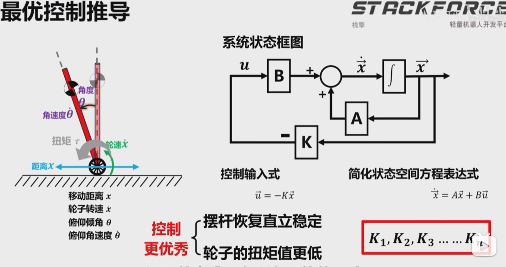​

​​

​​

​​

​​

​​

​​

​​

​​

​​

‍

​​

​​

​​

​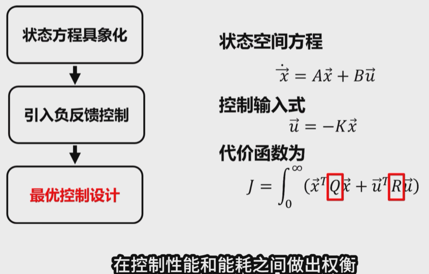​

## LQR调参器（腿高拟合）

​​

​​

### 轨迹追踪

##### 目标误差控制

​​

​​

​​

​​

##### 稳态非零参考值控制

​​

​​

​​

##### 输入增量控制

​​

​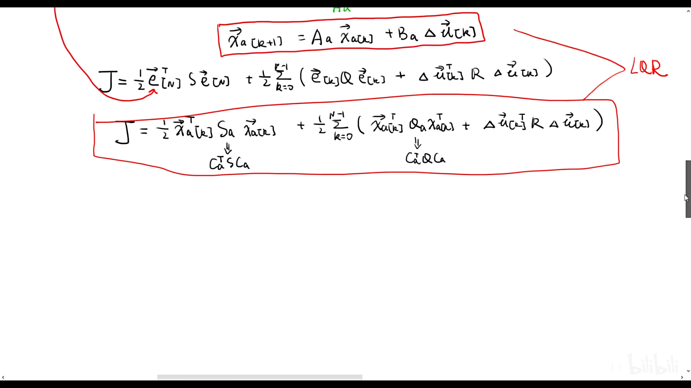​

​​

​​

​​

‍

​​

# 三、PID算法

​​

​​

​​

​​

​​

​​

​​

​​

​​

​​

​​

​​

# 四、MPC 算法

### **模型预测控制（MPC）在轮腿机器人中的应用**

模型预测控制（Model Predictive Control, MPC）是一种先进的控制策略，特别适合 **轮腿机器人（Wheel-Legged Robots）**  这种 **多自由度、非线性、强耦合** 的系统。与传统的 PID 控制相比，MPC 能够通过 **在线优化** 解决动态环境下的运动控制问题。以下是 MPC 的核心原理、优势、实现方法及在轮腿机器人中的具体应用。

---

## **1. MPC 的核心原理**

MPC 是一种 **基于模型、滚动优化、反馈校正** 的控制方法，其核心流程如下：

1. **预测模型**：

    * 使用机器人的动力学/运动学模型，预测未来一段时间（预测时域）的状态。
    * 例如：轮腿机器人的质心运动、关节角度、接触力等。
2. **在线优化**：

    * 在每一个控制周期，求解一个优化问题，得到最优控制输入序列。
    * 优化目标通常包括：

      * 跟踪参考轨迹（如步态规划）。
      * 最小化能量消耗。
      * 满足约束（如关节力矩限制、地面反力）。
3. **滚动执行**：

    * 只执行优化结果的第一组控制输入，下一周期重新优化（闭环反馈）。

---

## **2. MPC 在轮腿机器人中的优势**

###  **(1) 处理多自由度耦合**

* 轮腿机器人通常涉及 **轮式滚动 + 腿式踏步** 的混合运动，MPC 可以统一优化两者的协同控制。
* **示例**：

  * 在四足机器人（如 ANYmal）中，MPC 同时优化腿的摆动和轮的转动，实现平滑过渡。

###  **(2) 适应动态环境**

* MPC 能实时考虑 **地形变化、外部扰动**（如斜坡、撞击），并调整控制策略。
* **示例**：

  * 当机器人从平地切换到台阶时，MPC 自动调整腿的踏步高度和轮的扭矩分配。

###  **(3) 显式处理约束**

* MPC 可以直接在优化问题中加入约束：

  * **物理约束**：关节力矩、电机转速、地面摩擦锥。
  * **安全约束**：避免自碰撞、保持稳定性（如 ZMP 条件）。
* **示例**：

  * 在高速奔跑时，MPC 确保足端接触力不超出摩擦极限，避免打滑。

###  **(4) 能量效率优化**

* MPC 可以通过目标函数设计，最小化能量消耗（如电机扭矩的平方和）。
* **示例**：

  * 在长距离移动时，MPC 优先使用轮式滚动（省能），仅在障碍物时切换腿式踏步。

---

## **3. MPC 的实现方法**

###  **(1) 建模**

* **动力学模型**：

  * 轮腿机器人的刚体动力学（如牛顿-欧拉方程）。
  * 简化模型（如单刚体模型）可降低计算负担。
* **接触模型**：

  * 描述轮/腿与地面的交互（如弹簧-阻尼模型、摩擦锥模型）。

###  **(2) 离散化与预测时域**

* 将连续时间模型离散化（如使用欧拉法）。
* 选择预测时域（如 10-20 步），时域越长，计算量越大。

###  **(3) 优化求解**

* **目标函数**：

  ```math
  \min \sum_{k=1}^{N} \| x_k - x_{\text{ref}} \|_Q^2 + \| u_k \|_R^2
  ```

  * 其中：

    * \( x_k \)：状态（如位置、速度）。
    * \( u_k \)：控制输入（如关节扭矩）。
    * \( Q, R \)：权重矩阵。
* **约束条件**：

  * 动力学方程 \( x_{k+1} = f(x_k, u_k) \)。
  * 输入约束 \( u_{\min} \leq u_k \leq u_{\max} \)。
  * 接触力约束 \( F_z \geq 0 \)（避免足端穿透地面）。

###  **(4) 实时优化算法**

* **QP（二次规划）求解器**：如 OSQP、qpOASES。
* **非线性 MPC**：若模型非线性较强，可使用 SQP（序列二次规划）或 CasADi + IPOPT。

---

## **4. 实际案例**

|机器人|MPC 应用场景|效果|
| --------| --------------| -----------------------------|
|**ANYmal**|轮腿混合运动|实现轮式高速滚动 + 腿式越障|
|**MIT Cheetah**|动态奔跑|高速下保持稳定性|
|**Spot (BD)**|地形适应|自动调整步态应对斜坡、碎石|

---

## **5. 挑战与改进方向**

###  **(1) 计算复杂度**

* **问题**：MPC 的在线优化计算量较大，对嵌入式硬件要求高。
* **改进**：

  * 使用简化模型（如单刚体模型）。
  * 部署高效求解器（如 ACADO、GRAMPC）。

###  **(2) 模型误差**

* **问题**：模型不准确会导致控制性能下降。
* **改进**：

  * 结合 **学习-based 方法**（如强化学习）在线修正模型。
  * 使用 **自适应 MPC**。

###  **(3) 实时性**

* **问题**：在动态环境中，MPC 的求解速度可能跟不上变化。
* **改进**：

  * 降低预测时域（牺牲部分性能换速度）。
  * 采用 **事件触发 MPC**（仅在必要时重新优化）。

---

## **6. 总结**

* **MPC 的优势**：

  * 多自由度协同优化、适应动态环境、显式处理约束。
* **适用场景**：

  * 轮腿机器人的混合运动、复杂地形导航、高动态任务（如奔跑、跳跃）。
* **改进方向**：

  * 降低计算量、增强模型鲁棒性、结合机器学习。

如果需要 **具体代码实现** 或 **某款机器人的 MPC 调参方法**，可以进一步讨论！

‍

## 具体实现

​​

​​

​​

​​

​​

‍

‍

​​

‍

​​

​​

​​

​​

​​

​​

​​

#### 第二种解法：CAN老师

​​

​​

​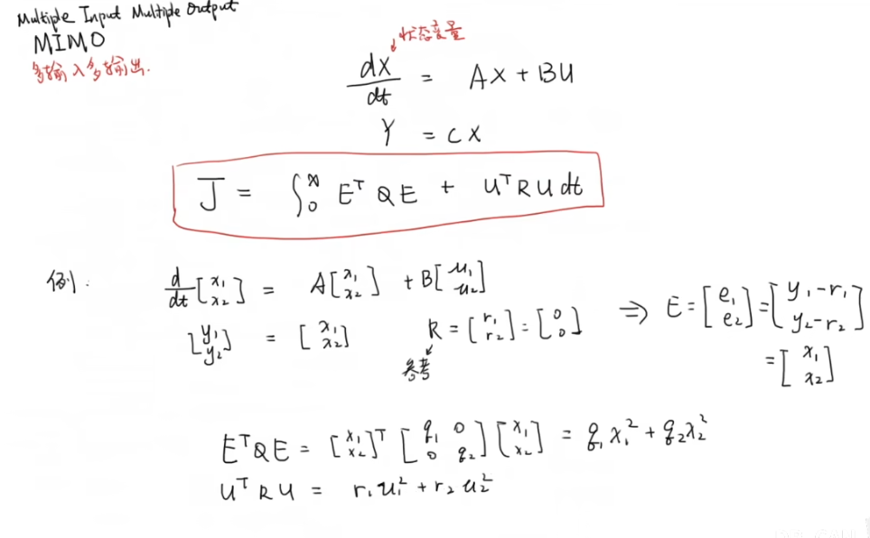​

‍

​​

​​

​​

​​

​​

​​

‍

# 五、VMC 算法

​​

​​

​​

​​

​​

​​

​​

​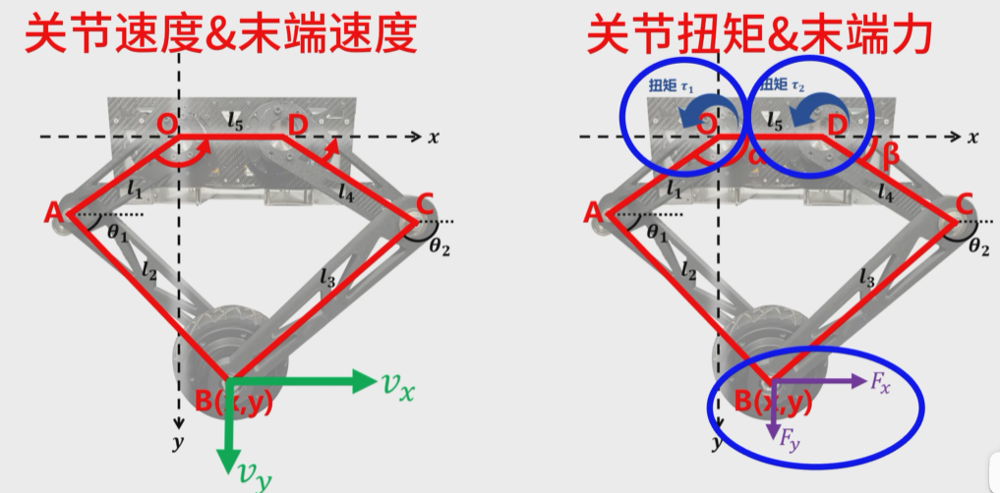​

​​

​​

​​

​​

​​

​​

​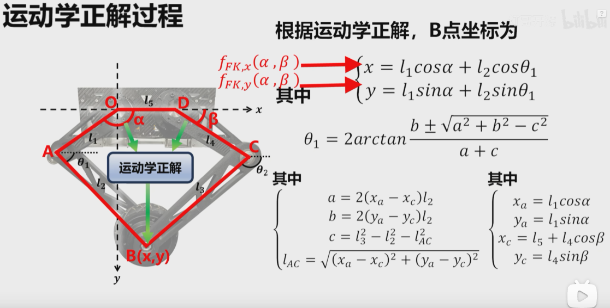​

​​

## 雅可比矩阵第二种计算方法

​​

​​

​​

这里的A与C点的角度难以求出

​​

​​

​​

​​

​​

​​

​​

​​

​​

​​

​​

​​

​​

# 最优控制：动态规划

​​

​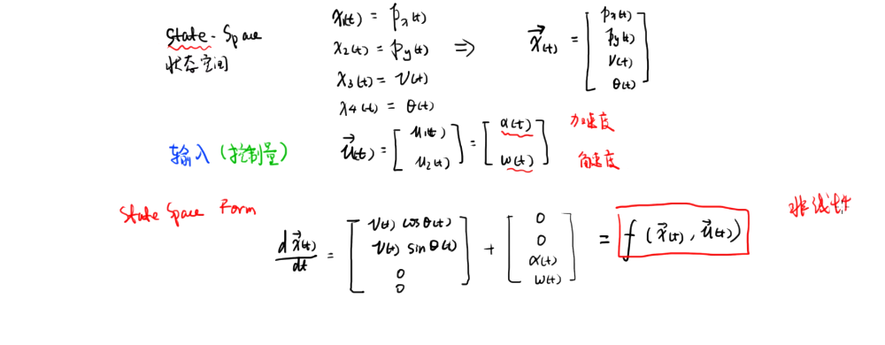​

​​

​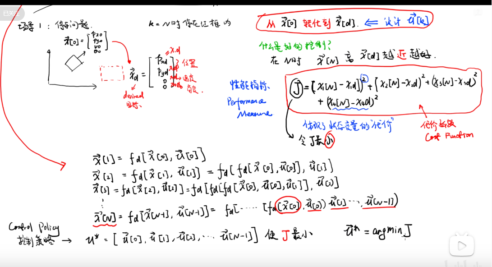​

​​

​​

​​

​​

‍

‍

## 动态规划

​​

​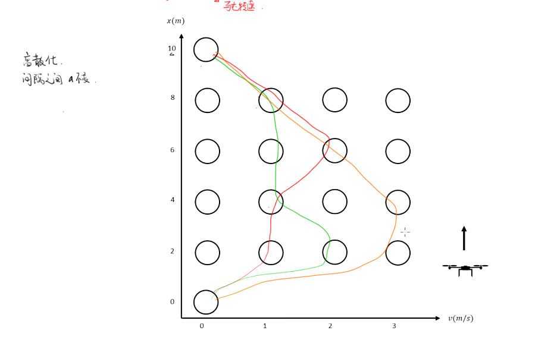​

​​

​​

​​

### 贝尔曼最优方程

贝尔曼最优方程是强化学习中的核心数学工具，用于求解马尔可夫决策过程（MDP）中的最优策略。它是贝尔曼方程在最优策略条件下的特殊形式。

## 基本概念

#### 1. 最优策略（Optimal Policy）

在有限状态和动作集合的MDP中，存在至少一个策略π\*，使得对于任意状态s，都有：  
V\^π(s) ≥ V\^π'(s)

这个策略π\*就是最优策略，它确保从任意状态出发都能获得最大的期望回报。

#### 2. 最优状态价值函数和最优动作价值函数

* **最优状态价值函数**：V\^\*(s) \= max\_π V\^π(s)
* **最优动作价值函数**：Q\^\*(s,a) \= max\_π Q\^π(s,a)

#### 方程的意义和特性

#### 1. 递归性质

贝尔曼最优方程体现了"最优性原理"：最优策略具有这样的性质，无论初始状态和初始决策如何，其余的决策必须构成一个最优策略。

#### 2. 约束条件

方程中的"最优"约束主要体现在动作选择上，即在每个状态s中选择能够最大化期望回报的动作a。

‍
